# Vacuum Pump Risk Assessment Report v2.0
**Fab: Phoenix Semiconductor - Fab 12**  
**Report Date: August 12, 2025**  
**Assessment Period: Next 30 Days**  
**CIP Engineer: Marcus Chen**

---

## Executive Summary Dashboard

### Risk Distribution Overview

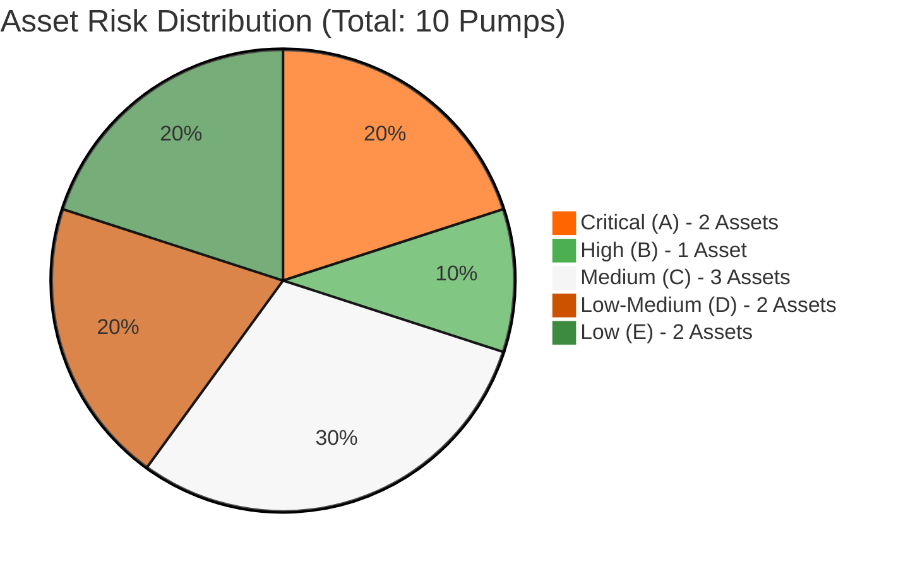

**Plot Description**: This pie chart shows the current risk categorization of all 10 vacuum pumps in the facility. Red segments indicate critical assets requiring immediate action, while green segments represent well-performing equipment. The distribution reveals that 30% of our fleet (3 pumps) are in critical or high-risk categories, requiring immediate management attention.

### IoT Asset Status Distribution

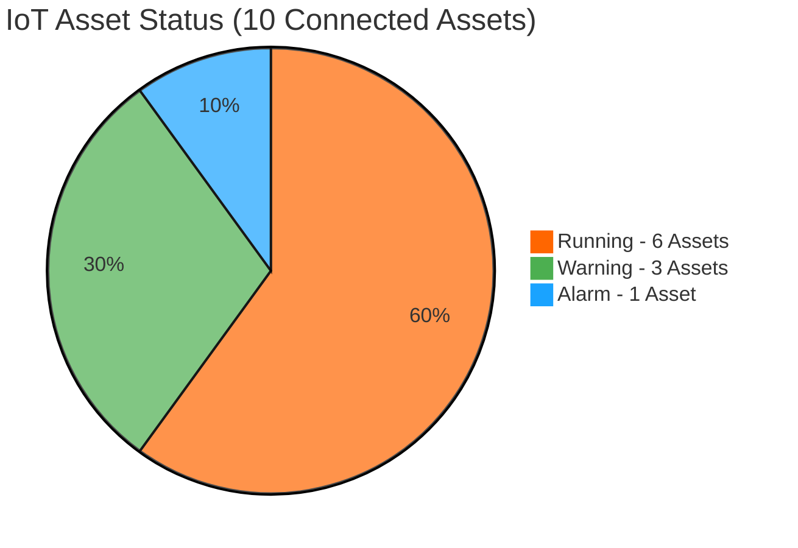

**Plot Description**: This chart displays the real-time operational status from our IoT monitoring system. While 60% of pumps are running normally, 40% are showing warning or alarm conditions. The single alarm status asset requires immediate investigation, while the three warning-status assets need enhanced monitoring to prevent escalation.

### Business Impact Summary
| Metric | Value | Status |
|--------|-------|--------|
| **Total Production Value at Risk** | $2.8M (30 days) |  |
| **Critical Process Tools Affected** | 3 tools |  |
| **Estimated Downtime Risk** | 48-72 hours |  |
| **SLA Compliance** | 97.2% (Target: 99.5%) |  |

### Risk Trend Analysis (30-Day Period)

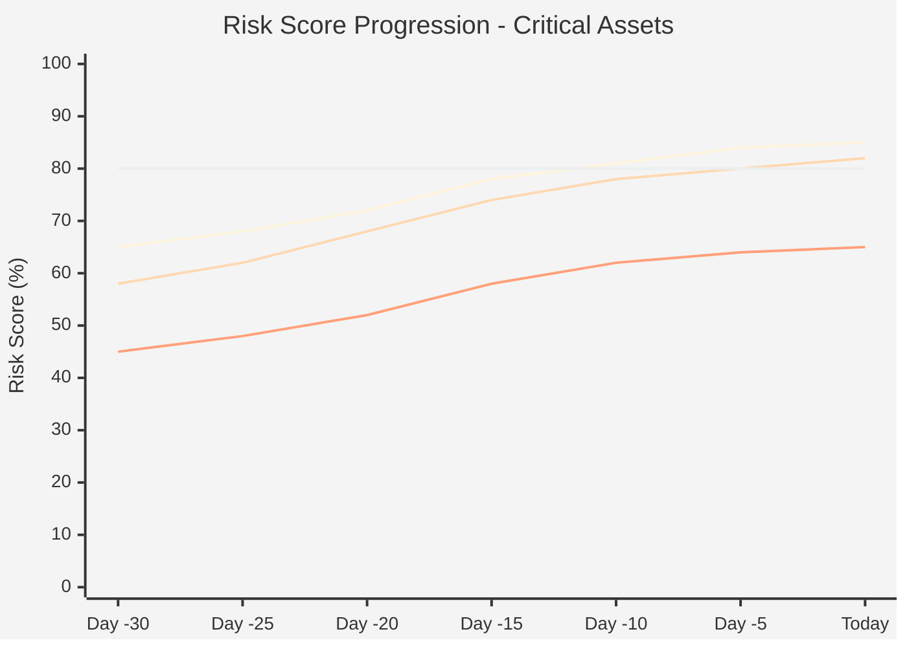

**Plot Description**: This trend analysis shows how risk scores have evolved over the past 30 days for our most concerning assets. Both VP-001 and VP-007 have crossed the critical 80% threshold, showing steady deterioration that demands immediate action. VP-003 is approaching the critical zone, indicating it needs urgent preventive intervention to avoid joining the critical category.

### Alert Summary
| Priority | Count | Assets |
|----------|-------|--------|
|  | 2 | VP-001, VP-007 |
|  | 1 | VP-003 |
|  | 3 | VP-002, VP-005, VP-009 |

---

## Critical Risk Assets (Category A - Immediate Action Required)

### VP-001 - Turbomolecular Pump (HiPace 700)
**Location**: Etch Tool Bay 3, Line 2  
**Risk Score**:  **Status**: CRITICAL

#### Business Impact
| Factor | Value | Impact |
|--------|-------|--------|
| **Process Type** | Advanced etch (7nm node) | Single point of failure |
| **Downtime Cost** | $45K/hour | Critical revenue impact |
| **Wafer Lots at Risk** | 12 lots (300 wafers) | High volume impact |
| **Production Criticality** | Line 2 - Primary production | Maximum severity |

#### Technical Performance Metrics
| Parameter | Current | Threshold | Status | Trend |
|-----------|---------|-----------|--------|-------|
| **Age** | 4.2 years | 5.0 years |  | Aging |
| **MTBF** | 180 days | 365 days |  | Declining |
| **Vibration** | 2.8 mm/s | 2.5 mm/s |  | Increasing |
| **Temperature** | 68°C | 65°C |  | Rising |
| **Power Draw** | +15% | Baseline |  | Increasing |

#### Real-Time Condition Monitoring

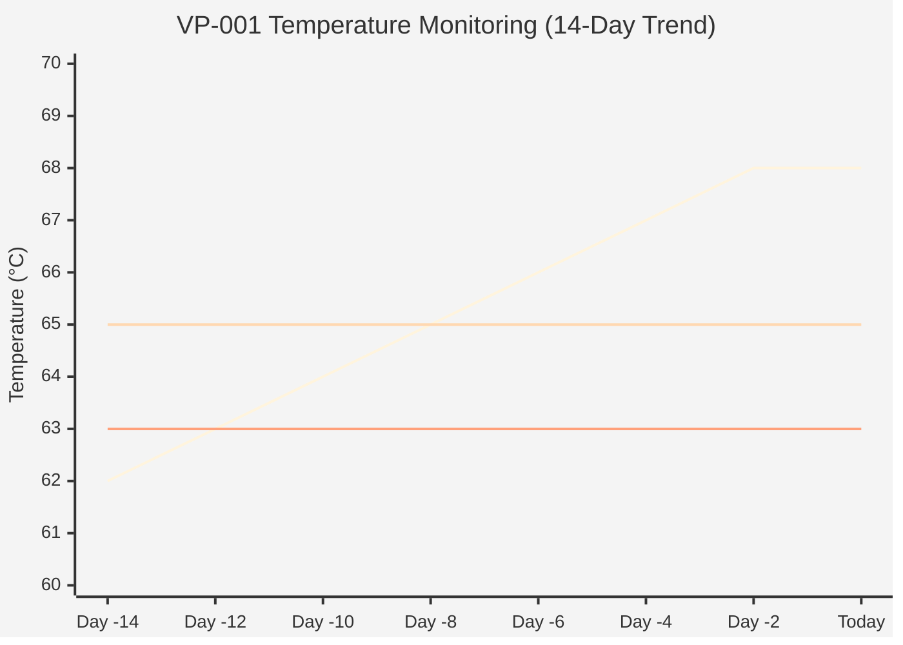

**Plot Description**: This temperature trend shows VP-001 has been steadily heating up over 14 days, now operating 3°C above the critical threshold. The consistent upward trend indicates bearing deterioration or cooling system issues. The pump has been running in the danger zone for 4 days, significantly increasing the risk of catastrophic failure.

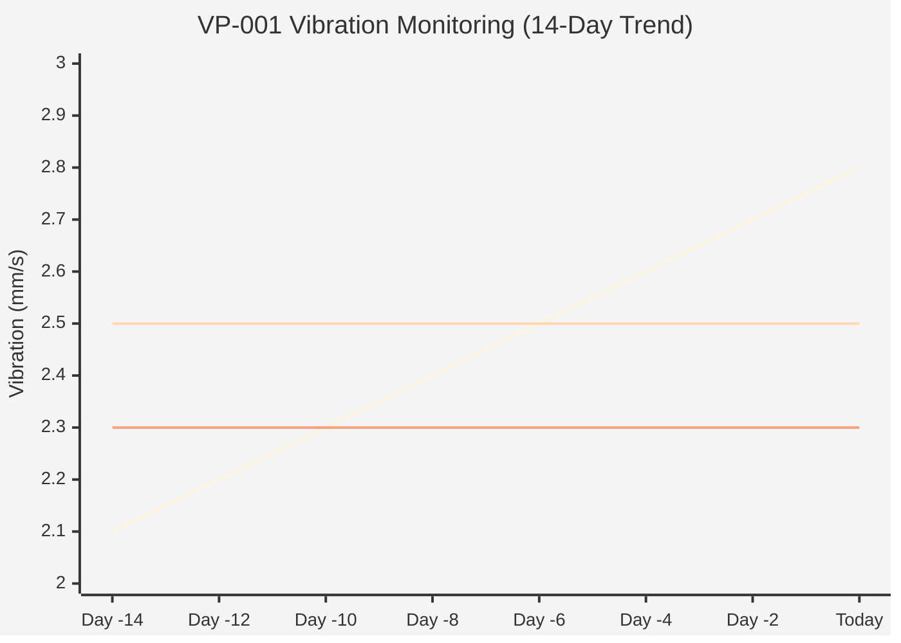

**Plot Description**: The vibration analysis reveals a dangerous linear increase over 14 days, now 12% above the critical threshold. This pattern typically indicates bearing wear, shaft misalignment, or rotor imbalance. The steady escalation suggests imminent mechanical failure if not addressed immediately. Combined with temperature data, this confirms urgent replacement is required.

#### Alarm History (Last 14 Days)
| Date | Alarm Type | Severity | Duration | Status |
|------|------------|----------|----------|--------|
| Aug 12 | High Temperature |  | 2.5 hrs | Active |
| Aug 11 | Excessive Vibration |  | 4.2 hrs | Resolved |
| Aug 10 | Power Anomaly |  | 1.8 hrs | Resolved |
| Aug 09 | High Temperature |  | 3.1 hrs | Resolved |

#### Immediate Action Required
-  **Replace within 48 hours**
- **Spare Status**: Available in inventory (S/N: HP700-2024-15)
- **Service Window**: 4-hour replacement scheduled for Aug 13, 02:00-06:00
- **Backup Plan**: Temporary tool shutdown, production rerouted to Line 1

---

### VP-007 - Dry Scroll Pump (XDS 35i)
**Location**: Load Lock Chamber, Tool 7  
**Risk Score**:  **Status**: CRITICAL

#### Business Impact
| Factor | Value | Impact |
|--------|-------|--------|
| **Process Type** | Wafer transfer system | Multi-tool dependency |
| **Downtime Cost** | $25K/hour | High revenue impact |
| **Affected Modules** | 4 process chambers | Cascading failure risk |
| **Tool Criticality** | No immediate backup | Critical bottleneck |

#### Technical Performance Metrics
| Parameter | Current | Threshold | Status | Trend |
|-----------|---------|-----------|--------|-------|
| **Age** | 3.8 years | 5.0 years |  | Aging |
| **MTBF** | 145 days | 400 days |  | Declining |
| **Motor Current** | 12.5A | 12.0A |  | Rising |
| **Oil Temperature** | 72°C | 70°C |  | Stable |
| **Pumping Speed** | 28 m³/h | 35 m³/h |  | Declining |

#### Real-Time Condition Monitoring

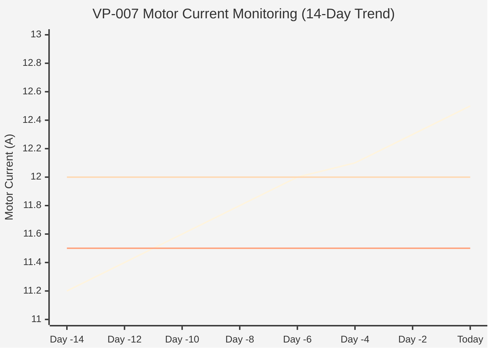

**Plot Description**: Motor current draw has increased steadily over 14 days, now 4% above the critical threshold. Rising current typically indicates mechanical resistance from worn scroll elements, contamination, or bearing degradation. The linear progression suggests the pump is working harder to maintain vacuum levels, indicating internal wear requiring immediate attention.

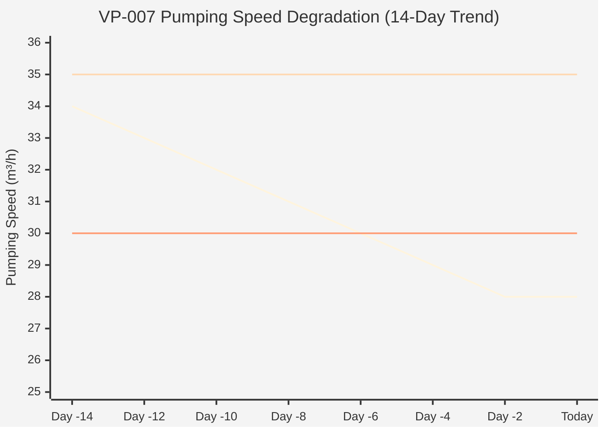

**Plot Description**: Pumping performance has degraded significantly, dropping 20% below rated capacity and now operating at the minimum acceptable level. The steady decline indicates scroll wear or seal leakage. This degradation, combined with increased motor current, confirms internal damage requiring pump replacement rather than maintenance.

#### Immediate Action Required
-  **Replace within 72 hours**
- **Spare Status**: On order (ETA: 24 hours, S/N: XDS35-2024-08)
- **Service Window**: 6-hour replacement required
- **Interim Action**: Monitor every 2 hours, deploy backup roughing

---

## High Risk Assets (Category B - Schedule ASAP)

### VP-003 - Turbomolecular Pump (HiPace 400)
**Location**: PVD Chamber 2, Tool 15  
**Risk Score**:  **Status**: HIGH RISK

#### Performance Summary
| Parameter | Value | Status |
|-----------|-------|--------|
| **Business Impact** | $18K/hour downtime |  |
| **Process Type** | Metal deposition | Critical process |
| **Age** | 3.1 years (62% consumed) |  |
| **MTBF** | 220 days (baseline: 330) |  |

#### Key Issues & Actions
- **Maintenance Status**: 
- **Bearing Vibration**: Increasing trend detected
- **Required Action**: Schedule maintenance within 7 days
- **Service Window**: 8-hour maintenance cycle required

---

## Medium Risk Assets (Category C - Enhanced Monitoring)

### Asset Overview
| Asset ID | Location | Risk Score | Primary Concern | Monitoring Action |
|----------|----------|------------|-----------------|-------------------|
| **VP-002** | Etch Tool 4 |  | Performance decline | Daily parameter checks |
| **VP-005** | CVD Chamber 1 |  | Power consumption trend | Monitor energy usage |
| **VP-009** | Roughing Station 3 |  | Oil contamination | Oil analysis scheduled |

### Enhanced Monitoring Protocol
- **Frequency**: Daily condition checks
- **Parameters**: Temperature, vibration, power draw
- **Thresholds**: Reduced warning levels (10% buffer)
- **Escalation**: Automatic alert if 2+ parameters exceed warning

---

## Low Risk Assets (Categories D & E)

### Asset Status Summary

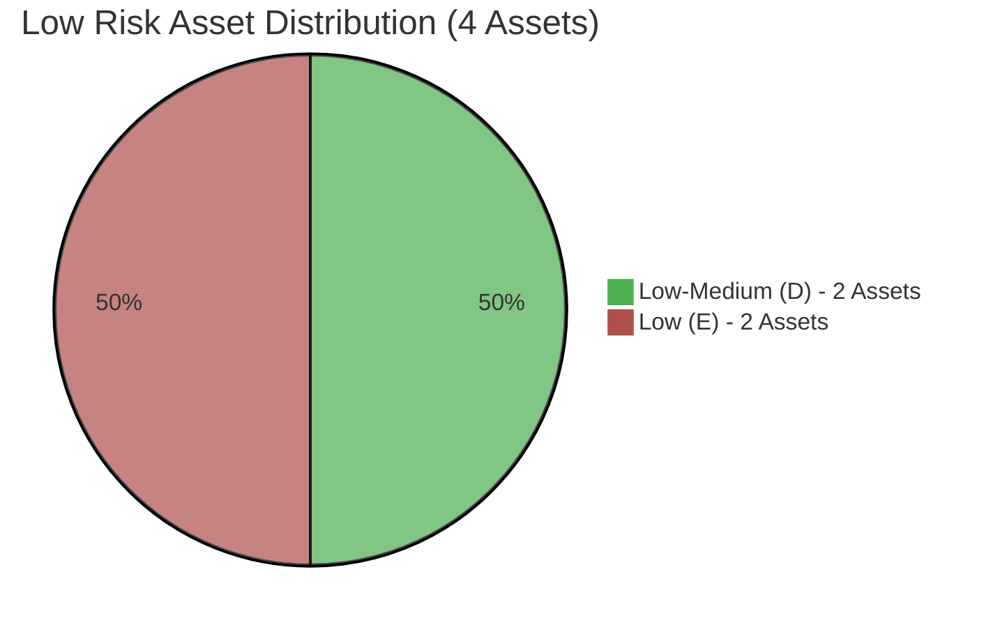

**Plot Description**: This chart shows the distribution of our four best-performing pumps. These assets are operating within normal parameters and require only routine maintenance. The 50/50 split between low-medium and low categories indicates a healthy baseline fleet performance.

| Asset ID | Location | Risk Score | Status | Next Maintenance |
|----------|----------|------------|--------|------------------|
| VP-004 | Load Lock 8 |  | Routine | Oct 12, 2025 |
| VP-006 | CVD Tool 9 |  | Routine | Sep 28, 2025 |
| VP-008 | PVD Chamber 5 |  | Excellent | Nov 15, 2025 |
| VP-010 | Etch Tool 12 |  | Excellent | Dec 3, 2025 |

---

## Business Context & SLA Performance

### Service Level Agreement Tracking

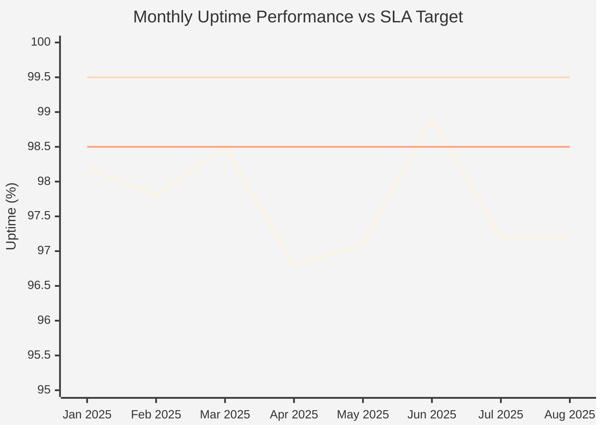

**Plot Description**: This performance tracking shows we've been consistently below our 99.5% SLA target for the past 8 months, with particularly poor performance in April (96.8%). Current performance at 97.2% represents a 2.3% shortfall, directly linked to our critical pump failures. The flat trend in July-August indicates urgent intervention is needed to restore SLA compliance.

### Current Performance Metrics
| Metric | Current | Target | Status |
|--------|---------|--------|--------|
| **Uptime** | 97.2% | 99.5% |  |
| **Unplanned Downtime** | 18.5 hours | <5 hours |  |
| **MTBF (Fleet Average)** | 265 days | 350 days |  |
| **Revenue Impact** | $485K | <$100K |  |

### Critical Process Impact Map

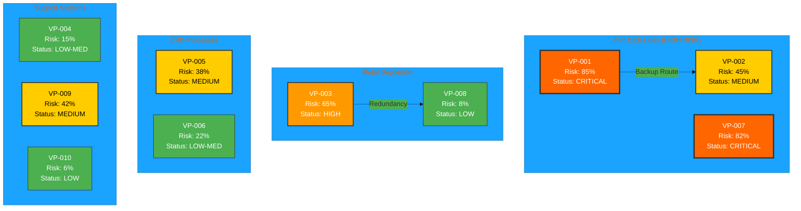

**Plot Description**: This process flow diagram maps pump risk levels to their production line impact. The 7nm etch lines show the highest concentration of risk with two critical pumps and limited backup options. VP-002 serves as the only backup for critical etch processes, making it a key asset despite its medium risk status. The diagram highlights that our most advanced and valuable production processes have the highest pump failure risk.

---

## Fleet Analytics & Cost Impact

### Maintenance Distribution

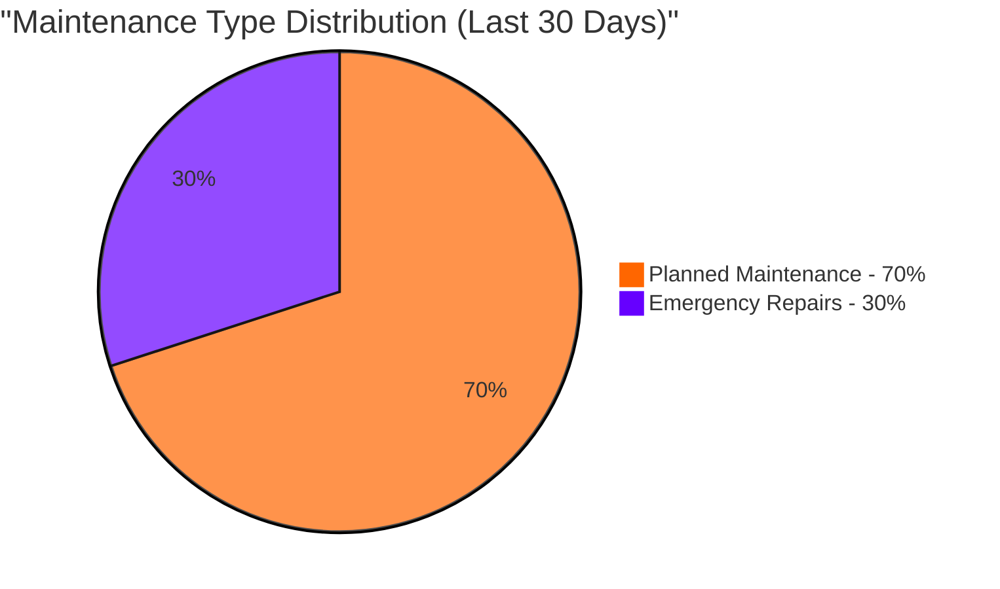

**Plot Description**: This distribution shows an unhealthy maintenance profile with 30% emergency repairs versus the industry best practice of <15%. The high emergency repair rate indicates reactive rather than proactive maintenance, leading to higher costs and unplanned downtime. This metric directly correlates with our SLA underperformance.

### Cost Trend Analysis

```mermaid
%%{init: {'theme':'base', 'themeVariables': {'primaryColor':'#ff6600'}}}%%
xychart-beta
    title "Monthly Maintenance Costs ($K)"
    x-axis ["Jan", "Feb", "Mar", "Apr", "May", "Jun", "Jul", "Aug"]
    y-axis "Cost ($K)" 0 --> 80
    bar "Emergency Repairs" [25, 35, 42, 38, 52, 28, 41, 45]
    bar "Planned Maintenance" [18, 22, 19, 24, 20, 25, 21, 22]
    bar "Target Emergency (<$30K)" [30, 30, 30, 30, 30, 30, 30, 30]
```

**Plot Description**: Monthly cost analysis reveals emergency repair expenses consistently exceed our $30K target, with a spike to $52K in May. Emergency repairs cost 2-3x more than planned maintenance due to overtime labor, expedited parts, and production losses. August's $45K emergency spending is directly attributable to our current critical pump issues.

### Fleet Performance Matrix

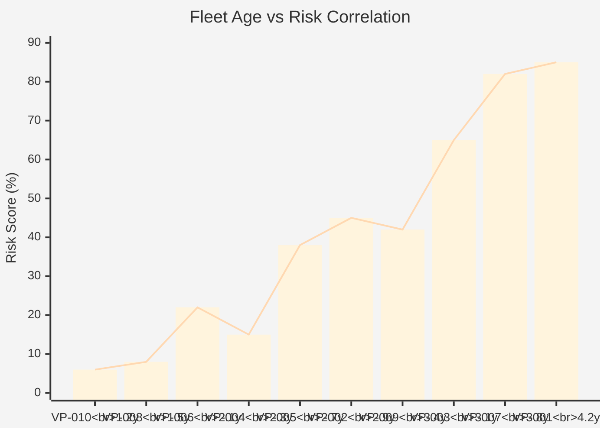

**Plot Description**: This correlation analysis shows a clear relationship between pump age and risk score, with risk accelerating after 3 years of operation. The trend line indicates pumps require more intensive monitoring and maintenance as they approach mid-life. VP-001 and VP-007, our oldest pumps, have reached critical risk levels, while newer pumps (VP-008, VP-010) maintain excellent performance.

---

## Action Plan & Resource Allocation

### Critical Path Timeline

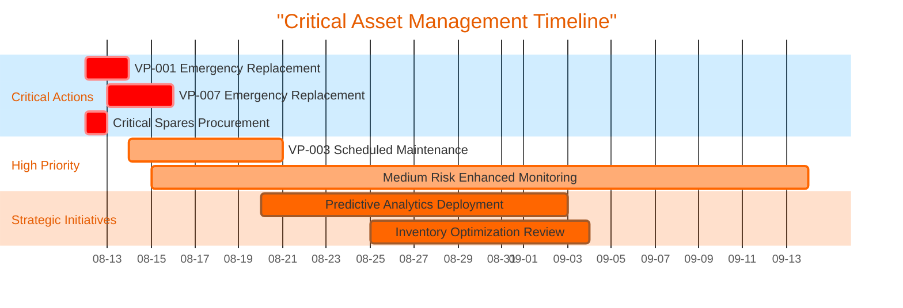

**Plot Description**: This Gantt chart shows the critical path for addressing our pump issues over the next 6 weeks. Critical replacements are scheduled immediately (red bars), followed by preventive actions (blue bars) and longer-term strategic improvements (gray bars). The timeline demonstrates overlapping activities required to restore fleet reliability while implementing proactive measures.

### Resource Requirements Summary

| Priority | Action | Timeline | Resources | Budget |
|----------|--------|----------|-----------|--------|
|  | VP-001/007 Replacement | 48-72 hours | 2 technicians, 12 hours | $45K |
|  | VP-003 Maintenance | 7 days | 1 technician, 8 hours | $12K |
|  | Enhanced Monitoring | 30 days | Remote monitoring | $5K |
|  | Predictive Analytics | 30 days | IT/Engineering team | $25K |

### Compliance & Standards Status
-  Safety standards current
-  Emissions within limits  
-  Customer agreements

---

**Report Generated**: 2025-08-12 06:30 UTC  
**Next Automated Update**: 2025-08-13 06:30 UTC  
**Emergency Contact**: Marcus Chen - +1-555-0199  
**Service Hotline**: 1-800-BUSCH-24

---
*Busch Vacuum Solutions - Advanced Process Monitoring & Predictive Maintenance*