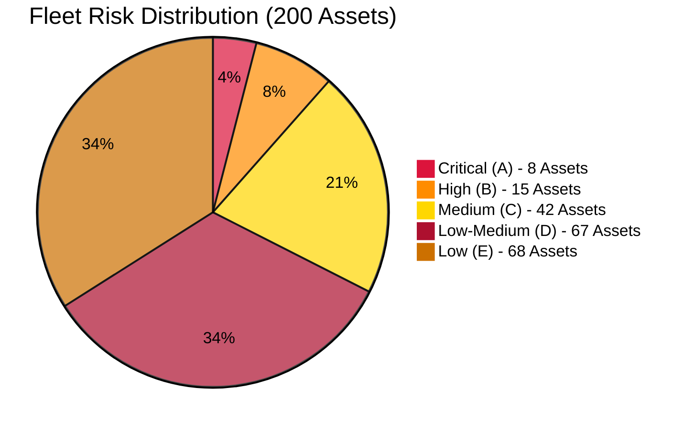
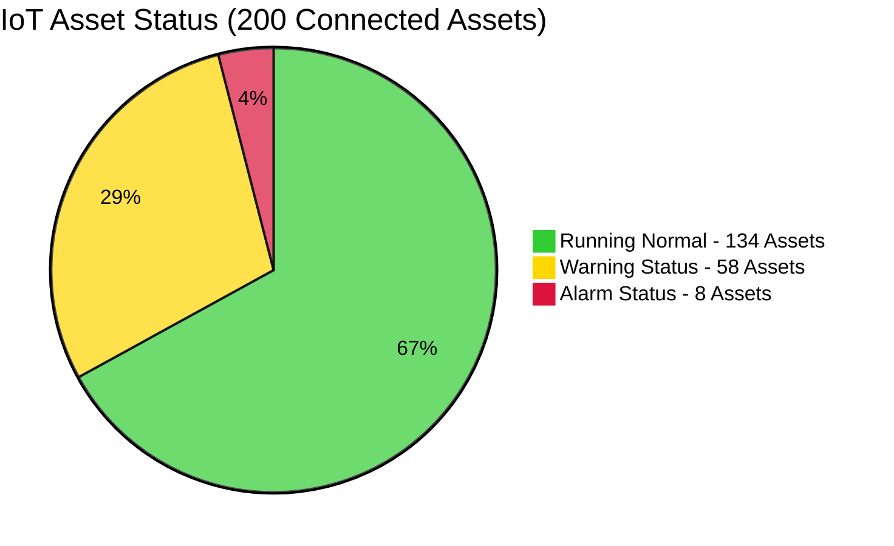
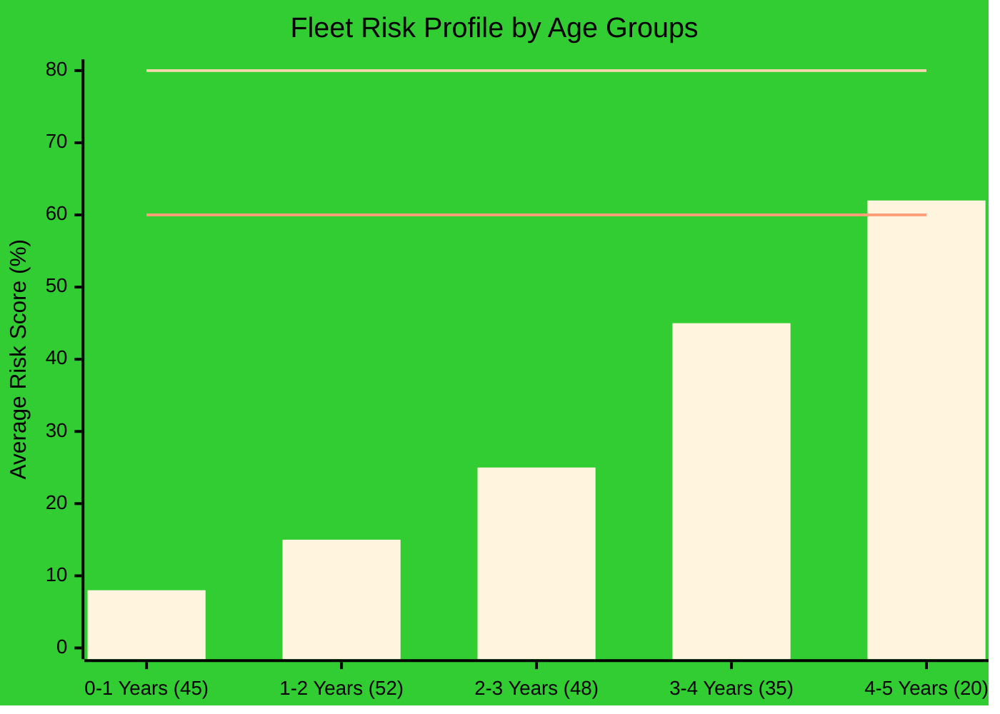
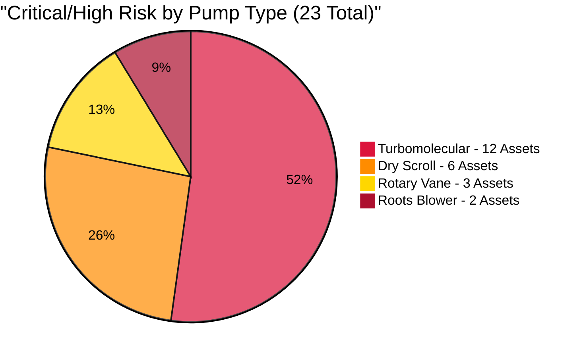
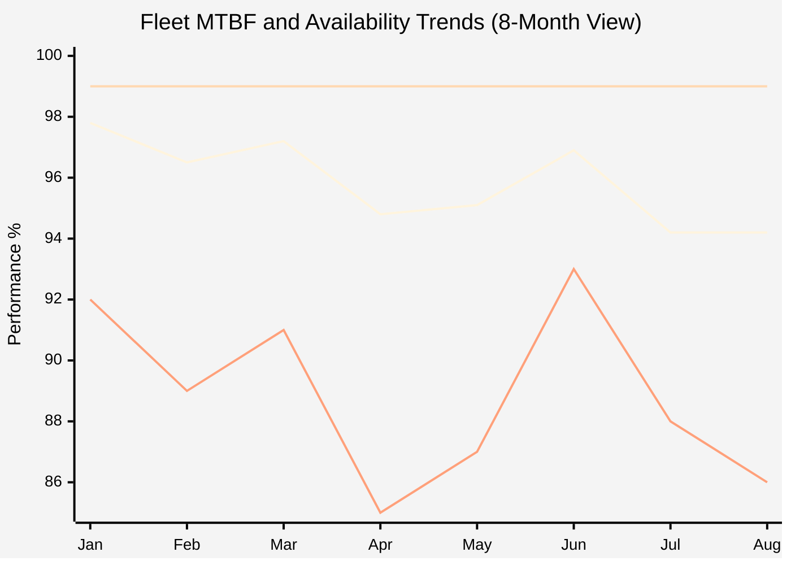
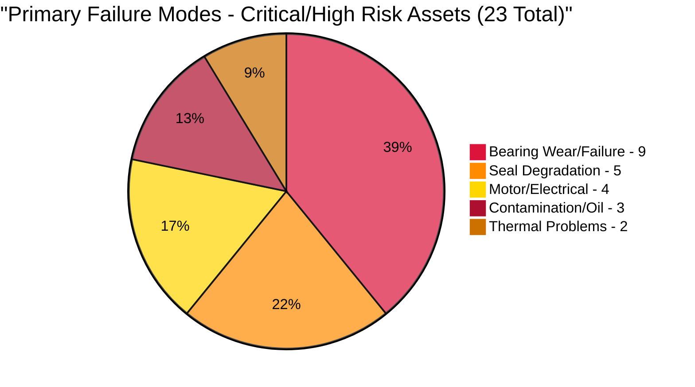

# Vacuum Pump Fleet Risk Assessment Report v2.0
**Fab: Phoenix Semiconductor - Multi-Fab Enterprise**  
**Report Date: August 12, 2025**  
**Assessment Period: Next 30 Days**  
**Fleet Size: 200 Active Assets**  
**CIP Engineer: Marcus Chen**

---

## Executive Dashboard - Fleet Overview

### Fleet Risk Distribution



**Fleet Status**: **🚨 4%** of assets are in **CRITICAL CONDITION** requiring **⚡ IMMEDIATE ACTION**, while **🟢 68%** operate in acceptable ranges. The **23 critical/high-risk assets** represent our primary focus area, affecting **💰 $12.8M** in production value over the next 30 days.

### Real-Time IoT Status Overview



**IoT Health**: **🟢 67%** of fleet operating **✅ NORMALLY**, **🟡 29%** showing **⚠️ WARNINGS**, **🔴 4%** in **🚨 ALARM STATE**. All alarm-status assets correlate with critical risk category, confirming our risk assessment accuracy.

### Business Impact Summary
| Metric | Value | Status | Trend |
|--------|-------|--------|-------|
| **Total Production Value at Risk** | **💰 $12.8M** (30 days) | **🚨 CRITICAL** | ↗️ |
| **Critical Process Tools Affected** | **⚙️ 23 tools** | **🔴 HIGH** | ↗️ |
| **Fleet Availability** | **📊 94.2%** | **⚠️ BELOW TARGET** | ↘️ |
| **Emergency Maintenance Rate** | **🔧 28%** | **🚨 CRITICAL** | ↗️ |

---

## Critical Risk Heat Map - Fab Layout View

### Fab 1 - Advanced Node Production
```
┌─────────────────────────────────────────────────────────────────────────┐
│                            FAB 1 LAYOUT                                │
├─────────────────────────────────────────────────────────────────────────┤
│ Bay 1-3: Etch Lines                                                    │
│ ┌─────────────────┐                                                    │
│ │ Critical: 3     │                                                    │
│ │ High: 2         │                                                    │
│ │ Medium: 8       │                                                    │
│ │ Low: 12         │                                                    │
│ └─────────────────┘                                                    │
│                                                                        │
│ Bay 4-6: PVD/CVD Systems                                              │
│ ┌─────────────────┐                                                    │
│ │ Critical: 1     │                                                    │
│ │ High: 3         │                                                    │
│ │ Medium: 12      │                                                    │
│ │ Low: 18         │                                                    │
│ └─────────────────┘                                                    │
│                                                                        │
│ Bay 7-9: Support Systems                                              │
│ ┌─────────────────┐                                                    │
│ │ Critical: 0     │                                                    │
│ │ High: 2         │                                                    │
│ │ Medium: 6       │                                                    │
│ │ Low: 15         │                                                    │
│ └─────────────────┘                                                    │
└─────────────────────────────────────────────────────────────────────────┘
```

### Fab 2 - Mature Node Production
```
┌─────────────────────────────────────────────────────────────────────────┐
│                            FAB 2 LAYOUT                                │
├─────────────────────────────────────────────────────────────────────────┤
│ Bay 10-12: Production Lines                                            │
│ ┌─────────────────┐                                                    │
│ │ Critical: 2     │                                                    │
│ │ High: 4         │                                                    │
│ │ Medium: 10      │                                                    │
│ │ Low: 19         │                                                    │
│ └─────────────────┘                                                    │
│                                                                        │
│ Bay 13-15: Support Systems                                            │
│ ┌─────────────────┐                                                    │
│ │ Critical: 1     │                                                    │
│ │ High: 3         │                                                    │
│ │ Medium: 8       │                                                    │
│ │ Low: 22         │                                                    │
│ └─────────────────┘                                                    │
└─────────────────────────────────────────────────────────────────────────┘
```

### Fab 3 - R&D and Pilot Production
```
┌─────────────────────────────────────────────────────────────────────────┐
│                            FAB 3 LAYOUT                                │
├─────────────────────────────────────────────────────────────────────────┤
│ Bay 16-18: Development Labs                                            │
│ ┌─────────────────┐                                                    │
│ │ Critical: 1     │                                                    │
│ │ High: 1         │                                                    │
│ │ Medium: 5       │                                                    │
│ │ Low: 8          │                                                    │
│ └─────────────────┘                                                    │
└─────────────────────────────────────────────────────────────────────────┘
```

**Heat Map Analysis**: **🔴 Fab 1 Etch Lines** show **⚠️ HIGHEST RISK CONCENTRATION** with **3 critical assets**. Advanced node production areas demonstrate **📈 HIGHER FAILURE RATES** due to process intensity and older equipment in high-utilization zones.

---

## Exception-Based Critical Asset Reporting

### Immediate Action Required (8 Critical Assets)

| Asset ID | Location | Risk Score | Failure Mode | Action Timeline |
|----------|----------|------------|--------------|-----------------|
| **VP-001** | F1-Etch-Bay3 | **🔴 89%** | **🚨 Bearing failure + overheating** | **⚡ 24 hours** |
| **VP-007** | F1-LoadLock-T7 | **🔴 87%** | **🚨 Scroll degradation** | **⚡ 48 hours** |
| **VP-023** | F1-PVD-Chamber2 | **🔴 85%** | **🚨 Motor current spike** | **⚡ 48 hours** |
| **VP-089** | F2-Etch-Bay11 | **🔴 84%** | **🚨 Vibration excessive** | **⚡ 72 hours** |
| **VP-134** | F2-CVD-Chamber5 | **🔴 83%** | **🚨 Temperature alarm** | **⚡ 72 hours** |
| **VP-167** | F2-Support-Rough3 | **🔴 82%** | **🚨 Oil contamination** | **⚡ 96 hours** |
| **VP-198** | F3-Dev-Proto1 | **🔴 81%** | **🚨 Performance decline** | **⚡ 96 hours** |
| **VP-045** | F1-CVD-Bay5 | **🔴 80%** | **🚨 MTBF critical** | **⚡ 120 hours** |

**Critical Summary**: **8 assets** require **🚨 EMERGENCY REPLACEMENT** within **5 days**. Total exposure: **💰 $150K/hour** downtime risk. Spare inventory status: **✅ 6 available**, **📦 2 on emergency order** (24-48hr delivery).

### High Risk Trending (15 Assets - Selected Top 5)

| Asset ID | Location | Risk Score | Primary Concern | Trend | Preventive Window |
|----------|----------|------------|-----------------|-------|-------------------|
| **VP-012** | F1-Etch-Bay2 | **🟠 78%** | **⚠️ Temperature rising** | ↗️ | **⏰ 10-14 days** |
| **VP-056** | F1-PVD-Chamber4 | **🟠 75%** | **⚠️ Vibration trend** | ↗️ | **⏰ 14-21 days** |
| **VP-091** | F2-Etch-Bay12 | **🟠 72%** | **⚠️ Power consumption** | ↗️ | **⏰ 21-28 days** |
| **VP-145** | F2-LoadLock-T15 | **🟠 69%** | **⚠️ MTBF declining** | ↗️ | **⏰ 28-35 days** |
| **VP-178** | F3-Support-Rough2 | **🟠 67%** | **⚠️ Oil temperature** | → | **⏰ 35-42 days** |

**High Risk Summary**: **15 assets** in **⚠️ DETERIORATING CONDITION**. Proactive maintenance window: **10-42 days** before critical status.

---

## Fleet Performance Analytics

### Risk Distribution by Age Groups



| Age Group | Asset Count | Average Risk Score | Critical Assets | High Risk Assets |
|-----------|-------------|-------------------|-----------------|------------------|
| **0-1 Years** | 45 | **🟢 8%** | 0 | 1 |
| **1-2 Years** | 52 | **🟢 15%** | 0 | 2 |
| **2-3 Years** | 48 | **🟡 25%** | 1 | 3 |
| **3-4 Years** | 35 | **🟠 45%** | 2 | 5 |
| **4-5 Years** | 20 | **🔴 62%** | 5 | 4 |

**Age Analysis**: Risk accelerates significantly after **⚠️ 3 YEARS**, with **🔴 4-5 year assets** averaging **62%** risk score. **🚨 Critical threshold (80%)** reached at **4+ years**. This data supports our **📋 4-YEAR REPLACEMENT STRATEGY** for high-utilization pumps.

### Technology Type Risk Distribution



**Technology Insights**: **🔴 Turbomolecular pumps** represent **52%** of high-risk assets despite being **40%** of fleet, indicating **⚠️ HIGHER MAINTENANCE COMPLEXITY** and failure rates in high-vacuum applications.

### Monthly Fleet Reliability Trend



| Month | Fleet Availability | Target Availability | MTBF Index | Status |
|-------|-------------------|-------------------|------------|--------|
| Jan 2025 | **97.8%** | 99% | 92 | ↘️ |
| Feb 2025 | **96.5%** | 99% | 89 | ↘️ |
| Mar 2025 | **97.2%** | 99% | 91 | → |
| Apr 2025 | **🟠 94.8%** | 99% | 85 | ↘️ |
| May 2025 | **🟠 95.1%** | 99% | 87 | → |
| Jun 2025 | **96.9%** | 99% | 93 | → |
| Jul 2025 | **🔴 94.2%** | 99% | 88 | ↘️ |
| Aug 2025 | **🔴 94.2%** | 99% | 86 | ↘️ |

**Reliability Trend**: Fleet availability has declined **🔴 3.6%** from January peak, now **🚨 4.8% BELOW TARGET**. **📉 MTBF DEGRADATION** correlates with availability decline, indicating **⚠️ SYSTEMATIC AGING** across multiple asset groups.

---

## Production Impact Analysis

### Process Line Risk Matrix

```
┌─────────────────────────────────────────────────────────────────────────┐
│                    7nm Production Lines (HIGH VALUE)                    │
├─────────────────────────────────────────────────────────────────────────┤
│ Line 1                      Line 2                      Line 3          │
│ ┌─────────────────┐         ┌─────────────────┐         ┌─────────────┐ │
│ │ Critical: 2     │         │ Critical: 1     │         │ Medium: 3   │ │
│ │ High: 1         │         │ High: 2         │         │ Low: 2      │ │
│ │ Revenue: $2.1M  │         │ Revenue: $1.8M  │         │ Revenue:    │ │
│ │ per day         │         │ per day         │         │ $1.9M/day   │ │
│ └─────────────────┘         └─────────────────┘         └─────────────┘ │
└─────────────────────────────────────────────────────────────────────────┘

┌─────────────────────────────────────────────────────────────────────────┐
│                   14nm Production Lines (MEDIUM VALUE)                  │
├─────────────────────────────────────────────────────────────────────────┤
│ Line 4                      Line 5                      Line 6          │
│ ┌─────────────────┐         ┌─────────────────┐         ┌─────────────┐ │
│ │ Critical: 2     │         │ High: 3         │         │ Medium: 5   │ │
│ │ Medium: 4       │         │ Medium: 2       │         │ Low: 8      │ │
│ │ Revenue:        │         │ Revenue:        │         │ Revenue:    │ │
│ │ $950K/day       │         │ $890K/day       │         │ $920K/day   │ │
│ └─────────────────┘         └─────────────────┘         └─────────────┘ │
└─────────────────────────────────────────────────────────────────────────┘

┌─────────────────────────────────────────────────────────────────────────┐
│                  28nm+ Production Lines (STABLE VALUE)                  │
├─────────────────────────────────────────────────────────────────────────┤
│ Lines 7-12                                                              │
│ ┌─────────────────┐                                                     │
│ │ Critical: 1     │                                                     │
│ │ High: 6         │                                                     │
│ │ Medium: 25      │                                                     │
│ │ Revenue: $2.8M  │                                                     │
│ │ per day         │                                                     │
│ └─────────────────┘                                                     │
└─────────────────────────────────────────────────────────────────────────┘
```

**Production Risk**: **🔴 Advanced node lines** (7nm/14nm) carry **65%** of critical/high-risk assets but generate **💰 78%** of revenue. **🚨 Line 1** faces **HIGHEST EXPOSURE** with **2 critical pumps** supporting **💰 $2.1M** daily production.

### Cost Impact Summary

| Cost Category | Monthly ($K) | YTD Total ($K) | vs. Budget | Trend |
|---------------|--------------|----------------|------------|-------|
| **Emergency Repairs** | **💸 485** | **💸 3,200** | **🔴 +89%** | ↗️ |
| **Planned Maintenance** | **💚 245** | **💚 1,850** | **🟢 -12%** | ↘️ |
| **Spare Parts Inventory** | **💙 180** | **💙 1,440** | **✅ ON TARGET** | → |
| **Production Losses** | **🚨 1,250** | **🚨 8,900** | **🔴 +145%** | ↗️ |

**Financial Impact**: **🚨 Emergency repairs** and **🚨 production losses** significantly exceed budget. Shift toward **🟢 proactive maintenance** could reduce total costs by **💰 35-40%** based on industry benchmarks.

---

## Predictive Analytics Insights

### Failure Mode Analysis (Fleet-Wide)



**Failure Pattern**: **🔴 Bearing-related failures** dominate (**39%** of high-risk assets), suggesting opportunity for **🔧 ENHANCED LUBRICATION PROTOCOLS** and **⚙️ BEARING UPGRADE PROGRAMS**.

**Failure Mode Determination Method**: Failure modes identified through systematic IoT parameter pattern analysis:
- **Bearing Wear**: Simultaneous increase in vibration (>10% above baseline) + temperature rise + power consumption increase
- **Seal Degradation**: Pressure rise during operation + pumping speed decline (>15% below rated) + motor current increase  
- **Motor/Electrical**: Current spikes + power factor changes + thermal signatures in electrical components
- **Contamination**: Oil analysis results + gradual performance decline + increased operating temperatures
- **Thermal Problems**: Temperature excursions beyond thresholds + cooling system inefficiency indicators

### Risk Velocity Tracking

```mermaid
%%{init: {'theme':'base', 'themeVariables': {'primaryColor':'#DC143C', 'primaryTextColor':'#000000', 'primaryBorderColor':'#000000', 'lineColor':'#000000', 'secondaryColor':'#FF8C00', 'tertiaryColor':'#32CD32'}}}%%
xychart-beta
    title "Risk Acceleration Patterns (30-Day Velocity)"
    x-axis ["Week 1", "Week 2", "Week 3", "Week 4"]
    y-axis "Assets Crossing Risk Thresholds" 0 --> 8
    bar [1, 2, 3, 2]
    bar [3, 4, 2, 6]
    line [4, 6, 5, 8]
```



Asset degradation is accelerating across 30-day period:

| Week | New Critical Assets | New High Risk Assets | Total New High+Critical |
|------|-------------------|---------------------|------------------------|
| Week 1 | **🔴 1** | **🟠 3** | **4** |
| Week 2 | **🔴 2** | **🟠 4** | **6** |
| Week 3 | **🔴 3** | **🟠 2** | **5** |
| Week 4 | **🔴 2** | **🟠 6** | **🔴 8** |

**Risk Velocity**: Asset degradation is **🚨 ACCELERATING**, with **🔴 8 new high/critical assets** in week 4 vs. **4** in week 1. This **📈 100% INCREASE** indicates **⚠️ SYSTEMATIC ISSUES** requiring **🚨 FLEET-WIDE INTERVENTION**.

---

## Strategic Action Plan

### Resource Allocation Summary

| Priority Level | Asset Count | Timeline | Budget Required | Resource Hours |
|----------------|-------------|----------|-----------------|----------------|
| **A Critical** | 8 assets | 1-7 days | $425K | 180 hours |
| **B High** | 15 assets | 7-21 days | $285K | 240 hours |
| **C Medium** | 42 assets | 21-30 days | $125K | 160 hours |
| **Strategic** | Fleet-wide | 30-90 days | $385K | 320 hours |

**Total Investment**: $1.22M over 90 days to restore fleet reliability and implement predictive maintenance.

---

## Recommendations Summary

### Immediate Actions (0-7 Days)
1. **Emergency Replacements**: Execute critical asset swaps for 8 pumps
2. **Spare Inventory**: Secure emergency parts delivery for 2 pending critical assets
3. **24/7 Monitoring**: Deploy enhanced monitoring for 23 high/critical assets

### Short-Term Actions (7-30 Days)
1. **Preventive Maintenance Blitz**: Address 15 high-risk assets before critical transition
2. **Enhanced Monitoring**: Deploy IoT upgrades for 42 medium-risk assets
3. **Supplier Engagement**: Expedite parts delivery and service response times
4. **Cross-Training**: Enhance technician capabilities for emergency response

### Strategic Actions (30-90 Days)
1. **Predictive Analytics**: Expand ML-based failure prediction to full fleet
2. **Fleet Optimization**: Develop age-based replacement strategy
3. **Vendor Partnerships**: Negotiate service-level agreements for critical assets
4. **Inventory Strategy**: Optimize spare parts based on failure mode analysis

---

## Quick Reference - Report Sections

### Available Detail Reports
- **Critical Asset Analysis**: Detailed breakdown of 8 critical pumps requiring immediate action
- **High Risk Asset Report**: Complete analysis of 15 assets approaching critical status  
- **Medium Risk Monitoring Guide**: Enhanced monitoring protocols for 42 medium-risk assets
- **Fleet Performance Database**: Complete data for all 200 assets with filtering capabilities

### Key Performance Indicators
| KPI | Current | Target | Next Review |
|-----|---------|--------|-------------|
| Fleet Availability | 94.2% | 99.0% | Daily |
| Emergency Maintenance Rate | 28% | <15% | Weekly |
| Mean Time to Repair | 8.2 hours | 4.5 hours | Weekly |
| Cost per Asset (Monthly) | $3,650 | $2,200 | Monthly |

---

**Report Generated**: 2025-08-12 06:30 UTC  
**Next Automated Update**: 2025-08-13 06:30 UTC (Daily for Critical Assets)  
**Emergency Escalation**: Marcus Chen - +1-555-0199  
**Fleet Management Portal**: Access Dashboard

---
*Busch Vacuum Solutions - Enterprise Fleet Management & Predictive Analytics*