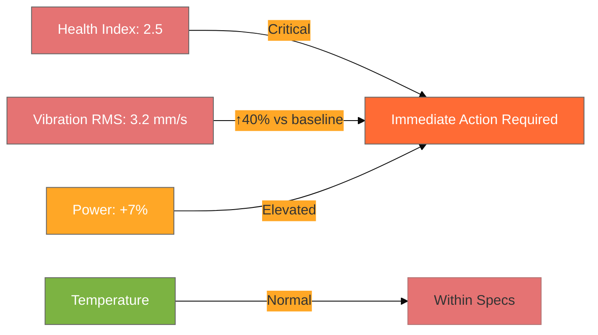

# ARGOS Health Alarm Report
**Report ID: AR-P-0107-001**  
**Asset: Pump #P-0107**  
**Chamber: CVD105 (AMAT - Centura - Chamber A)**  
**CIP Engineer: Marcus Chen**  
**Report Date: October 21, 2025**  
**Alarm ID: AL-2025-0812-045**

---

## Executive Summary

**Alarm Type**: Health Alarm - Abnormal vibration levels detected on pump #P-0107. Trend analysis shows gradual increase in RMS vibration on the front bearing over the last 2 weeks, indicating potential bearing degradation.

### Alarm Status Overview

| Parameter | Value | Status |
|-----------|-------|--------|
| **Alarm Raised** | October 20, 2025 14:26 | 🔴 Active |
| **Detection Method** | ARGOS Telemetry Monitoring | Automated |
| **Risk Score** |  | Critical |
| **Health Index** | 0.8 | ⚠️ Degraded |
| **Current Runtime** | 18,450 h (93% of target) | High Utilization |
| **Status** | Service action recommended | Awaiting Validation |

---

## Data Analysis Dashboard

### Key Performance Indicators

### Telemetry Analysis

| Metric | Current Value | Baseline | Deviation | Status |
|--------|---------------|----------|-----------|--------|
| **Health Index** | 2.5 | < 1.0 | +150% | 🔴 Critical |
| **Vibration RMS** | 3.2 mm/s | 2.3 mm/s | +40% | 🔴 Critical |
| **Power Consumption** | +7% | Baseline | +7% | 🟠 Elevated |
| **Temperature** | Normal | Normal | 0% | 🟢 Normal |

### Trend Visualization

**Vibration Trend (Last 14 Days)**:
- Week 1: Gradual increase from 2.4 mm/s to 2.8 mm/s
- Week 2: Accelerated increase from 2.8 mm/s to 3.2 mm/s (current)
- Projection: Continued degradation expected without intervention

**Contributing Factors**:
- RMS vibration (primary indicator)
- Power consumption increase
- High runtime utilization (93% of target lifetime)

---

## Root Cause Analysis

### Historical Context

Past incidents on this pump model indicate that rising vibration is often associated with:
1. **Bearing wear** - Most common failure mode (60% of cases)
2. **Exhaust restriction** - Secondary cause (30% of cases)
3. **Mechanical misalignment** - Less common (10% of cases)

### Risk Assessment

**Failure Probability**: High (86% risk score)

**Consequences of Continued Operation**:
- Increased risk of bearing seizure
- Potential catastrophic failure
- Unplanned downtime impact on production
- Secondary damage to connected equipment

**Time to Failure Estimate**: 7-14 days of continued operation at current degradation rate

---

## Recommendations

### Immediate Action Required (0-7 Days)

**Primary Recommendation**: Schedule pump removal for preventive bearing inspection and replacement

| Action Item | Details | Priority |
|-------------|---------|----------|
| **Action** | Pump Removal & Inspection | 🔴 Critical |
| **Target Date** | October 28, 2025 | 7 days from report |
| **Estimated Downtime** | 4-6 hours | Standard procedure |
| **Parts Required** | Front bearing assembly, seals | Pre-order recommended |
| **Labor** | 2 technicians | Coordinate scheduling |

### Alternative Actions (If Immediate Removal Not Feasible)

1. **Increase Monitoring Frequency**: Daily telemetry review instead of weekly
2. **Reduce Process Load**: Lower chamber utilization to reduce pump stress
3. **Emergency Spares**: Position backup pump for hot-swap if failure occurs

---

## Customer Validation Required

**Awaiting Customer Decision**:

- [ ] **Approve Recommendation** - Proceed with scheduled pump removal on October 28, 2025
- [ ] **Decline Recommendation** - Continue operation with enhanced monitoring (not recommended)

**Customer Comments**:

---

**Next Steps Upon Approval**:
1. Coordinate production schedule for chamber downtime
2. Order replacement parts (2-day lead time)
3. Schedule maintenance crew
4. Prepare backup pump if available
5. Update CMMS with work order

---

## Key Performance Impact

| KPI | Before Action | After Action | Expected Improvement |
|-----|---------------|--------------|---------------------|
| Risk Score | 86% | < 20% | 66% reduction |
| Health Index | 2.5 | < 0.5 | Normal operation |
| Unplanned Downtime Risk | High | Low | Mitigated |
| Equipment Availability | At Risk | Restored | Protected |

---

**Report Generated**: 2025-10-21 09:00 UTC  
**Alarm Status**: 🔴 Active - Awaiting Customer Validation  
**Emergency Contact**: Marcus Chen - +1-555-0199  
**Next Review**: Daily until resolved  

---

**Document Control**  
Version: 1.0 | Status: Pending Approval | Classification: Internal Use