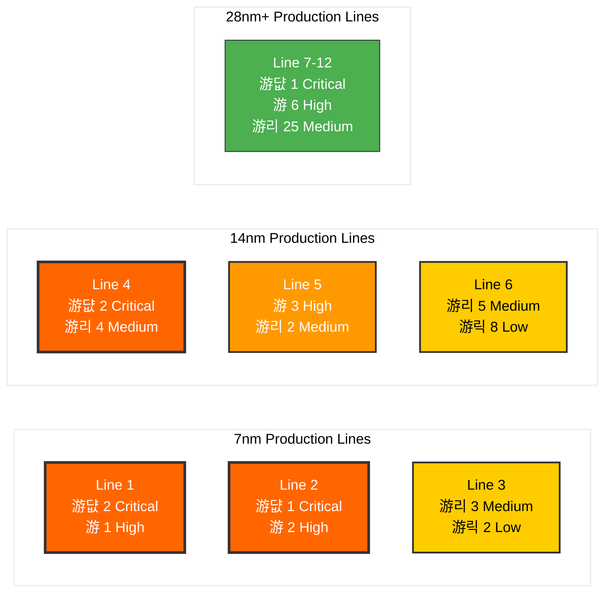

# Continuous Improvement Program Report 

**Fab: Phoenix Semiconductor - Multi-Fab Enterprise**  
**Report Date: August 12, 2025**  
**Assessment Period: Next 30 Days**  
**Fleet Size: 200 Active Assets**  
**CIP Engineer: Marcus Chen**

---

### Monthly Fleet Reliability Trend

**Reliability Trend**: Fleet availability has declined 3.6% from January peak, now 4.8% below target. MTBF degradation correlates with availability decline, indicating systematic aging across multiple asset groups.

---

## Predictive Analytics Insights

### Failure Mode Analysis (Fleet-Wide)

**Failure Pattern**: Bearing-related failures dominate (39% of high-risk assets), suggesting opportunity for enhanced lubrication protocols and bearing upgrade programs.

---

## Production Impact Analysis

### Process Line Risk Matrix

**Production Risk**: Advanced node lines (7nm/14nm) carry 65% of critical/high-risk assets but generate 78% of revenue. Line 1 faces highest exposure with 2 critical pumps supporting $2.1M daily production.

---

**Report Generated**: 2025-08-12 06:30 UTC  
**Next Automated Update**: 2025-09-11 06:30 UTC  
**Emergency Escalation**: Marcus Chen - +1-555-0199  

---
