# Monthly Risk Assessment Report
**Fab: Phoenix Semiconductor - Multi-Fab Enterprise**  
**Report Date: August 12, 2025**  
**Assessment Period: Next 30 Days**  
**Fleet Size: 200 Active Assets**  
**CIP Engineer: Marcus Chen**

---

## Executive Dashboard - Fleet Overview

### Fleet Risk Distribution

**Fleet Status**: 2 assets (1%) are in critical condition requiring immediate action, while 183 assets (91.5%) operate in acceptable ranges (low-medium). The 17 critical/high-risk assets represent our primary focus area.

### Real-Time IoT Status Overview

**IoT Health**: 140 assets (70%) of fleet operating normally, 85 assets (29%) showing warnings, 2 assets (1%) in alarm state. All alarm-status assets correlate with critical risk category, confirming our risk assessment accuracy.

## Critical Risk Heat Map - Fab Layout View

```mermaid
%%{init: {'theme':'base', 'themeVariables': {'primaryColor':'#fff', 'secondaryColor':'#000'}}}%%
graph TB
    subgraph "Fab 3"
        direction TB
        spacer["<br/><br/>"]:::invisible
            subgraph "Bay 16-18: Development"
                F3B1["🔴 1 Critical<br/>🟠 1 High<br/>🟡 5 Medium"]
            end
    end
    
    subgraph "Fab 2"
        direction TB
        spacer["<br/><br/>"]:::invisible
            subgraph "Bay 13-15: Support"
                F2B2["🔴 1 Critical<br/>🟠 3 High<br/>🟡 8 Medium"]
            end
            subgraph "Bay 10-12: Production"
                F2B1["🔴 1 Critical<br/>🟠 4 High<br/>🟡 10 Medium"]
            end
    end
    
    subgraph "Fab 1"
        direction TB
        spacer["<br/><br/>"]:::invisible
            subgraph "Bay 7-9: Support" 
                F1B3["🟠 2 High<br/>🟡 6 Medium<br/>🟢 17 Low"]
            end
            subgraph "Bay 4-6: PVD/CVD"
                F1B2["🔴 1 Critical<br/>🟠 3 High<br/>🟡 12 Medium"]
            end
            subgraph "Bay 1-3: Etch Lines" 
                F1B1["🔴 2 Critical<br/>🟠 2 High<br/>🟡 8 Medium"]
            end
    end

    classDef invisible fill:none,stroke:none,stroke-width:0px
    classDef critical fill:#ff6600,stroke:#333,stroke-width:3px,color:#fff
    classDef high fill:#ff9900,stroke:#333,stroke-width:2px,color:#fff
    classDef medium fill:#ffcc00,stroke:#333,stroke-width:2px,color:#000
    classDef lowrisk fill:#4CAF50,stroke:#333,stroke-width:1px,color:#fff
    

    
    class F1B1,F2B1 critical
    class F1B2,F2B2,F3B1 high
    class F1B3 lowrisk
```

**Heat Map Analysis**: Fab 1 Etch Lines show highest risk concentration with 3 critical assets. Advanced node production areas demonstrate higher failure rates due to process intensity and older equipment in high-utilization zones.

---

## Exception-Based Critical Asset Reporting

### Immediate Action Required (2 Critical Assets)

| Asset ID | Location | Risk Score | Associated Report | Status |
|----------|----------|------------|-----------------|-----------------|
| **P-107** | CVD105 |  | AR-P-107-001 | Waiting for customer validation | 
| **P-009** | ETC234 |  | AR-P-009-004 | Service action scheduled on 01/11/2025 |

**Critical Summary**: 2 assets require emergency action. 

### High Risk Trending (15 Assets - Selected Top 5)

| Asset ID | Location | Risk Score | Primary Concern | Trend | Preventive Window |
|----------|----------|------------|-----------------|-------|-------------------|
| **VP-012** | F1-Etch-Bay2 |  | Temperature rising | ↗️ +12% (7d) | 10-14 days |
| **VP-056** | F1-PVD-Chamber4 |  | Vibration trend | ↗️ +8% (14d) | 14-21 days |
| **VP-091** | F2-Etch-Bay12 |  | Power consumption | ↗️ +15% (21d) | 21-28 days |
| **VP-145** | F2-LoadLock-T15 |  | MTBF declining | ↗️ +6% (30d) | 28-35 days |
| **VP-178** | F3-Support-Rough2 |  | Oil temperature | ↗️ +5% (14d) | 35-42 days |

**High Risk Summary**: 15 assets in deteriorating condition. Proactive maintenance window: 10-42 days before critical status. [View All 15 Assets →](#detailed-high-risk)

---

## Service Cost Savings Analysis Through Predictive Monitoring

### Executive Summary - Financial Impact

**Total Annual Cost Avoidance Potential: $847,500**
- **Preventive vs. Emergency Maintenance**: $485,200 saved annually
- **Production Downtime Reduction**: $285,600 avoided costs
- **Extended Asset Lifecycle**: $76,700 in depreciation benefits

### Detailed Cost Analysis by Intervention Category

#### 1. Emergency vs. Preventive Maintenance Cost Comparison

| Maintenance Type | Average Cost | Current Frequency (Annual) | Monitoring-Enabled Frequency | Annual Savings |
|------------------|--------------|---------------------------|------------------------------|----------------|
| **Emergency Repair** | $8,500 | 56 incidents | 22 incidents | $289,000 |
| **Unscheduled Maintenance** | $3,200 | 84 incidents | 35 incidents | $156,800 |
| **Critical Component Replacement** | $12,750 | 18 incidents | 7 incidents | $140,250 |
| **After-Hours Service Calls** | $5,800 | 32 calls | 8 calls | $139,200 |
| **Rush Parts Delivery** | $1,850 | 45 shipments | 12 shipments | $61,050 |
| **Expedited Technician Deployment** | $2,100 | 28 deployments | 8 deployments | $42,000 |
| **Production Line Shutdown Events** | $25,000 | 8 events | 2 events | $150,000 |

**Subtotal - Direct Service Cost Reduction: $978,300**

#### 2. Monitoring-Enabled Proactive Actions (Current Period)

| Asset Category | Action Type | Cost Avoidance | Assets Impacted |
|----------------|-------------|----------------|-----------------|
| **Critical Assets (2)** | Emergency replacement prevention | $34,000 | VP-001, VP-007 |
| **High Risk Assets (15)** | Scheduled maintenance optimization | $127,500 | All 15 high-risk assets |
| **Medium Risk Assets (42)** | Component replacement timing | $84,000 | 42 assets under enhanced monitoring |
| **Fleet-wide IoT Monitoring** | Early fault detection | $156,200 | 200 connected assets |

**Current Period Cost Avoidance: $401,700**

#### 3. Production Impact Cost Savings

**Production Downtime Analysis**:
- **Baseline Downtime Cost** (without monitoring): $85,000/month
- **Current Downtime Cost** (with monitoring): $40,000/month
- **Monthly Savings**: $45,000
- **Annual Production Impact Savings**: $540,000

#### 4. Asset Lifecycle Extension Benefits

| Monitoring Benefit | Financial Impact | Calculation Basis |
|--------------------|------------------|-------------------|
| **Extended Mean Time Between Failures** | +18 months average | $2,850 per asset annually |
| **Reduced Catastrophic Failures** | 78% reduction | $15,400 per incident avoided |
| **Optimized Replacement Timing** | 15% cost reduction | $225 per asset annually |
| **Improved Spare Parts Management** | 22% inventory reduction | $1,280 per asset annually |

**Annual Fleet Lifecycle Savings**: $180,000

### ROI Analysis - Monitoring Investment vs. Savings

#### Investment Costs
- **IoT Sensor Deployment**: $125,000 (one-time)
- **Analytics Platform License**: $48,000/year
- **Enhanced Monitoring Personnel**: $85,000/year
- **Training and Implementation**: $22,000 (one-time)

**Total Annual Investment**: $133,000

#### Return Calculation
- **Annual Cost Savings**: $847,500
- **Annual Investment**: $133,000
- **Net Annual Benefit**: $714,500
- **ROI**: 537%
- **Payback Period**: 1.9 months

### Cost Savings Breakdown by Asset Risk Category

### Monthly Cost Tracking Dashboard

| Month | Emergency Costs Avoided | Preventive Savings | Production Impact | Total Monthly Savings |
|-------|-------------------------|--------------------|--------------------|----------------------|
| **Aug 2025** | $42,500 | $18,200 | $45,000 | $105,700 |
| **Jul 2025** | $38,900 | $22,100 | $41,000 | $102,000 |
| **Jun 2025** | $35,200 | $19,800 | $38,000 | $93,000 |
| **Q2 2025 Average** | $37,800 | $21,200 | $38,500 | $97,500 |

### Recommended Cost Optimization Actions

#### Immediate (0-30 Days)
1. **Accelerate Critical Asset Interventions**: Target $34,000 immediate cost avoidance
2. **Optimize High-Risk Maintenance Scheduling**: Reduce emergency service calls by 60%
3. **Implement Enhanced Monitoring Protocols**: Deploy to 42 medium-risk assets

#### Short-Term (30-90 Days)
1. **Expand Predictive Analytics**: Cover additional failure modes for $125K annual savings
2. **Vendor Cost Negotiations**: Leverage monitoring data for 15% service cost reduction
3. **Spare Parts Optimization**: Reduce inventory costs by $45K annually

#### Strategic (90+ Days)
1. **Fleet Modernization Planning**: Use monitoring data to optimize replacement cycles
2. **Advanced Analytics Implementation**: Deploy ML models for $200K additional annual savings
3. **Cross-Site Monitoring Integration**: Scale cost benefits across all facilities

---

## Recommendations Summary

### Immediate Actions (0-7 Days)
1. **Emergency Replacements**: Execute critical asset swaps for 8 pumps
2. **Spare Inventory**: Secure emergency parts delivery for 2 pending critical assets
3. **Production Coordination**: Implement contingency production routing
4. **24/7 Monitoring**: Deploy enhanced monitoring for 23 high/critical assets

### Short-Term Actions (7-30 Days)
1. **Preventive Maintenance Blitz**: Address 15 high-risk assets before critical transition
2. **Enhanced Monitoring**: Deploy IoT upgrades for 42 medium-risk assets
3. **Supplier Engagement**: Expedite parts delivery and service response times
4. **Cross-Training**: Enhance technician capabilities for emergency response

### Strategic Actions (30-90 Days)
1. **Predictive Analytics**: Expand ML-based failure prediction to full fleet
2. **Fleet Optimization**: Develop age-based replacement strategy
3. **Vendor Partnerships**: Negotiate service-level agreements for critical assets
4. **Inventory Strategy**: Optimize spare parts based on failure mode analysis

---

### Key Performance Indicators
| KPI | Current | Target | Next Review |
|-----|---------|--------|-------------|
| Fleet Availability | 94.2% | 99.0% | Daily |
| Emergency Maintenance Rate | 28% | <15% | Weekly |
| Mean Time to Repair | 8.2 hours | 4.5 hours | Weekly |
| Cost per Asset (Monthly) | $3,650 | $2,200 | Monthly |
| **Cost Savings Rate** | **$70.6K/month** | **$85K/month** | **Monthly** |
| **ROI on Monitoring** | **537%** | **400%** | **Quarterly** |

---

**Report Generated**: 2025-08-12 06:30 UTC  
**Next Automated Update**: 2025-08-13 06:30 UTC (Daily for Critical Assets)  
**Emergency Escalation**: Marcus Chen - +1-555-0199  

---
