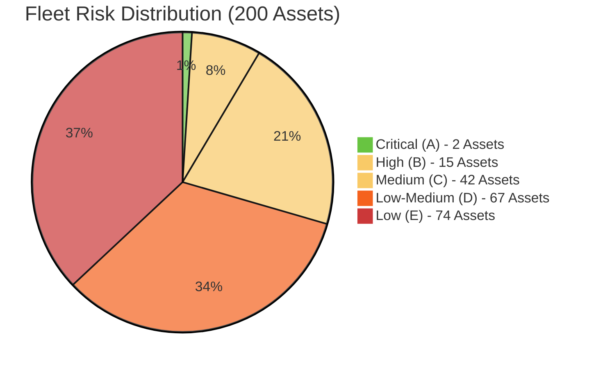
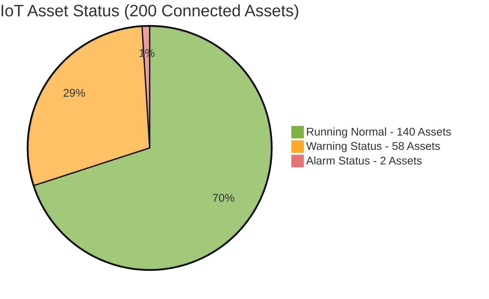
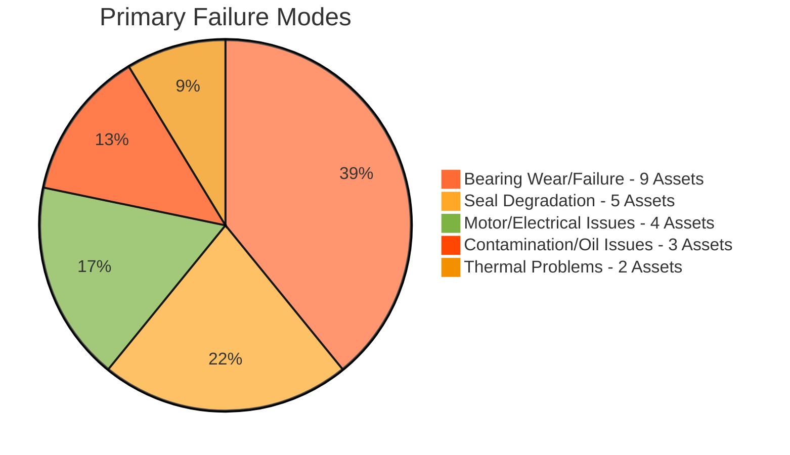

# Monthly Risk Assessment Report
**Fab: Phoenix Semiconductor - Multi-Fab Enterprise**  
**Report Date: October 12, 2025**  
**Assessment Period: Next 30 Days**  
**Fleet Size: 200 Active Assets**  
**CIP Engineer: Marcus Chen**

---

## Executive Dashboard - Fleet Overview

### Fleet Risk Distribution

**Fleet Status**: 2 assets (1%) are in critical condition requiring immediate action, while 183 assets (91.5%) operate in acceptable ranges (low-medium). The 17 critical/high-risk assets represent our primary focus area.

### Real-Time IoT Status Overview

**IoT Health**: 140 assets (70%) of fleet operating normally, 58 assets (29%) showing warnings, 2 assets (1%) in alarm state. All alarm-status assets correlate with critical risk category, confirming our risk assessment accuracy.

## Critical Risk Heat Map - Fab Layout View

```mermaid
%%{init: {'theme':'base', 'themeVariables': {'primaryColor':'#fff', 'secondaryColor':'#000', 'tertiaryColor':'#f5f5f5'}}}%%
graph TB
    subgraph "Fab 3"
        direction TB
        spacer3["<br/><br/>"]:::invisible
            subgraph "Bay 16-18: Development"
                F3B1["🔴 1 Critical<br/>🟠 1 High<br/>🟡 5 Medium"]
            end
    end
    
    subgraph "Fab 2"
        direction TB
        spacer2["<br/><br/>"]:::invisible
            subgraph "Bay 13-15: Support"
                F2B2["🔴 1 Critical<br/>🟠 3 High<br/>🟡 8 Medium"]
            end
            subgraph "Bay 10-12: Production"
                F2B1["🔴 1 Critical<br/>🟠 4 High<br/>🟡 10 Medium"]
            end
    end
    
    subgraph "Fab 1"
        direction TB
        spacer1["<br/><br/>"]:::invisible
            subgraph "Bay 7-9: Support" 
                F1B3["🟠 2 High<br/>🟡 6 Medium<br/>🟢 17 Low"]
            end
            subgraph "Bay 4-6: PVD/CVD"
                F1B2["🔴 1 Critical<br/>🟠 3 High<br/>🟡 12 Medium"]
            end
            subgraph "Bay 1-3: Etch Lines" 
                F1B1["🔴 2 Critical<br/>🟠 2 High<br/>🟡 8 Medium"]
            end
    end

    classDef invisible fill:none,stroke:none,stroke-width:0px
    classDef critical fill:#E57373,stroke:#666,stroke-width:3px,color:#fff
    classDef high fill:#FFA726,stroke:#666,stroke-width:2px,color:#fff
    classDef medium fill:#FFD54F,stroke:#666,stroke-width:2px,color:#333
    classDef lowrisk fill:#7CB342,stroke:#666,stroke-width:1px,color:#fff
    
    class F1B1,F2B1 critical
    class F1B2,F2B2,F3B1 high
    class F1B3 lowrisk
```

**Heat Map Analysis**: Fab 1 Etch Lines show highest risk concentration with 3 critical assets. Advanced node production areas demonstrate higher failure rates due to process intensity and older equipment in high-utilization zones.

---

## Failure Mode Analysis 

### Last Failures

| Asset ID | Location | Failure Mode | Root Cause | Recommended Measures | Associated Report | Status |
|----------|----------|--------------|------------|----------------------|-------------------|--------|
| **P-0177** | CVD115 | Shaft broken | Load on MB too high | - | FAR-P-0177-001 | Root cause investigation | 
| **P-1099** | ETC214 | Faulty contact | Cable too old | Change cable and checks wires at every overhaul | FAR-P-1099-001 | Implementation of corrective measures |

### Failure Trend Analysis

**Failure Pattern**: Bearing-related failures dominate (39% of high-risk assets), suggesting opportunity for enhanced lubrication protocols and bearing upgrade programs.

---

## Riskiest Assets Summary

### Immediate Action Required (2 Critical Assets)

| Asset ID | Location | Risk Score | Recommendation | Associated Report | Status |
|----------|----------|------------|----------------|-------------------|--------|
| **P-0107** | CVD105 |  | Pump Removal | AR-P-0107-001 | Waiting for customer validation | 
| **P-1009** | ETC234 |  | Increase Cylinder Temperature | AR-P-1009-004 | Service action scheduled on 01/11/2025 |

**Critical Summary**: 2 assets require emergency action. 

### High Risk Trending (15 Assets - Selected Top 5)

| Asset ID | Location | Risk Score | Recommendation | Associated Report | Status |
|----------|----------|------------|----------------|-------------------|--------|
| **P-0012** | FUR290 |  | Pump Removal | AR-P-0012-001 | Waiting for customer validation |
| **P-1056** | CVD200 |  | Increase Dilution | AR-P-1056-002 | Service action scheduled on 21/10/2025 |
| **P-1091** | CVD201 |  | Check Foreline and Exhaust | AR-P-1091-013 | Service action scheduled on 01/11/2025 |
| **P-1145** | SPU691 |  | Install a Heating Jacket | AR-P-1145-001 | Waiting for customer validation |
| **P-0178** | ETC089 |  | Install a Cold Trap | AR-P-0178-007 | Service action scheduled on 31/10/2025 |

**High Risk Summary**: 15 assets in deteriorating condition. [View All 15 Assets →](#detailed-high-risk)

---

## High Runners Summary

### Assets Close Target Lifetime (3 Assets Reaching > 90 % Target Lifetime)

| Asset ID | Location | Risk Score | Runtime | Target Lifetime | Recommendation | Associated Report | Status |
|----------|----------|------------|---------|-----------------|----------------|-------------------|--------|
| **P-1007** | SPU023 |  | 45.237 h | 50.000 h | Keep Pump Running | LR-P-1007-001 | Waiting for customer validation | 
| **P-0009** | ETC204 |  | 12.012 h | 15.000 h | Keep Pump Running | LR-P-0009-001 | Telemetries to be analysed in 3 months |
| **P-0908** | CVD234 |  | 34.000 h | 30.000 h | Keep Pump Running | LR-P-0908-004 | Pump Removal Planned |

**High Runners Summary**: 3 assets reaching their replacement window but in perfect condition.

---

## Recommendations Summary

### Immediate Actions (0-7 Days)
1. **Validate Recommendations For Riskiest Pumps**: Get reports AR-P-0107-001, AR-P-0012-001 and AR-P-1145-001 signed
2. **Spare Inventory**: Secure emergency parts delivery for 2 pending critical assets 

### Short-Term Actions (7-30 Days)
1. **Preventive Maintenance Blitz**: Address 15 high-risk assets before critical transition
2. **Validate Recommendations For High Runners**: Get report LR-P-1007-001 signed

### Strategic Actions (30-90 Days)
1. **Predictive Analytics**: Expand ML-based failure prediction to full fleet
2. **Fleet Optimization**: Reduce global risk score
3. **Inventory Strategy**: Optimize spare parts based on failure mode analysis

---

## Key Performance Indicators

| KPI | Current | Target | Next Review |
|-----|---------|--------|-------------|
| Fleet Availability | 94.2% | 99.0% | Daily |
| Failure Rate | 28% | <15% | Weekly |
| Mean Time to Repair | 8.2 hours | 4.5 hours | Weekly |
| Global Risk Score | 54% | 35% | Monthly |

---

**Report Generated**: 2025-10-12 06:30 UTC  
**Next Automated Update**: 2025-10-13 06:30 UTC (Daily for Critical Assets)  
**Emergency Escalation**: Marcus Chen - +1-555-0199  

---

## Styling Guide

**Farbpalette** (an Plattform angepasst):
- **Critical/Alarm**: `#E57373` (helles Rot)
- **High/Warning**: `#FFA726` (Orange)
- **Medium**: `#FFD54F` (helles Gelb)
- **Low/Running**: `#7CB342` (Grün)
- **Neutral**: `#78909C` (Blaugrau)
- **Hintergrund**: `#FFFFFF` / `#F5F5F5`
- **Text**: `#333333`
- **Border**: `#DDDDDD` / `#666666`
