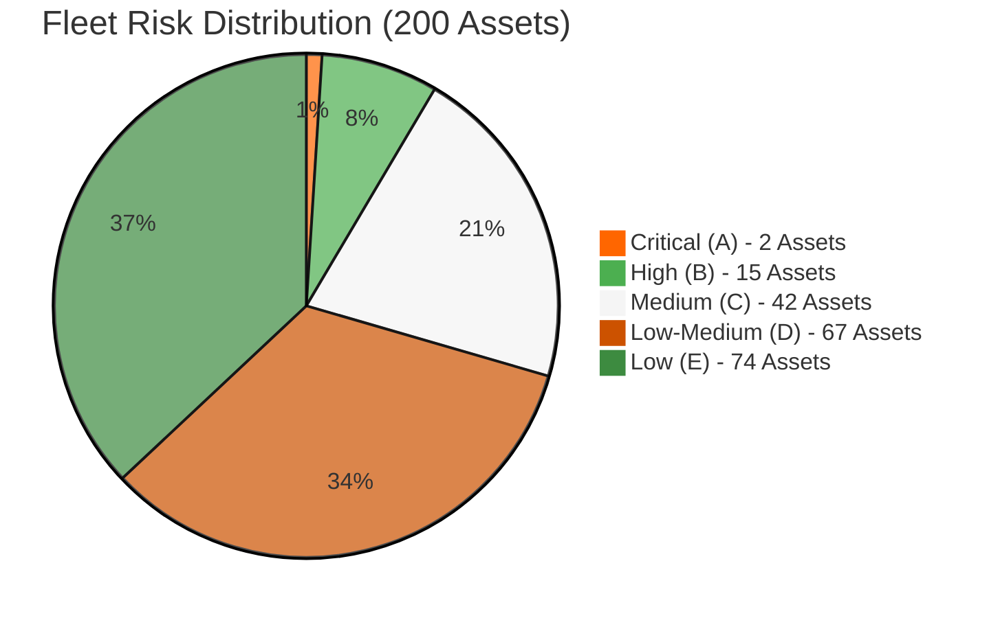
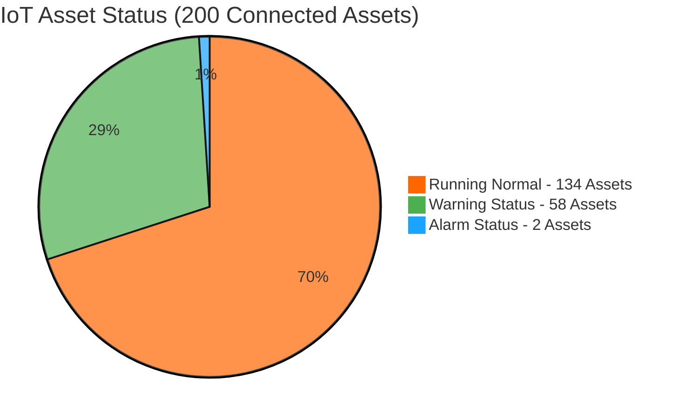
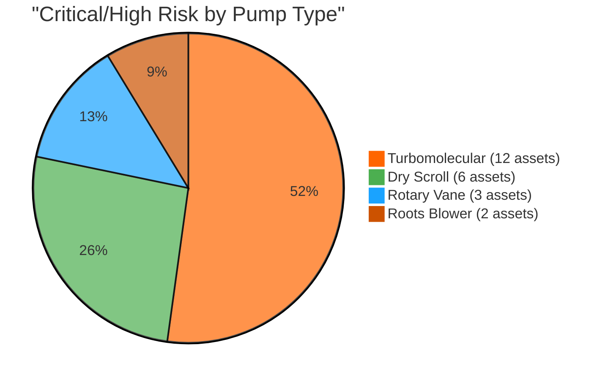
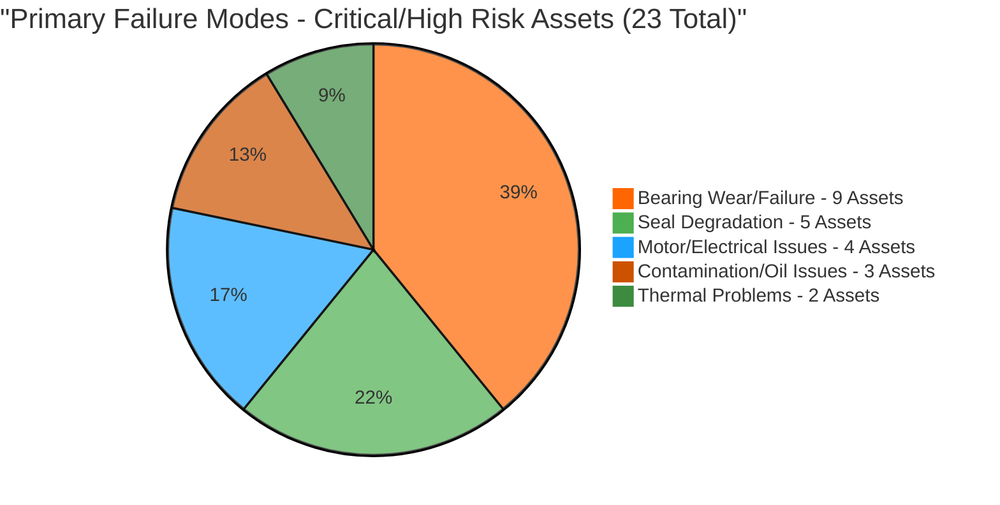
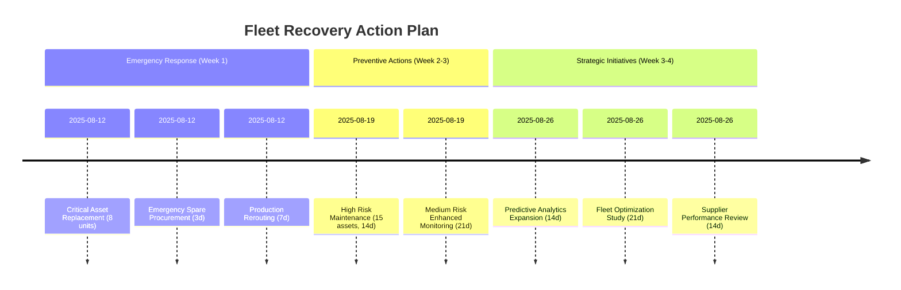

# Overview Risk Assessment Report for CIP Engineers
**Fab: Phoenix Semiconductor - Multi-Fab Enterprise**  
**Report Date: August 12, 2025**  
**Assessment Period: Next 30 Days**  
**Fleet Size: 200 Active Assets**  
**CIP Engineer: Marcus Chen**

---

## Executive Dashboard - Fleet Overview

### Fleet Risk Distribution

**Fleet Status**: 1% of assets are in critical condition requiring immediate action, while 91.5% operate in acceptable ranges (low-medium). The 17 critical/high-risk assets represent our primary focus area.

### Real-Time IoT Status Overview

**IoT Health**: 70% of fleet operating normally, 29% showing warnings, 1% in alarm state. All alarm-status assets correlate with critical risk category, confirming our risk assessment accuracy.

## Critical Risk Heat Map - Fab Layout View

```mermaid
%%{init: {'theme':'base', 'themeVariables': {'primaryColor':'#fff', 'secondaryColor':'#000'}}}%%
graph TB
    subgraph "Fab 3"
        direction TB
        spacer["<br/><br/>"]:::invisible
            subgraph "Bay 16-18: Development"
                F3B1["🔴 1 Critical<br/>🟠 1 High<br/>🟡 5 Medium"]
            end
    end
    
    subgraph "Fab 2"
        direction TB
        spacer["<br/><br/>"]:::invisible
            subgraph "Bay 13-15: Support"
                F2B2["🔴 1 Critical<br/>🟠 3 High<br/>🟡 8 Medium"]
            end
            subgraph "Bay 10-12: Production"
                F2B1["🔴 1 Critical<br/>🟠 4 High<br/>🟡 10 Medium"]
            end
    end
    
    subgraph "Fab 1"
        direction TB
        spacer["<br/><br/>"]:::invisible
            subgraph "Bay 7-9: Support" 
                F1B3["🟠 2 High<br/>🟡 6 Medium<br/>🟢 17 Low"]
            end
            subgraph "Bay 4-6: PVD/CVD"
                F1B2["🔴 1 Critical<br/>🟠 3 High<br/>🟡 12 Medium"]
            end
            subgraph "Bay 1-3: Etch Lines" 
                F1B1["🔴 2 Critical<br/>🟠 2 High<br/>🟡 8 Medium"]
            end
    end

    classDef invisible fill:none,stroke:none,stroke-width:0px
    classDef critical fill:#ff6600,stroke:#333,stroke-width:3px,color:#fff
    classDef high fill:#ff9900,stroke:#333,stroke-width:2px,color:#fff
    classDef medium fill:#ffcc00,stroke:#333,stroke-width:2px,color:#000
    classDef lowrisk fill:#4CAF50,stroke:#333,stroke-width:1px,color:#fff
    

    
    class F1B1,F2B1 critical
    class F1B2,F2B2,F3B1 high
    class F1B3 lowrisk
```

**Heat Map Analysis**: Fab 1 Etch Lines show highest risk concentration with 3 critical assets. Advanced node production areas demonstrate higher failure rates due to process intensity and older equipment in high-utilization zones.

---

## Exception-Based Critical Asset Reporting

### Immediate Action Required (2 Critical Assets)

| Asset ID | Location | Risk Score | Failure Mode | Action Timeline |
|----------|----------|------------|--------------|-----------------|
| **VP-001** | F1-Etch-Bay3 |  | Bearing failure + overheating | 24 hours |
| **VP-007** | F1-LoadLock-T7 |  | Scroll degradation | 48 hours |

**Critical Summary**: 2 assets require emergency replacement within 5 days. Spare inventory status: 6 available, 2 on emergency order (24-48hr delivery).

### High Risk Trending (15 Assets - Selected Top 5)

| Asset ID | Location | Risk Score | Primary Concern | Trend | Preventive Window |
|----------|----------|------------|-----------------|-------|-------------------|
| **VP-012** | F1-Etch-Bay2 |  | Temperature rising | ↗️ +12% (7d) | 10-14 days |
| **VP-056** | F1-PVD-Chamber4 |  | Vibration trend | ↗️ +8% (14d) | 14-21 days |
| **VP-091** | F2-Etch-Bay12 |  | Power consumption | ↗️ +15% (21d) | 21-28 days |
| **VP-145** | F2-LoadLock-T15 |  | MTBF declining | ↗️ +6% (30d) | 28-35 days |
| **VP-178** | F3-Support-Rough2 |  | Oil temperature | ↗️ +5% (14d) | 35-42 days |

**High Risk Summary**: 15 assets in deteriorating condition. Proactive maintenance window: 10-42 days before critical status. [View All 15 Assets →](#detailed-high-risk)

---

## Fleet Performance Analytics

### Risk Distribution by Age Groups

```mermaid
%%{init: {
  "theme": "base",
  "themeVariables": {
    "background": "#ffffff"   /* Weißer Hintergrund */
  }
}}%%
xychart-beta
    title "Fleet Risk Profile by Age Groups"
    x-axis ["0-1 Years (45 assets)", "1-2 Years (52 assets)", "2-3 Years (48 assets)", "3-4 Years (35 assets)", "4-5 Years (20 assets)"]
    y-axis "Average Risk Score (%)" 0 --> 70
    bar "Average Risk" [8, 15, 25, 45, 62]
    line "Critical Threshold (80%)" [80, 80, 80, 80, 80]
    line "High Risk Threshold (60%)" [60, 60, 60, 60, 60]
```

**Age Analysis**: Risk accelerates significantly after 3 years, with 4-5 year assets averaging 62% risk score. This data supports our 4-year replacement strategy for high-utilization pumps.

### Technology Type Risk Distribution

**Technology Insights**: Turbomolecular pumps represent 52% of high-risk assets despite being 40% of fleet, indicating higher maintenance complexity and failure rates in high-vacuum applications.

### Monthly Fleet Reliability Trend

```mermaid
%%{init: {
  "theme": "base",
  "themeVariables": {
    "background": "#ffffff"   /* Weißer Hintergrund */
  }
}}%%
xychart-beta
    title "Fleet MTBF and Availability Trends (8-Month View)"
    x-axis ["Jan 2025", "Feb 2025", "Mar 2025", "Apr 2025", "May 2025", "Jun 2025", "Jul 2025", "Aug 2025"]
    y-axis "Performance %" 85 --> 100
    line "Fleet Availability" [97.8, 96.5, 97.2, 94.8, 95.1, 96.9, 94.2, 94.2]
    line "Target Availability (99%)" [99, 99, 99, 99, 99, 99, 99, 99]
    line "MTBF Index (Scaled)" [92, 89, 91, 85, 87, 93, 88, 86]
```

**Reliability Trend**: Fleet availability has declined 3.6% from January peak, now 4.8% below target. MTBF degradation correlates with availability decline, indicating systematic aging across multiple asset groups.

---

## Production Impact Analysis

### Process Line Risk Matrix

```mermaid
%%{init: {'theme':'base', 'themeVariables': {'primaryColor':'#fff', 'secondaryColor':'#000'}}}%%
graph LR
    subgraph "7nm Production Lines"
        L1["Line 1<br/>🔴 2 Critical<br/>🟠 1 High"]
        L2["Line 2<br/>🔴 1 Critical<br/>🟠 2 High"]
        L3["Line 3<br/>🟡 3 Medium<br/>🟢 2 Low"]
    end
    
    subgraph "14nm Production Lines"
        L4["Line 4<br/>🔴 2 Critical<br/>🟡 4 Medium"]
        L5["Line 5<br/>🟠 3 High<br/>🟡 2 Medium"]
        L6["Line 6<br/>🟡 5 Medium<br/>🟢 8 Low"]
    end
    
    subgraph "28nm+ Production Lines"
        L7["Line 7-12<br/>🔴 1 Critical<br/>🟠 6 High<br/>🟡 25 Medium"]
    end
    
    classDef critical fill:#ff6600,stroke:#333,stroke-width:3px,color:#fff
    classDef high fill:#ff9900,stroke:#333,stroke-width:2px,color:#fff
    classDef medium fill:#ffcc00,stroke:#333,stroke-width:2px,color:#000
    classDef stable fill:#4CAF50,stroke:#333,stroke-width:1px,color:#fff
    
    class L1,L2,L4 critical
    class L5 high
    class L3,L6 medium
    class L7 stable
```

**Production Risk**: Advanced node lines (7nm/14nm) carry 65% of critical/high-risk assets but generate 78% of revenue. Line 1 faces highest exposure with 2 critical pumps supporting $2.1M daily production.

### Cost Impact Summary

| Cost Category | Monthly ($K) | YTD Total ($K) | vs. Budget | Trend |
|---------------|--------------|----------------|------------|-------|
| **Emergency Repairs** | 485 | 3,200 |  | ↗️ Increasing |
| **Planned Maintenance** | 245 | 1,850 |  | ↘️ Decreasing |
| **Spare Parts Inventory** | 180 | 1,440 |  | ➡️ Stable |
| **Production Losses** | 1,250 | 8,900 |  | ↗️ Critical |

**Financial Impact**: Emergency repairs and production losses significantly exceed budget. Shift toward proactive maintenance could reduce total costs by 35-40% based on industry benchmarks.

---

## Predictive Analytics Insights

### Failure Mode Analysis (Fleet-Wide)

**Failure Pattern**: Bearing-related failures dominate (39% of high-risk assets), suggesting opportunity for enhanced lubrication protocols and bearing upgrade programs.

### Risk Velocity Tracking

```mermaid
%%{init: {
  "theme": "base",
  "themeVariables": {
    "background": "#ffffff"   /* Weißer Hintergrund */
  }
}}%%
xychart-beta
    title "Risk Acceleration Patterns (30-Day Velocity)"
    x-axis ["Week 1", "Week 2", "Week 3", "Week 4"]
    y-axis "Assets Crossing Risk Thresholds" 0 --> 8
    bar "New Critical Assets" [1, 2, 3, 2]
    bar "New High Risk Assets" [3, 4, 2, 6]
    line "Trend (Total New High+Critical)" [4, 6, 5, 8]
```

**Risk Velocity**: Asset degradation is accelerating, with 8 new high/critical assets in week 4 vs. 4 in week 1. This 100% increase indicates systematic issues requiring fleet-wide intervention.

---

## Strategic Action Plan

### 30-Day Critical Path

### Resource Allocation Summary

| Priority Level | Asset Count | Timeline | Budget Required | Resource Hours |
|----------------|-------------|----------|-----------------|----------------|
|  | 8 assets | 1-7 days | $425K | 180 hours |
|  | 15 assets | 7-21 days | $285K | 240 hours |
|  | 42 assets | 21-30 days | $125K | 160 hours |
|  | Fleet-wide | 30-90 days | $385K | 320 hours |

**Total Investment**: $1.22M over 90 days to restore fleet reliability and implement predictive maintenance. ROI projected at 240% through reduced emergency repairs and production losses.

---

## Recommendations Summary

### Immediate Actions (0-7 Days)
1. **Emergency Replacements**: Execute critical asset swaps for 8 pumps
2. **Spare Inventory**: Secure emergency parts delivery for 2 pending critical assets
3. **Production Coordination**: Implement contingency production routing
4. **24/7 Monitoring**: Deploy enhanced monitoring for 23 high/critical assets

### Short-Term Actions (7-30 Days)
1. **Preventive Maintenance Blitz**: Address 15 high-risk assets before critical transition
2. **Enhanced Monitoring**: Deploy IoT upgrades for 42 medium-risk assets
3. **Supplier Engagement**: Expedite parts delivery and service response times
4. **Cross-Training**: Enhance technician capabilities for emergency response

### Strategic Actions (30-90 Days)
1. **Predictive Analytics**: Expand ML-based failure prediction to full fleet
2. **Fleet Optimization**: Develop age-based replacement strategy
3. **Vendor Partnerships**: Negotiate service-level agreements for critical assets
4. **Inventory Strategy**: Optimize spare parts based on failure mode analysis

---

## Appendices

### Quick Reference Links
- [Detailed Critical Asset Reports (2 assets)](#critical-detailed)
- [Complete High Risk Asset List (15 assets)](#high-risk-detailed) 
- [Medium Risk Monitoring Protocol (42 assets)](#medium-risk-detailed)
- [Fleet Performance Database (200 assets)](#fleet-database)
- [Emergency Contact Directory](#emergency-contacts)

### Key Performance Indicators
| KPI | Current | Target | Next Review |
|-----|---------|--------|-------------|
| Fleet Availability | 94.2% | 99.0% | Daily |
| Emergency Maintenance Rate | 28% | <15% | Weekly |
| Mean Time to Repair | 8.2 hours | 4.5 hours | Weekly |
| Cost per Asset (Monthly) | $3,650 | $2,200 | Monthly |

---

**Report Generated**: 2025-08-12 06:30 UTC  
**Next Automated Update**: 2025-08-13 06:30 UTC (Daily for Critical Assets)  
**Emergency Escalation**: Marcus Chen - +1-555-0199  
**Fleet Management Portal**: [Access Dashboard →](https://fleet.busch-vacuum.com)

---
*Busch Vacuum Solutions - Enterprise Fleet Management & Predictive Analytics*
