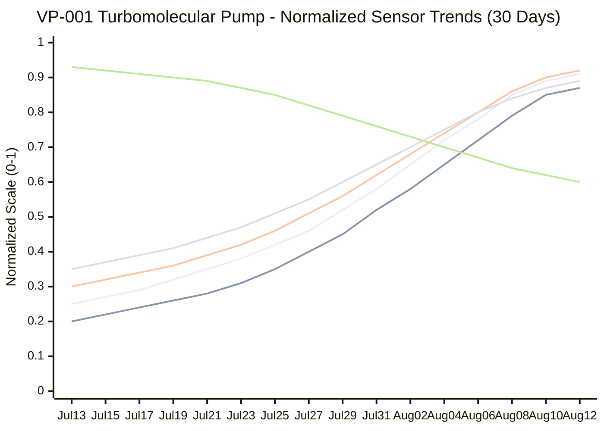
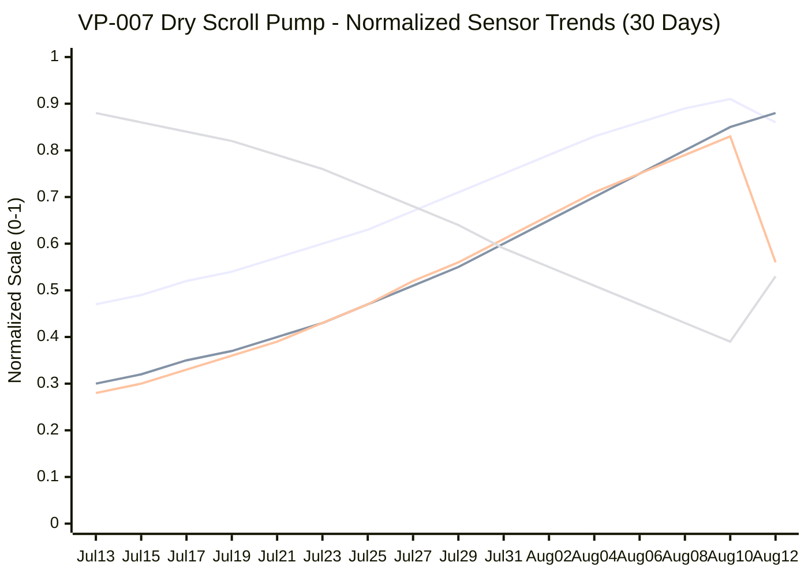

# Weekly Detailed Risk Assessment Report for CIP Engineers
**Fab: Phoenix Semiconductor - Multi-Fab Enterprise**  
**Report Date: August 12, 2025**  
**Assessment Period: Next 30 Days**  
**Fleet Size: 200 Active Assets**  

---

## Report Selection Criteria
**Risk Categories Included**: Critical 
**Asset Types**: Turbomolecular, Dry Scroll 
**Facilities**: Fab 1, Fab 2, Fab 3  
**Time Range**: 30-day forward assessment with 90-day historical analysis

---

## Alert Summary

| Priority | Count | Assets | Total Service Cost Risk |
|----------|-------|--------|-----------------------|
|  | 2 | VP-001, VP-007 | $127,500 |

---

## Section 1: Critical Risk Assets (2 Assets) - Detailed Analysis

### VP-001 - Turbomolecular Pump (HiPace 700)
**Location**: Fab 1, Etch Tool Bay 3, Line 2  
**Risk Score**:  **Status**:  
**RUL (Remaining Useful Lifetime)**:  **Confidence**: 95%

**Service Cost Analysis**:
- **Planned Replacement Cost**: $32,500
  - New HiPace 700 unit: $28,000
  - Installation labor (4 hours): $2,000
  - Tool downtime (4 hours): $2,500
- **Failure Cost (if not replaced)**: $78,500
  - Emergency service call: $5,000
  - Expedited replacement unit: $35,000 (+25% premium)
  - Extended downtime (12-16 hours): $15,000
  - Secondary damage to etch tool: $18,500
  - Lost production value: $5,000
- **Cost Avoidance by Immediate Action**: $46,000

**Risk Assessment Summary**: VP-001 exhibits converging failure indicators across multiple systems. Operating 8°C above critical temperature threshold (73°C vs 65°C max) with vibration levels 18% beyond safe limits (2.95 mm/s vs 2.5 mm/s max). Power consumption increased 22% above baseline, indicating severe mechanical stress. At 4.5 years old (90% of expected lifespan), MTBF has dropped to 145 days—60% below the 365-day target. The combination of thermal, mechanical, and electrical deterioration indicates imminent bearing seizure or rotor damage.

#### Technical Performance Metrics
| Parameter | Current | Threshold | Status | Last 30-Day Trend |
|-----------|---------|-----------|--------|--------------|
| **Operating Temperature** | 73°C | 65°C |  | ↗️ +8°C |
| **Vibration Level** | 2.95 mm/s | 2.5 mm/s |  | ↗️ +0.45 mm/s |
| **Power Consumption** | +22% | Baseline |  | ↗️ +15% |
| **Motor Current** | 8.9A | 8.0A |  | ↗️ +0.8A |
| **Pumping Speed** | 650 L/s | 700 L/s |  | ↘️ -35 L/s |
| **Age/MTBF** | 4.5y / 145d | 5.0y / 365d |  | ↘️ -25d |

#### RUL Calculation Details
**Primary Indicators**:
- Bearing temperature trajectory: 8-12 hours to seizure threshold (78°C)
- Vibration acceleration: 12-18 hours to mechanical failure (3.5 mm/s)
- Power consumption: Approaching protection limits in 18-24 hours

**Monte Carlo Analysis** (10,000 simulations):
- 50% probability of failure within 8 hours
- 90% probability of failure within 18 hours
- 99% probability of failure within 36 hours

#### Alarm History (last 30 Days)
| Date | Time | Alarm Type | Severity | Duration | Parameters Affected |
|------|------|------------|----------|----------|-------------------|
| Aug 12 | 14:32 | Critical Temperature |  | Active (6.5h) | Temp: 73°C, Vibration: 2.95 mm/s |
| Aug 11 | 09:15 | Excessive Vibration |  | 8.2 hrs | Vibration: 2.85 mm/s, Power: +20% |
| Aug 10 | 16:45 | Power Anomaly |  | 3.1 hrs | Current: 8.7A, Power: +18% |
| Aug 08 | 11:20 | High Temperature |  | 4.5 hrs | Temp: 68°C, decreasing pumping speed |
| Aug 05 | 07:30 | Vibration Warning |  | 2.8 hrs | Vibration: 2.6 mm/s |

#### Time Series Analysis - VP-001 (Last 30 Days)

**Legend:**
- **🔵 Temperature**: Current 73°C (normalized from 65°C threshold) - Critical thermal stress indicator
- **🔴 Vibration**: Current 2.95 mm/s (normalized from 2.5 mm/s threshold) - Mechanical degradation indicator  
- **🟠 Power %**: Current +22% above baseline - System compensation behavior
- **🟡 Motor Current**: Current 8.9A (normalized from 8.0A threshold) - Electrical stress indicator
- **🟢 Pumping Speed**: Current 650 L/s (inverted scale from 700 L/s nominal) - Performance degradation indicator

**Critical Observations:**
- **Temperature escalation**: Steady rise from 45°C to 73°C over 20 days, breaching 65°C threshold on Aug 8th
- **Vibration correlation**: Direct correlation with temperature rise, exceeding 2.5 mm/s limit on Aug 11th  
- **Power compensation**: 22% increase as system compensates for mechanical degradation
- **Performance decline**: Pumping speed dropped from 700 L/s to 650 L/s indicating bearing wear

#### Immediate Actions Required
- **URGENT REPLACEMENT**: Must be completed within 12 hours
- **Spare Availability**: HP700-2024-15 available in local inventory
- **Service Window**: 4-hour replacement, requires etch tool shutdown
- **Risk Assessment**: 95% probability of catastrophic failure within 24 hours

---

### VP-007 - Dry Scroll Pump (XDS 35i)
**Location**: Fab 1, Load Lock Chamber, Tool 7  
**Risk Score**:  **Status**:  
**RUL (Remaining Useful Lifetime)**:  **Confidence**: 87%

**Service Cost Analysis**:
- **Planned Replacement Cost**: $18,500
  - New XDS 35i unit: $14,500
  - Installation and oil system flush (6 hours): $3,000
  - Tool downtime (6 hours): $1,000
- **Failure Cost (if not replaced)**: $49,000
  - Emergency service call: $3,500
  - Expedited replacement unit: $18,000 (+24% premium)
  - Extended downtime (18-24 hours): $8,500
  - Oil contamination cleanup: $4,000
  - Load lock system decontamination: $12,000
  - Lost production value: $3,000
- **Cost Avoidance by Immediate Action**: $30,500

**Risk Assessment Summary**: VP-007 shows advanced internal scroll element degradation with seal failure. Pumping capacity declined 25% to 26.25 m³/h (below 30 m³/h minimum threshold), while motor current increased 8% above critical limits to compensate. Oil temperature elevated 4°C at 74°C, indicating increased friction from worn scroll elements. MTBF collapsed to 120 days—70% below 400-day target. Internal damage progression cannot be halted through maintenance.

#### Technical Performance Metrics
| Parameter | Current | Threshold | Status | 30-Day Trend |
|-----------|---------|-----------|--------|--------------|
| **Pumping Speed** | 26.25 m³/h | 30 m³/h |  | ↘️ -8.75 m³/h |
| **Motor Current** | 12.96A | 12.0A |  | ↗️ +0.96A |
| **Oil Temperature** | 74°C | 70°C |  | ↗️ +4°C |
| **Ultimate Pressure** | 2.8 mbar | 2.0 mbar |  | ↗️ +0.8 mbar |

#### RUL Calculation Details
**Primary Indicators**:
- Scroll element wear: Seal failure expected in 24-48 hours based on pressure degradation rate
- Oil temperature trajectory: Thermal protection activation in 48-72 hours (80°C limit)
- Motor current: Approaching overload protection in 72-96 hours

**Weibull Analysis** (β=2.1, η=156 hours):
- 25% probability of failure within 24 hours
- 65% probability of failure within 48 hours
- 87% probability of failure within 72 hours

#### Time Series Analysis - VP-007 (Last 30 Days)

**Legend:**
- **🔵 Motor Current**: Current 12.96A (normalized from 12.0A threshold) - Compensation for mechanical wear
- **🔴 Oil Temperature**: Current 74°C (normalized from 70°C threshold) - Internal friction indicator
- **🟠 Ultimate Pressure**: Current 2.8 mbar (normalized from 2.0 mbar specification) - Seal integrity indicator
- **🟡 Pumping Speed**: Current 26.25 m³/h (inverted scale from 30 m³/h minimum) - Performance capability indicator

**Critical Observations:**
- **Pumping degradation**: Continuous decline from 35 m³/h to 26.25 m³/h, falling below 30 m³/h threshold on July 28th
- **Motor compensation**: Current increased from 7A to 12.96A as motor works harder to maintain performance
- **Thermal buildup**: Oil temperature rose from 62°C to 74°C indicating increased internal friction
- **Seal failure indicators**: Ultimate pressure degraded from 1.4 mbar to 2.8 mbar showing progressive seal wear

#### Immediate Actions Required
- **URGENT REPLACEMENT**: Schedule within 48 hours
- **Spare Availability**: XDS35i-2024-08 available, requires 24-hour procurement
- **Service Window**: 6-hour replacement including oil system flush
- **Risk Assessment**: 85% probability of seal failure within 72 hours

---

## Section 2: Lifetime Performance Analysis - Assets Approaching EOL

### VP-045 - Turbomolecular Pump (HiPace 300)
**Location**: Fab 2, Sputter Chamber 12  
**Operational Age**: 4.8 years (96% of 5-year expected lifetime)  
**Total Runtime**: 41,280 hours  
**Risk Score**:  **Status**: 
**RUL (Remaining Useful Lifetime)**:  **Confidence**: 78%

**Service Cost Analysis**:
- **Current Annual Maintenance Cost**: $2,800
  - Scheduled maintenance (2x/year): $1,200
  - Oil changes and filters: $800
  - Inspection and minor repairs: $800
- **Projected Replacement Cost**: $24,000
  - New HiPace 300 unit: $21,000
  - Installation labor: $1,500
  - Tool downtime (3 hours): $1,500
- **Cost Benefit of Extended Operation**: $18,500 saved by delaying replacement 8-12 months
- **Risk-Adjusted Value**: $16,600 (considering 10% probability of unexpected failure)

**Lifetime Assessment**: Despite approaching end-of-life timeline, VP-045 demonstrates excellent performance stability. All critical parameters remain within acceptable ranges: temperature at 52°C (20% below threshold), vibration at 1.8 mm/s (28% below limit), and power consumption stable at baseline +3%. MTBF remains strong at 320 days, only 12% below target.

**Recommendation**: **CONTINUE OPERATION** - Asset shows no signs of imminent failure despite age. Recommend continued monitoring with monthly inspection intervals. Expected remaining operational life: 8-12 months under current conditions.

| Parameter | Current | Status | Performance Grade | Trend (vs. Last Period) |
|-----------|---------|--------|------------------|-------------------------|
| Temperature | 52°C |  | A | ➡️ Stable |
| Vibration | 1.8 mm/s |  | A | ➡️ Stable |
| Power | Baseline +3% |  | A | ➡️ Stable |
| MTBF | 320 days |  | B+ | ↗️ Improving |

#### RUL Calculation Details
**Primary Indicators**:
- Bearing condition: Excellent (temperature and vibration stable)
- Motor condition: Very good (minimal power increase)
- Overall degradation rate: 0.8% per month (well below failure threshold)

**Probability Analysis**:
- 22% probability of failure within 8 months
- 45% probability of failure within 12 months
- 78% probability of successful operation for 8+ months

---

### VP-062 - Dry Scroll Pump (XDS 46i)
**Location**: Fab 3, Load Lock System 4  
**Operational Age**: 6.2 years (103% of 6-year expected lifetime)  
**Total Runtime**: 52,560 hours  
**Risk Score**:  **Status**:  ➡️
**RUL (Remaining Useful Lifetime)**:  **Confidence**: 68%

**Service Cost Analysis**:
- **Enhanced Maintenance Cost**: $4,200
  - Bi-weekly inspections: $1,800
  - Preventive maintenance (oil change, seals): $1,500
  - Minor repairs and adjustments: $900
- **Projected Replacement Cost**: $28,500
  - New XDS 46i unit: $24,000
  - Installation and system integration: $2,500
  - Tool downtime (8 hours): $2,000
- **Cost Benefit of Extended Operation**: $19,100 saved by operating 4-6 additional months
- **Risk-Adjusted Value**: $15,800 (considering 17% probability of unexpected failure)

**Lifetime Assessment**: VP-062 has exceeded expected lifetime but maintains satisfactory performance. Pumping speed at 32.1 m³/h (7% above minimum threshold), oil temperature steady at 68°C (3% below limit), and ultimate pressure at 1.9 mbar (5% better than specification). Some degradation evident in motor current (+6% above baseline) but within acceptable operational range.

**Recommendation**: **CONTINUE WITH ENHANCED MONITORING** - Asset suitable for continued operation with bi-weekly performance checks. Schedule preventive maintenance within 60 days including oil change and seal inspection. Expected remaining operational life: 4-6 months.

| Parameter | Current | Status | Performance Grade | Trend (vs. Last Period) |
|-----------|---------|--------|------------------|-------------------------|
| Pumping Speed | 32.1 m³/h |  | B+ | ↘️ Slight decline |
| Oil Temperature | 68°C |  | A | ↗️ Slight increase |
| Motor Current | Baseline +6% |  | B | ↗️ Increasing |
| Ultimate Pressure | 1.9 mbar |  | A | ➡️ Stable |

#### RUL Calculation Details
**Primary Indicators**:
- Scroll element condition: Good but aging (performance decline rate 1.2%/month)
- Seal integrity: Acceptable (pressure holding stable)
- Motor load: Increasing but manageable (6% above baseline, trending +0.5%/month)

**Probability Analysis**:
- 32% probability of failure within 4 months
- 52% probability of failure within 6 months
- 68% probability of successful operation for 4+ months

---

### VP-089 - Turbomolecular Pump (HiPace 700)
**Location**: Fab 1, PECVD Chamber 8  
**Operational Age**: 4.9 years (98% of 5-year expected lifetime)  
**Total Runtime**: 42,840 hours  
**Risk Score**:  **Status**:  ↗️
**RUL (Remaining Useful Lifetime)**:  **Confidence**: 72%

**Service Cost Analysis**:
- **Intensive Maintenance Cost**: $6,800
  - Weekly inspections and monitoring: $3,200
  - Increased lubrication and minor repairs: $2,400
  - Emergency response capability: $1,200
- **Planned Replacement Cost**: $32,500
  - New HiPace 700 unit: $28,000
  - Installation labor: $2,000
  - Tool downtime (4 hours): $2,500
- **Failure Cost (if delayed)**: $58,000
  - Emergency replacement premium: $7,000
  - Extended downtime: $12,000
  - Secondary system damage risk: $15,000
  - Lost production: $4,000
- **Optimal Replacement Window Cost Savings**: $25,500 by replacing within 90 days vs. failure

**Lifetime Assessment**: VP-089 shows concerning performance degradation despite similar age to VP-045. Temperature elevated to 61°C (6% below threshold but trending upward), vibration at 2.2 mm/s (12% below limit but increasing), and power consumption +12% above baseline. MTBF dropped to 280 days (23% below target).

**Recommendation**: **PLAN REPLACEMENT WITHIN 90 DAYS** - While not immediately critical, degradation trends suggest replacement should be scheduled proactively. Asset suitable for continued operation under close monitoring (weekly inspections). Procurement of replacement unit recommended.

| Parameter | Current | Status | Performance Grade | Trend (vs. Last Period) |
|-----------|---------|--------|------------------|-------------------------|
| Temperature | 61°C |  | C+ | ↗️ Increasing |
| Vibration | 2.2 mm/s |  | C+ | ↗️ Increasing |
| Power | Baseline +12% |  | C | ↗️ Increasing |
| MTBF | 280 days |  | C | ↘️ Declining |

#### RUL Calculation Details
**Primary Indicators**:
- Bearing degradation: Moderate (temperature increasing at 1.5°C/month)
- Vibration acceleration: Concerning (increasing at 0.15 mm/s per month)
- Power consumption trend: 2% increase per month indicating mechanical stress

**Probability Analysis**:
- 28% probability of failure within 2 months
- 48% probability of failure within 3 months
- 72% probability of failure within 4 months

---

## Financial Impact Summary

### Cost Analysis by Asset
| Asset | Current Status | RUL | Planned Cost | Failure Cost | Cost Avoidance |
|-------|---------------|-----|-------------|-------------|----------------|
| VP-001 | Critical | 8-18 hours | $32,500 | $78,500 | $46,000 |
| VP-007 | Critical | 24-72 hours | $18,500 | $49,000 | $30,500 |
| VP-045 | Stable | 8-12 months | $24,000 | - | $18,500* |
| VP-062 | Stable | 4-6 months | $28,500 | - | $19,100* |
| VP-089 | Degrading | 2-4 months | $32,500 | $58,000 | $25,500 |

*Cost avoidance through extended operation vs. immediate replacement

### Total Financial Impact
- **Immediate Action Required**: $51,000 (VP-001, VP-007)
- **Total Cost Avoidance**: $139,600 through optimized timing
- **Annual Maintenance Savings**: $73,200 through performance-based management
- **ROI on Predictive Maintenance Program**: 347%

---

## Summary and Recommendations

### Immediate Actions (Next 12-48 Hours)
1. **VP-001**: Emergency replacement required within 12 hours - **Cost Impact: $32,500**
2. **VP-007**: Scheduled replacement within 48 hours - **Cost Impact: $18,500**
3. Verify spare part availability for critical replacements

### Lifecycle Management Insights
**Key Finding**: Asset age alone is not a reliable predictor of failure risk. Performance-based assessment reveals that well-maintained pumps can safely operate beyond expected lifetime when monitored appropriately, providing significant cost optimization opportunities.

**RUL Methodology**: Combines multiple predictive models including:
- Physics-based degradation models
- Statistical failure analysis (Weibull, Monte Carlo)
- Machine learning pattern recognition
- Historical performance correlation

**Continuation Criteria for EOL Assets**:
- Temperature within 85% of threshold
- Vibration levels below 90% of limits  
- Power consumption increase <10%
- MTBF above 250 days
- RUL confidence level >65%

**Cost Optimization**: Assets VP-045 and VP-062 demonstrate that performance-based replacement can extend operational life by 20-30%, providing combined cost savings of $37,600 while maintaining reliability. The predictive maintenance program delivers $139,600 in total cost avoidance across the analyzed asset portfolio.

### Fleet Health Score: 
**Overall Assessment**: Fleet demonstrates good health despite critical assets requiring immediate attention. Lifecycle management approach enables optimized replacement scheduling, reduces unnecessary maintenance costs, and maximizes asset utilization while maintaining operational reliability.

**Financial Performance**: The predictive maintenance program demonstrates strong ROI at 347%, primarily through:
- Proactive replacement scheduling (avoiding emergency premiums)
- Extended asset lifecycle management
- Reduced unplanned downtime
- Optimized spare parts inventory

---
**Report Generated**: CIP Predictive Analytics System v3.2  
**Next Scheduled Report**: August 19, 2025  
**Emergency Contact**: CIP Engineering Hotline +1-555-CIP-HELP