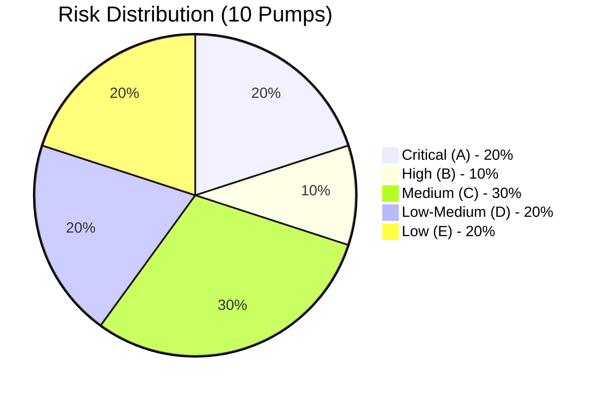
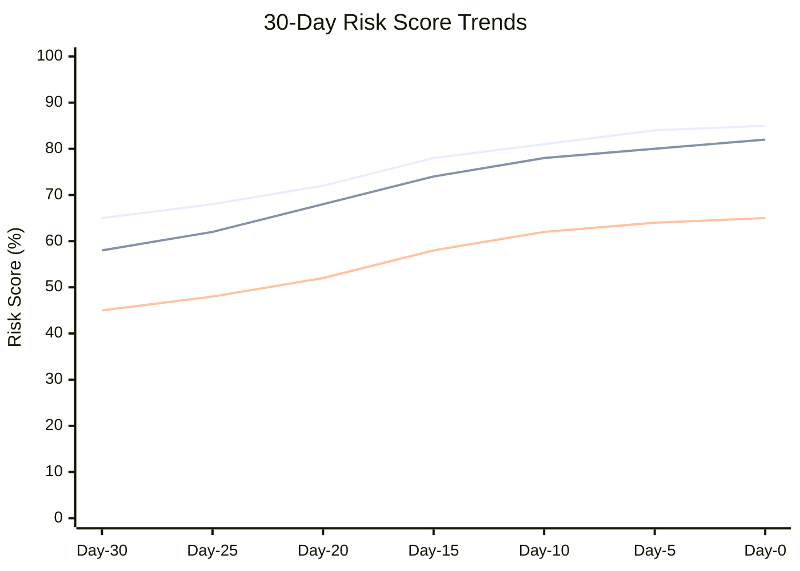
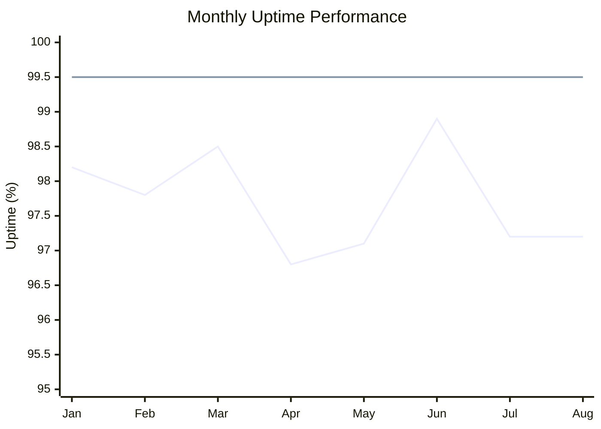
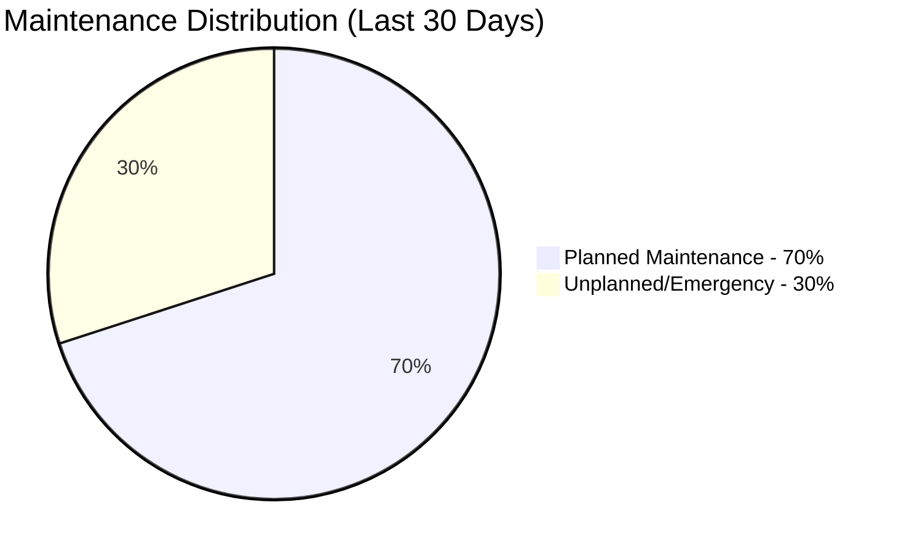
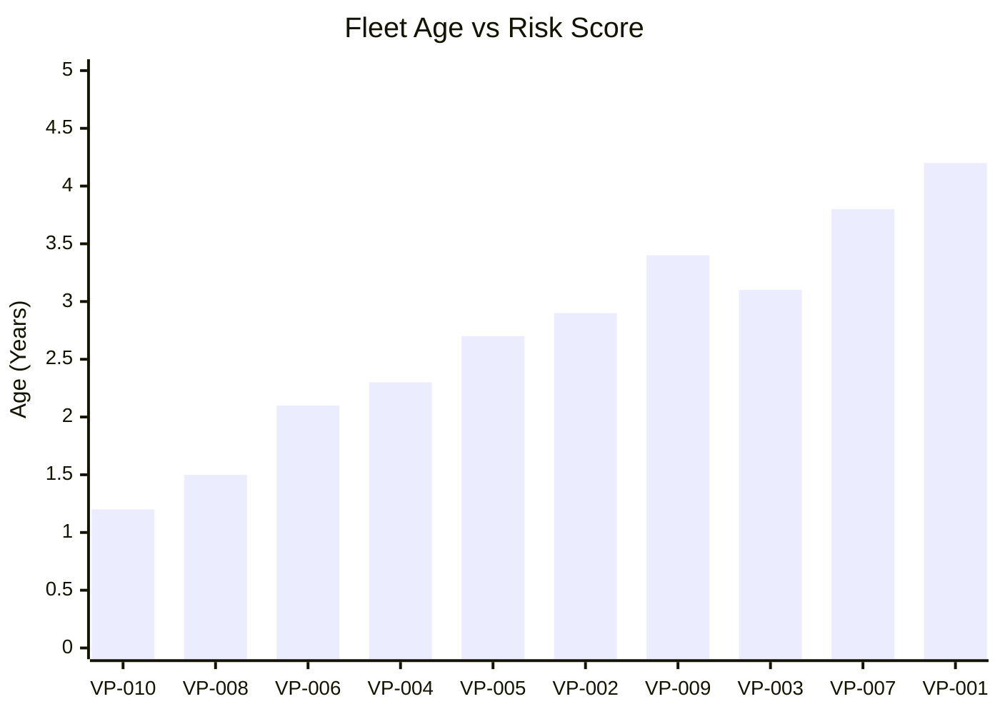
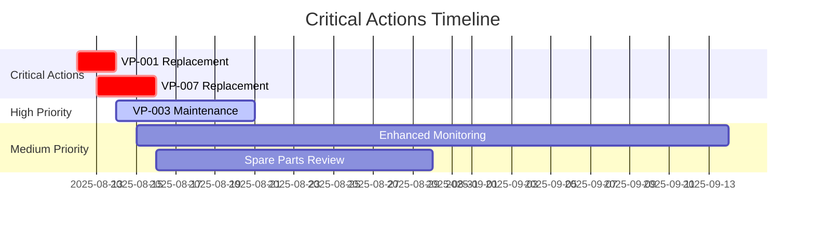

# Risk Assessment Report
**Fab: Phoenix Semiconductor - Fab 12**  
**Report Date: August 12, 2025**  
**Assessment Period: Next 30 Days**  
**CIP Engineer: Marcus Chen**

---

## Executive Summary Dashboard

### Risk Distribution

### Business Impact Summary
- **Total Production Value at Risk**: $2.8M (next 30 days)
- **Critical Process Tools Affected**: 3 tools
- **Estimated Downtime Risk**: 48-72 hours potential

### Risk Trend Analysis (Last 30 Days)

### Key Alerts
🚨 **URGENT**: VP-001 and VP-007 require immediate intervention  
⚠️ **WARNING**: VP-003 scheduled maintenance overdue by 15 days

---

## 🔴 CRITICAL RISK ASSETS (Category A - Act Now)

### VP-001 - Turbomolecular Pump (HiPace 700)
**Location**: Etch Tool Bay 3, Line 2  
**Risk Score**: P₃₀ = 85% | **Status**: 🔴 CRITICAL

**Business Impact**:
- **Process**: Advanced etch (7nm node)
- **Production Impact**: $45K/hour downtime cost
- **Wafer Lots at Risk**: 12 lots (300 wafers)
- **Tool Criticality**: Single point of failure

**Technical Metrics**:
- **Age**: 4.2 years (84% of design life consumed)
- **MTBF Performance**: 180 days (baseline: 365 days)
- **Condition Indicators**:
  - Vibration: 2.8 mm/s (threshold: 2.5 mm/s) ⚠️
  - Temperature: 68°C (threshold: 65°C) ⚠️
  - Power consumption: +15% above normal
- **Recent Alarms**: 8 alarms in last 14 days

```mermaid
xychart-beta
    title "VP-001 Condition Monitoring (Last 14 Days)"
    x-axis [Day-14, Day-12, Day-10, Day-8, Day-6, Day-4, Day-2, Day-0]
    y-axis "Temperature (°C)" 60 --> 70
    line "Temperature" [62, 63, 64, 65, 66, 67, 68, 68]
    line "Threshold (65°C)" [65, 65, 65, 65, 65, 65, 65, 65]
```

**Recommended Actions**:
- **IMMEDIATE**: Replace within 48 hours
- **Spare Status**: Available in inventory
- **Service Window**: 4-hour replacement scheduled
- **Backup Plan**: Temporary tool shutdown, reroute production

---

### VP-007 - Dry Scroll Pump (XDS 35i)
**Location**: Load Lock Chamber, Tool 7  
**Risk Score**: P₃₀ = 82% | **Status**: 🔴 CRITICAL

**Business Impact**:
- **Process**: Wafer transfer system
- **Production Impact**: $25K/hour downtime cost
- **Impact**: Affects 4 process modules
- **Tool Criticality**: No immediate backup

**Technical Metrics**:
- **Age**: 3.8 years (76% of design life consumed)
- **MTBF Performance**: 145 days (baseline: 400 days)
- **Condition Indicators**:
  - Motor current: 12.5A (threshold: 12.0A) ⚠️
  - Oil temperature: 72°C (threshold: 70°C) ⚠️
  - Pumping speed: 28 m³/h (rated: 35 m³/h)
- **Recent Alarms**: 12 alarms in last 21 days

**Recommended Actions**:
- **IMMEDIATE**: Schedule replacement within 72 hours
- **Spare Status**: On order (ETA: 24 hours)
- **Service Window**: 6-hour replacement required
- **Interim**: Increase monitoring frequency to 2-hour intervals

---

## 🟠 HIGH RISK ASSETS (Category B - Schedule ASAP)

### VP-003 - Turbomolecular Pump (HiPace 400)
**Location**: PVD Chamber 2, Tool 15  
**Risk Score**: P₃₀ = 65% | **Status**: 🟠 HIGH

**Business Impact**: $18K/hour downtime | **Process**: Metal deposition
**Age**: 3.1 years | **MTBF**: 220 days (baseline: 330 days)
**Key Issues**: Maintenance overdue, bearing vibration increasing
**Action**: Schedule maintenance within 7 days

---

## 🟡 MEDIUM RISK ASSETS (Category C - Intensify Monitoring)

### VP-002 - Dry Scroll Pump (XDS 46i)
**Risk Score**: P₃₀ = 45% | **Location**: Etch Tool 4
**Monitoring**: Increase to daily checks | **Next Service**: September 15, 2025

### VP-005 - Turbomolecular Pump (HiPace 300)
**Risk Score**: P₃₀ = 38% | **Location**: CVD Chamber 1
**Trend**: Gradual performance decline | **Action**: Monitor power consumption trend

### VP-009 - Rotary Vane Pump (R5 RA 0630)
**Risk Score**: P₃₀ = 42% | **Location**: Roughing Station 3
**Issue**: Oil contamination detected | **Action**: Oil analysis scheduled

---

## 🟢 LOW RISK ASSETS (Categories D & E)

| Asset ID | Location | Risk Score | Status | Next Maintenance |
|----------|----------|------------|--------|------------------|
| VP-004 | Load Lock 8 | 15% (D) | Routine | Oct 12, 2025 |
| VP-006 | CVD Tool 9 | 22% (D) | Routine | Sep 28, 2025 |
| VP-008 | PVD Chamber 5 | 8% (E) | Excellent | Nov 15, 2025 |
| VP-010 | Etch Tool 12 | 6% (E) | Excellent | Dec 3, 2025 |

---

## Business Context & Compliance

### Service Level Agreement Status
- **Current Uptime**: 97.2% (Target: 99.5%) ⚠️
- **Unplanned Downtime**: 18.5 hours (last 30 days)
- **Cost Impact**: $485K revenue impact

### SLA Performance Tracking

### Compliance Status
- ✅ SEMI S2 safety standards compliant
- ✅ Environmental emissions within limits
- ⚠️ Customer maintenance agreements: 2 pumps overdue

### Critical Process Mapping

```mermaid
graph TB
    subgraph "7nm Etch Lines (High Risk)"
        VP001[VP-001<br/>Risk: 85%<br/>🔴 Critical]
        VP007[VP-007<br/>Risk: 82%<br/>🔴 Critical]
        VP002[VP-002<br/>Risk: 45%<br/>🟡 Medium]
    end
    
    subgraph "Metal Deposition"
        VP003[VP-003<br/>Risk: 65%<br/>🟠 High]
        VP008[VP-008<br/>Risk: 8%<br/>🟢 Low]
    end
    
    subgraph "CVD Processes"
        VP005[VP-005<br/>Risk: 38%<br/>🟡 Medium]
        VP006[VP-006<br/>Risk: 22%<br/>🟢 Low-Med]
    end
    
    subgraph "Support Systems"
        VP004[VP-004<br/>Risk: 15%<br/>🟢 Low-Med]
        VP009[VP-009<br/>Risk: 42%<br/>🟡 Medium]
        VP010[VP-010<br/>Risk: 6%<br/>🟢 Low]
    end
```

---

## Installed Base Analytics

### Fleet Health Metrics
- **Average Fleet Age**: 2.8 years
- **Fleet MTBF**: 265 days (target: 350 days)
- **Planned vs Unplanned Maintenance**: 70% / 30% (target: 85% / 15%)

### Maintenance Type Distribution

### Cost Analysis (Last 30 Days)
- **Emergency Repairs**: $45K
- **Planned Maintenance**: $22K
- **Parts Inventory**: $180K value

### Monthly Cost Trends

```mermaid
xychart-beta
    title "Maintenance Cost Trends ($K)"
    x-axis [Jan, Feb, Mar, Apr, May, Jun, Jul, Aug]
    y-axis "Cost ($K)" 0 --> 80
    bar "Emergency Repairs" [25, 35, 42, 38, 52, 28, 41, 45]
    bar "Planned Maintenance" [18, 22, 19, 24, 20, 25, 21, 22]
```

### Performance Trends
- **Deteriorating**: 3 pumps showing declining performance
- **Stable**: 5 pumps performing within normal parameters
- **Improving**: 2 pumps showing enhanced performance post-service

### Fleet Age Distribution

---

## Recommendations & Action Plan

### Action Priority Timeline

### ⚡ IMMEDIATE ACTIONS (Next 48 Hours)
1. **VP-001**: Coordinate emergency replacement with production planning
2. **VP-007**: Expedite spare parts delivery and schedule replacement
3. **Both critical pumps**: Deploy temporary monitoring sensors

### 📅 SHORT-TERM ACTIONS (Next 30 Days)
1. **VP-003**: Schedule overdue maintenance (7 days)
2. **Medium-risk pumps**: Implement enhanced monitoring protocols
3. **Spare parts**: Ensure backup inventory for VP-002 and VP-005

### 🎯 STRATEGIC RECOMMENDATIONS
1. **Predictive Maintenance**: Implement ML-based failure prediction for top 5 critical pumps
2. **Inventory Optimization**: Pre-position spares for high-risk pump models
3. **Process Optimization**: Review operating conditions contributing to accelerated wear
4. **Training**: Schedule advanced diagnostics training for field technicians

### 📊 RESOURCE REQUIREMENTS
- **Immediate**: 2 technicians for emergency replacements
- **Week 1**: 1 technician for scheduled maintenance
- **Parts Budget**: $85K for planned replacements
- **Downtime Windows**: Coordinate 3 service windows with production

---

**Report Generated**: 2025-08-12 06:30 UTC  
**Next Update**: 2025-08-13 06:30 UTC  
**Emergency Contact**: Marcus Chen - +1-555-0199  
**Service Hotline**: 1-800-BUSCH-24
