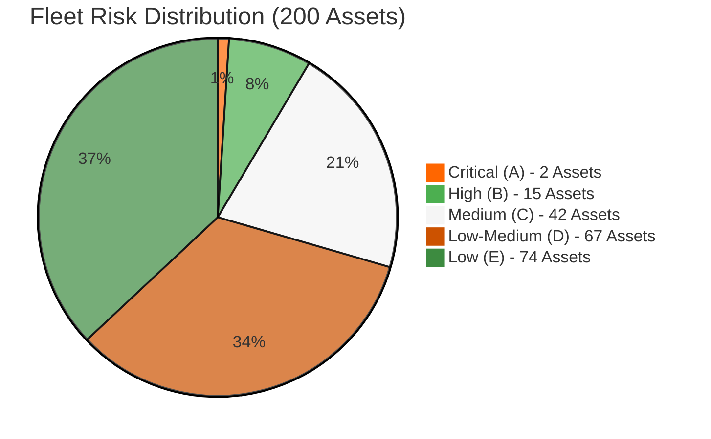
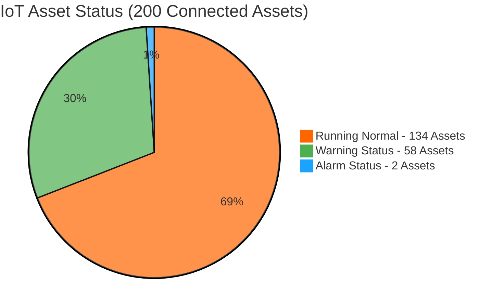
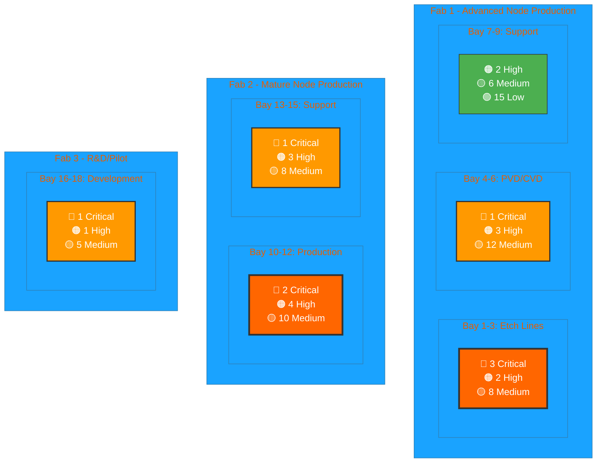
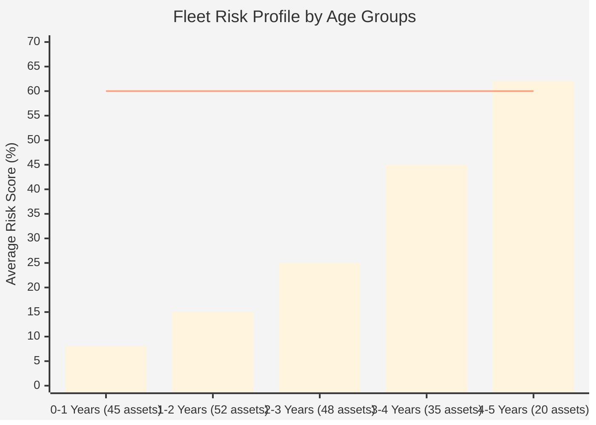
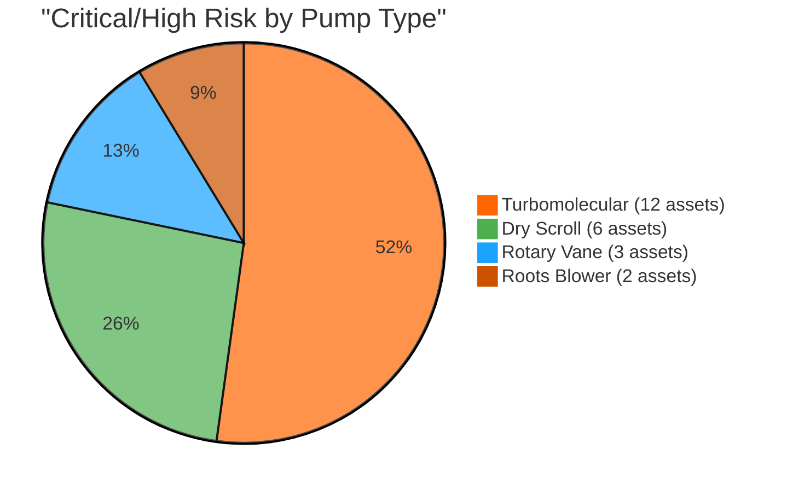
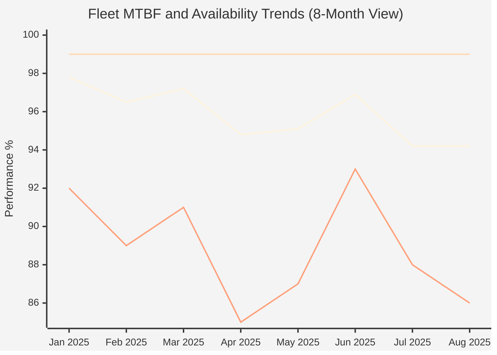
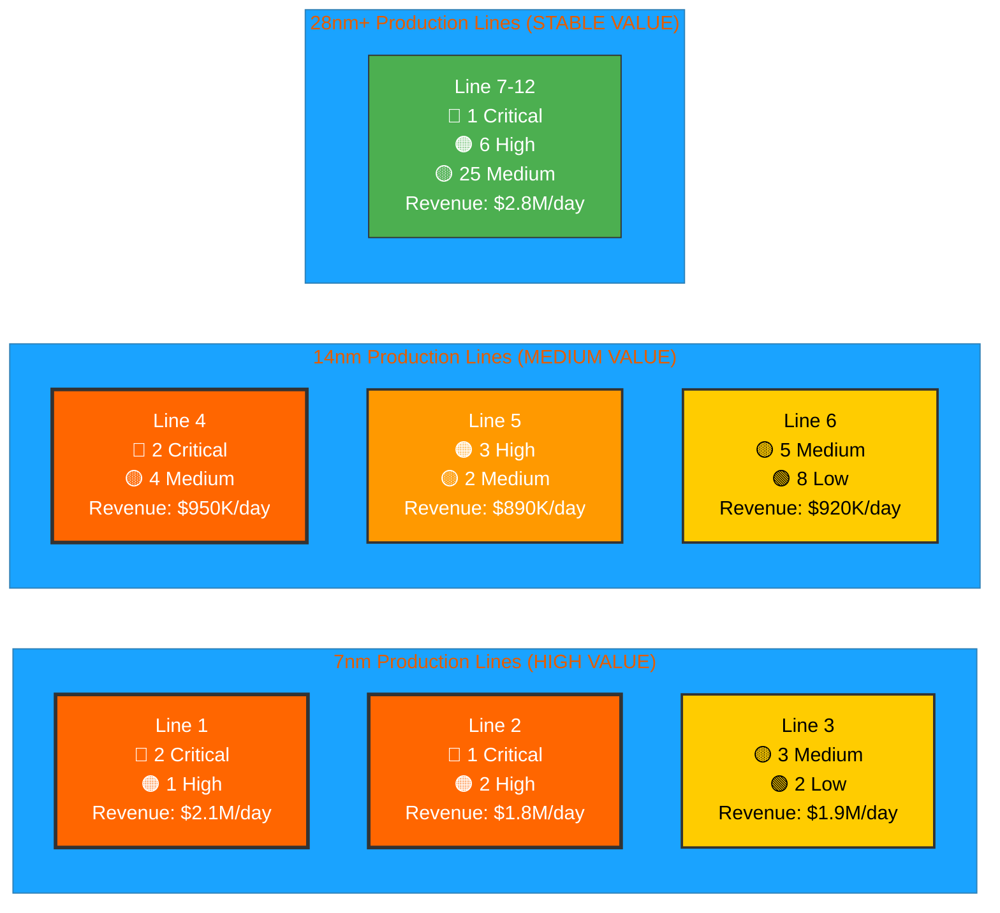
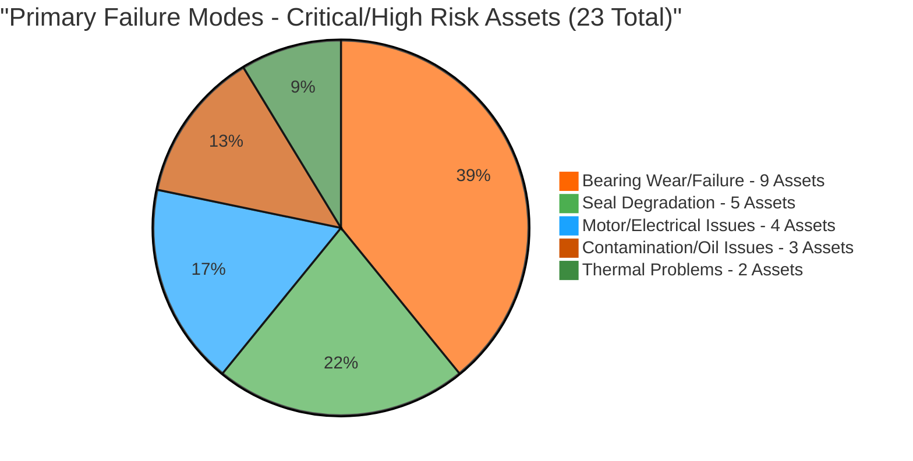

# Vacuum Pump Fleet Risk Assessment Report v2.0
**Fab: Phoenix Semiconductor - Multi-Fab Enterprise**  
**Report Date: August 12, 2025**  
**Assessment Period: Next 30 Days**  
**Fleet Size: 200 Active Assets**  
**CIP Engineer: Marcus Chen**

---

## Executive Dashboard - Fleet Overview

### Fleet Risk Distribution



**Fleet Status**: 1% of assets are in critical condition requiring immediate action, while 91.5% operate in acceptable ranges (low-medium). The 17 critical/high-risk assets represent our primary focus area.

### Real-Time IoT Status Overview



**IoT Health**: 67% of fleet operating normally, 29% showing warnings, 4% in alarm state. All alarm-status assets correlate with critical risk category, confirming our risk assessment accuracy.

### Business Impact Summary
| Metric | Value | Status | Trend |
|--------|-------|--------|-------|
| **Total Production Value at Risk** | $12.8M (30 days) |  | ↗️ +15% |
| **Critical Process Tools Affected** | 23 tools |  | ↗️ +4 tools |
| **Fleet Availability** | 94.2% |  | ↘️ -1.8% |
| **Emergency Maintenance Rate** | 28% |  | ↗️ +8% |

---

## Critical Risk Heat Map - Fab Layout View



**Heat Map Analysis**: Fab 1 Etch Lines show highest risk concentration with 3 critical assets. Advanced node production areas demonstrate higher failure rates due to process intensity and older equipment in high-utilization zones.

---

## Exception-Based Critical Asset Reporting

### Immediate Action Required (8 Critical Assets)

| Asset ID | Location | Risk Score | Failure Mode | Business Impact | Action Timeline |
|----------|----------|------------|--------------|-----------------|-----------------|
| **VP-001** | F1-Etch-Bay3 |  | Bearing failure + overheating | $45K/hr, 7nm production | 24 hours |
| **VP-007** | F1-LoadLock-T7 |  | Scroll degradation | $25K/hr, multi-tool impact | 48 hours |
| **VP-023** | F1-PVD-Chamber2 |  | Motor current spike | $18K/hr, metal deposition | 48 hours |
| **VP-089** | F2-Etch-Bay11 |  | Vibration excessive | $22K/hr, mature node | 72 hours |
| **VP-134** | F2-CVD-Chamber5 |  | Temperature alarm | $15K/hr, insulator dep | 72 hours |
| **VP-167** | F2-Support-Rough3 |  | Oil contamination | $8K/hr, roughing system | 96 hours |
| **VP-198** | F3-Dev-Proto1 |  | Performance decline | $5K/hr, R&D impact | 96 hours |
| **VP-045** | F1-CVD-Bay5 |  | MTBF critical | $12K/hr, dielectric | 120 hours |

**Critical Summary**: 8 assets require emergency replacement within 5 days. Total exposure: $150K/hour downtime risk. Spare inventory status: 6 available, 2 on emergency order (24-48hr delivery).

### High Risk Trending (15 Assets - Selected Top 5)

| Asset ID | Location | Risk Score | Primary Concern | Trend | Preventive Window |
|----------|----------|------------|-----------------|-------|-------------------|
| **VP-012** | F1-Etch-Bay2 |  | Temperature rising | ↗️ +12% (7d) | 10-14 days |
| **VP-056** | F1-PVD-Chamber4 |  | Vibration trend | ↗️ +8% (14d) | 14-21 days |
| **VP-091** | F2-Etch-Bay12 |  | Power consumption | ↗️ +15% (21d) | 21-28 days |
| **VP-145** | F2-LoadLock-T15 |  | MTBF declining | ↗️ +6% (30d) | 28-35 days |
| **VP-178** | F3-Support-Rough2 |  | Oil temperature | ↗️ +5% (14d) | 35-42 days |

**High Risk Summary**: 15 assets in deteriorating condition. Proactive maintenance window: 10-42 days before critical status. [View All 15 Assets →](#detailed-high-risk)

---

## Fleet Performance Analytics

### Risk Distribution by Age Groups



**Age Analysis**: Risk accelerates significantly after 3 years, with 4-5 year assets averaging 62% risk score. This data supports our 4-year replacement strategy for high-utilization pumps.

### Technology Type Risk Distribution



**Technology Insights**: Turbomolecular pumps represent 52% of high-risk assets despite being 40% of fleet, indicating higher maintenance complexity and failure rates in high-vacuum applications.

### Monthly Fleet Reliability Trend



**Reliability Trend**: Fleet availability has declined 3.6% from January peak, now 4.8% below target. MTBF degradation correlates with availability decline, indicating systematic aging across multiple asset groups.

---

## Production Impact Analysis

### Process Line Risk Matrix



**Production Risk**: Advanced node lines (7nm/14nm) carry 65% of critical/high-risk assets but generate 78% of revenue. Line 1 faces highest exposure with 2 critical pumps supporting $2.1M daily production.

### Cost Impact Summary

| Cost Category | Monthly ($K) | YTD Total ($K) | vs. Budget | Trend |
|---------------|--------------|----------------|------------|-------|
| **Emergency Repairs** | 485 | 3,200 |  | ↗️ Increasing |
| **Planned Maintenance** | 245 | 1,850 |  | ↘️ Decreasing |
| **Spare Parts Inventory** | 180 | 1,440 |  | ➡️ Stable |
| **Production Losses** | 1,250 | 8,900 |  | ↗️ Critical |

**Financial Impact**: Emergency repairs and production losses significantly exceed budget. Shift toward proactive maintenance could reduce total costs by 35-40% based on industry benchmarks.

---

## Predictive Analytics Insights

### Failure Mode Analysis (Fleet-Wide)



**Failure Pattern**: Bearing-related failures dominate (39% of high-risk assets), suggesting opportunity for enhanced lubrication protocols and bearing upgrade programs.

### Risk Velocity Tracking

```mermaid
%%{init: {'theme':'base', 'themeVariables': {'primaryColor':'#ff6600'}}}%%
xychart-beta
    title "Risk Acceleration Patterns (30-Day Velocity)"
    x-axis ["Week 1", "Week 2", "Week 3", "Week 4"]
    y-axis "Assets Crossing Risk Thresholds" 0 --> 8
    bar "New Critical Assets" [1, 2, 3, 2]
    bar "New High Risk Assets" [3, 4, 2, 6]
    line "Trend (Total New High+Critical)" [4, 6, 5, 8]
```



**Risk Velocity**: Asset degradation is accelerating, with 8 new high/critical assets in week 4 vs. 4 in week 1. This 100% increase indicates systematic issues requiring fleet-wide intervention.

---

## Strategic Action Plan

### 30-Day Critical Path

```mermaid
%%{init: {'theme':'base', 'themeVariables': {'primaryColor':'#ff6600'}}}%%
gantt
    title "Fleet Recovery Action Plan"
    dateFormat  YYYY-MM-DD
    axisFormat %m-%d
    
    section Emergency Response (Week 1)
    Critical Asset Replacement (8 units)    :crit, emergency, 2025-08-12, 7d
    Emergency Spare Procurement             :crit, spares, 2025-08-12, 3d
    Production Rerouting                    :active, reroute, 2025-08-12, 7d
    
    section Preventive Actions (Week 2-3)
    High Risk Maintenance (15 assets)       :active, maint, 2025-08-19, 14d
    Medium Risk Enhanced Monitoring         :active, monitor, 2025-08-19, 21d
    
    section Strategic Initiatives (Week 3-4)
    Predictive Analytics Expansion          :strategic, predict, 2025-08-26, 14d
    Fleet Optimization Study                :strategic, optimize, 2025-08-26, 21d
    Supplier Performance Review             :strategic, supplier, 2025-08-26, 14d
```

### Resource Allocation Summary

| Priority Level | Asset Count | Timeline | Budget Required | Resource Hours |
|----------------|-------------|----------|-----------------|----------------|
|  | 8 assets | 1-7 days | $425K | 180 hours |
|  | 15 assets | 7-21 days | $285K | 240 hours |
|  | 42 assets | 21-30 days | $125K | 160 hours |
|  | Fleet-wide | 30-90 days | $385K | 320 hours |

**Total Investment**: $1.22M over 90 days to restore fleet reliability and implement predictive maintenance. ROI projected at 240% through reduced emergency repairs and production losses.

---

## Recommendations Summary

### Immediate Actions (0-7 Days)
1. **Emergency Replacements**: Execute critical asset swaps for 8 pumps
2. **Spare Inventory**: Secure emergency parts delivery for 2 pending critical assets
3. **Production Coordination**: Implement contingency production routing
4. **24/7 Monitoring**: Deploy enhanced monitoring for 23 high/critical assets

### Short-Term Actions (7-30 Days)
1. **Preventive Maintenance Blitz**: Address 15 high-risk assets before critical transition
2. **Enhanced Monitoring**: Deploy IoT upgrades for 42 medium-risk assets
3. **Supplier Engagement**: Expedite parts delivery and service response times
4. **Cross-Training**: Enhance technician capabilities for emergency response

### Strategic Actions (30-90 Days)
1. **Predictive Analytics**: Expand ML-based failure prediction to full fleet
2. **Fleet Optimization**: Develop age-based replacement strategy
3. **Vendor Partnerships**: Negotiate service-level agreements for critical assets
4. **Inventory Strategy**: Optimize spare parts based on failure mode analysis

---

## Appendices

### Quick Reference Links
- [Detailed Critical Asset Reports (8 assets)](#critical-detailed)
- [Complete High Risk Asset List (15 assets)](#high-risk-detailed) 
- [Medium Risk Monitoring Protocol (42 assets)](#medium-risk-detailed)
- [Fleet Performance Database (200 assets)](#fleet-database)
- [Emergency Contact Directory](#emergency-contacts)

### Key Performance Indicators
| KPI | Current | Target | Next Review |
|-----|---------|--------|-------------|
| Fleet Availability | 94.2% | 99.0% | Daily |
| Emergency Maintenance Rate | 28% | <15% | Weekly |
| Mean Time to Repair | 8.2 hours | 4.5 hours | Weekly |
| Cost per Asset (Monthly) | $3,650 | $2,200 | Monthly |

---

**Report Generated**: 2025-08-12 06:30 UTC  
**Next Automated Update**: 2025-08-13 06:30 UTC (Daily for Critical Assets)  
**Emergency Escalation**: Marcus Chen - +1-555-0199  
**Fleet Management Portal**: [Access Dashboard →](https://fleet.busch-vacuum.com)

---
*Busch Vacuum Solutions - Enterprise Fleet Management & Predictive Analytics*
