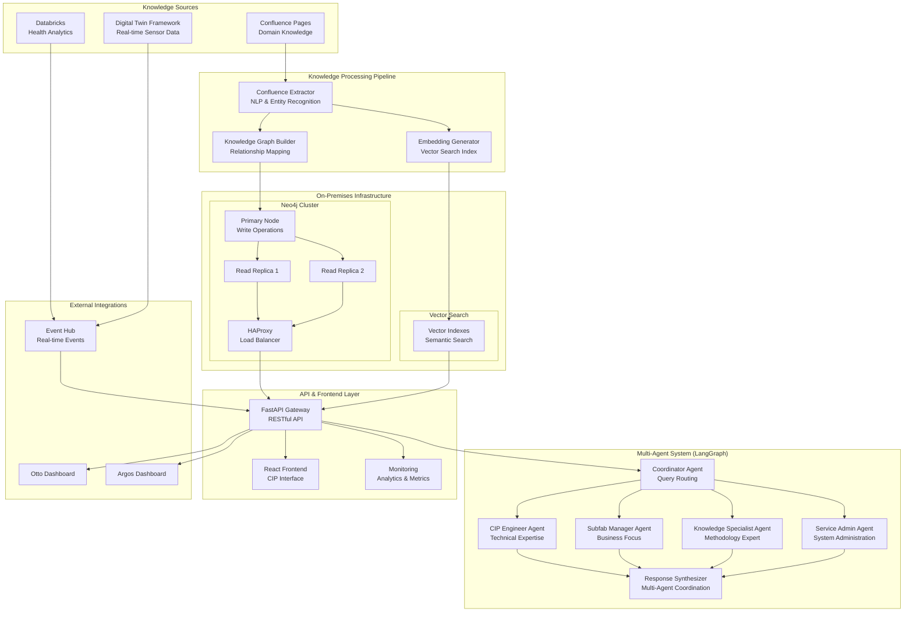
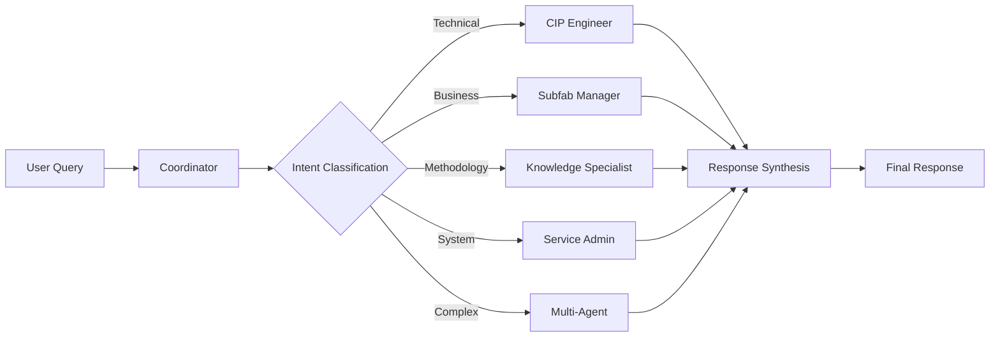

# Architecture Overview

## System Architecture

The CIP Multi-Agent Knowledge Graph System is built on a modern, scalable architecture that combines knowledge graphs, multi-agent AI systems, and real-time data integration.

## High-Level Architecture



## Core Components

### 1. Knowledge Sources

#### Confluence Pages
- **Purpose**: Primary source of domain knowledge and methodologies
- **Content**: Risk assessment procedures, maintenance guidelines, troubleshooting guides
- **Structure**: Labeled pages with structured content for automated extraction
- **Integration**: Automated daily sync with change detection

#### Databricks Analytics
- **Purpose**: Real-time pump health analytics and predictive models
- **Data**: Health Index, RUL (Remaining Useful Life), MTBF, Failure Likelihood
- **Models**: Machine learning models for predictive maintenance
- **Integration**: Event-driven updates via Azure Event Hub

#### Digital Twin Framework (DTF)
- **Purpose**: Real-time IoT sensor data and asset registry
- **Data**: Temperature, vibration, pressure, power consumption
- **Assets**: Complete pump inventory with specifications and locations
- **Integration**: Live data streaming and event notifications

### 2. Knowledge Processing Pipeline

#### Confluence Extractor
```python
# Key capabilities
- HTML/Markdown parsing
- Named Entity Recognition (NER)
- Domain-specific pattern matching
- Relationship extraction using linguistic analysis
- Embedding generation for semantic search
```

**Entity Types Extracted:**
- **Concepts**: Risk Assessment, Predictive Maintenance
- **Metrics**: P₃₀ Risk Score, Health Index, MTBF
- **Processes**: Bearing Replacement, Troubleshooting Procedures
- **Thresholds**: Critical values and operating limits
- **Assets**: Pump models and specifications

#### Knowledge Graph Builder
```python
# Graph construction process
1. Entity deduplication and normalization
2. Relationship mapping using dependency patterns
3. Property enrichment with metadata
4. Vector embedding integration
5. Schema validation and constraints
```

**Relationship Types:**
- `CONTAINS`: Process contains steps or components
- `DEPENDS_ON`: Calculations depend on input metrics
- `IMPLEMENTS`: Procedures implement methodologies
- `RELATES_TO`: General conceptual relationships
- `TRIGGERS`: Conditions that trigger actions

### 3. Neo4j Knowledge Graph

#### Cluster Architecture
- **Primary Node**: All write operations, schema changes
- **Read Replicas**: Load-balanced read queries, high availability
- **HAProxy**: Intelligent request routing based on operation type
- **Backup**: Automated daily backups with point-in-time recovery

#### Schema Design
```cypher
// Core node types
(:Concept {name, description, type, embedding})
(:Process {name, description, steps, duration})
(:Metric {name, formula, unit, thresholds})
(:Asset {id, model, location, specifications})
(:Procedure {name, pump_models, skill_level, time_hours})

// Relationship types with properties
()-[:DEPENDS_ON {confidence, context}]->()
()-[:CONTAINS {order, mandatory}]->()
()-[:IMPLEMENTS {compliance_level}]->()
```

#### Vector Search Integration
- **Embedding Model**: OpenAI text-embedding-3-large (1536 dimensions)
- **Similarity Metric**: Cosine similarity
- **Index Types**: Separate indexes for concepts, processes, and procedures
- **Query Strategy**: Hybrid approach combining vector similarity and graph traversal

### 4. Multi-Agent System (LangGraph)

#### Agent Architecture
```python
# State management for multi-agent coordination
class AgentState(TypedDict):
    messages: List[Message]
    user_query: str
    query_intent: str
    query_complexity: str
    assigned_agent: str
    agent_responses: Dict[str, Any]
    knowledge_context: List[Dict]
    real_time_data: Dict[str, Any]
    final_response: str
    action_items: List[Dict]
    escalation_needed: bool
```

#### Agent Specializations

**Coordinator Agent**
- **Role**: Query analysis, intent classification, agent routing
- **Capabilities**: Natural language understanding, complexity assessment
- **Decision Logic**: Route based on intent, complexity, and available context

**CIP Engineer Agent**
- **Role**: Technical pump expertise, maintenance planning, risk assessment
- **Knowledge Access**: Pump specifications, failure modes, maintenance procedures
- **Tools**: Asset health analysis, critical asset identification, procedure lookup

**Subfab Manager Agent**
- **Role**: Business impact analysis, operational planning, resource management
- **Knowledge Access**: Cost models, production schedules, business metrics
- **Tools**: Downtime cost calculation, resource allocation, SLA tracking

**Knowledge Specialist Agent**
- **Role**: Methodology expert, framework guidance, standards compliance
- **Knowledge Access**: Complete domain knowledge, calculation methods, standards
- **Tools**: Methodology lookup, procedure validation, standards reference

**Service Admin Agent**
- **Role**: System administration, user management, configuration
- **Knowledge Access**: System documentation, configuration guides, security procedures
- **Tools**: User management, system health checks, configuration validation

#### Agent Coordination Workflow


### 5. API & Frontend Layer

#### FastAPI Gateway
```python
# Key endpoints
POST /api/query              # Main query processing
POST /api/sync-confluence    # Knowledge synchronization
GET  /api/health            # System health check
GET  /api/agents            # Available agents
GET  /api/knowledge-stats   # Knowledge graph metrics
```

**Features:**
- **Request Validation**: Pydantic models for type safety
- **Rate Limiting**: Prevent abuse and ensure fair usage
- **Authentication**: Role-based access control
- **Monitoring**: Request/response logging and metrics
- **Error Handling**: Graceful error responses with debugging info

#### React Frontend
```typescript
// Key components
<CIPChatInterface />        // Main chat interface
<AgentResponseCard />       // Agent response formatting
<ActionItemsList />         // Actionable recommendations
<KnowledgeSourcesList />    // Source attribution
<PerformanceMetrics />      // System performance display
```

**Features:**
- **Real-time Chat**: WebSocket-based communication
- **Agent Awareness**: Visual indication of which agent is responding
- **Action Items**: Structured task lists with priorities and timelines
- **Source Attribution**: Links back to original knowledge sources
- **Responsive Design**: Works on desktop, tablet, and mobile

### 6. Integration Layer

#### Real-time Data Integration
```python
# Event-driven architecture
Event Hub --> API Gateway --> Agent System
    |
    ├── Health Metric Updates
    ├── Alarm Notifications  
    ├── Maintenance Events
    └── Asset Status Changes
```

#### External System Connections
- **Databricks**: Health analytics via REST API and Event Hub
- **DTF**: Real-time sensor data via Event Hub
- **Otto/Argos**: Dashboard integration via API calls
- **MES/ERP**: Future integration points for production data

## Deployment Architecture

### Development Environment
```yaml
Services:
  - Neo4j Single Instance
  - FastAPI Development Server
  - React Development Server
  - Local Confluence (optional)
```

### Production Environment
```yaml
Infrastructure:
  - Kubernetes Cluster (3+ nodes)
  - Neo4j Enterprise Cluster (1 primary + 2 replicas)
  - HAProxy Load Balancer
  - Persistent Storage (100GB+ for Neo4j)
  - Monitoring Stack (Prometheus + Grafana)
  
Scaling:
  - API Gateway: 3+ replicas with HPA
  - Knowledge Extraction: Scheduled jobs
  - Neo4j: Read replicas for query scaling
```

### Security Architecture
```yaml
Authentication:
  - OAuth 2.0 / OIDC integration
  - Role-based access control (RBAC)
  - API key management for service accounts

Network Security:
  - Private VLANs for database traffic
  - TLS encryption for all communications
  - Firewall rules for port restrictions

Data Security:
  - Encryption at rest (Neo4j Enterprise)
  - Encryption in transit (TLS 1.3)
  - Regular security audits and updates
```

## Performance Characteristics

### Query Performance
- **Response Time**: < 2 seconds for 95% of queries
- **Concurrent Users**: 50+ simultaneous users
- **Throughput**: 100+ queries per minute
- **Cache Hit Rate**: 70%+ for repeated queries

### Scalability Limits
- **Knowledge Graph**: 1M+ nodes, 10M+ relationships
- **Vector Search**: 100K+ embeddings with sub-second search
- **Agent Concurrency**: 20+ simultaneous agent conversations
- **Real-time Updates**: 1000+ events per minute

### Resource Requirements
```yaml
Minimum (Development):
  - CPU: 4 cores
  - RAM: 16 GB
  - Storage: 50 GB SSD
  
Recommended (Production):
  - CPU: 16+ cores
  - RAM: 64+ GB  
  - Storage: 500+ GB NVMe SSD
  - Network: 1 Gbps
```

## Monitoring & Observability

### Key Metrics
- **System Health**: API availability, database connectivity
- **Query Performance**: Response times, success rates, error rates
- **Agent Performance**: Agent utilization, confidence scores
- **Knowledge Metrics**: Graph size, sync frequency, update rates
- **Business Metrics**: User adoption, query patterns, value delivery

### Alerting Rules
```yaml
Critical Alerts:
  - API downtime > 1 minute
  - Database connectivity lost
  - Query error rate > 5%
  - Knowledge sync failures

Warning Alerts:
  - Response time > 5 seconds
  - Agent confidence < 60%
  - Disk usage > 80%
  - Memory usage > 85%
```

---

## Next Steps

1. **[Deploy the System](Deployment-Guide)** - Get started with deployment
2. **[Configure Agents](Agent-Configuration)** - Set up specialized agents
3. **[Integrate Knowledge](Confluence-Integration)** - Connect your Confluence
4. **[Monitor Performance](Monitoring-Alerting)** - Set up monitoring
5. **[Optimize Performance](Performance-Tuning)** - Fine-tune for your environment

---

*For detailed implementation guides, see the specific wiki pages for each component.*