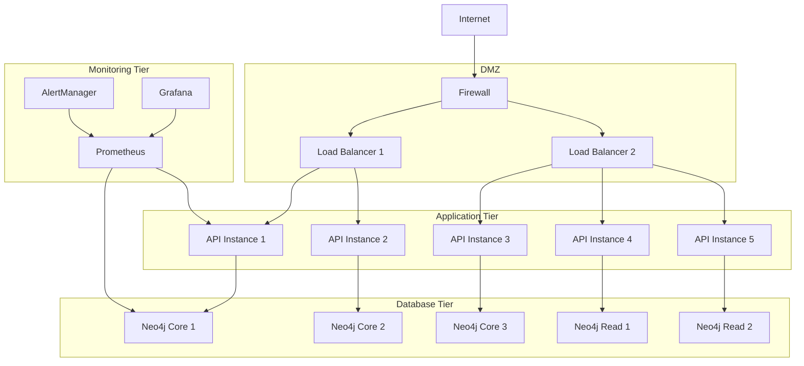

# Deployment Guide

This guide covers all deployment scenarios for the CIP Multi-Agent Knowledge Graph System, from local development to production enterprise deployment.

## Deployment Options Overview

| Deployment Type | Use Case | Complexity | Scalability | High Availability |
|----------------|----------|------------|-------------|-------------------|
| **Local Development** | Development, Testing | Low | Single User | No |
| **Docker Compose** | Small Teams, POC | Medium | 5-10 Users | Limited |
| **Kubernetes** | Production | High | 50+ Users | Yes |
| **Enterprise On-Prem** | Large Scale Production | Very High | 500+ Users | Full HA |

---

## 🚀 Quick Start (5 Minutes)

### Prerequisites
```bash
# Required software
- Docker Desktop 4.0+
- Docker Compose 2.0+
- Git
- 8GB+ RAM available
- 20GB+ disk space

# Optional for production
- Kubernetes cluster
- Helm 3.0+
```

### Immediate Setup
```bash
# 1. Clone repository
git clone https://github.com/your-org/cip-knowledge-graph.git
cd cip-knowledge-graph

# 2. Configure environment
cp .env.example .env
# Edit .env with your credentials

# 3. Start system
./quick-start.sh

# 4. Verify deployment
curl http://localhost:8000/api/health
```

---

## 🔧 Local Development Setup

### Environment Configuration
```bash
# .env file for development
NEO4J_PASSWORD=dev123
OPENAI_API_KEY=your_openai_key_here
CONFLUENCE_URL=https://your-company.atlassian.net/wiki
CONFLUENCE_USERNAME=your_username
CONFLUENCE_API_TOKEN=your_api_token

# Optional for full integration
DATABRICKS_TOKEN=your_databricks_token
DATABRICKS_WORKSPACE=your_workspace_url
DTF_ENDPOINT=your_dtf_endpoint
```

### Docker Compose Development
```yaml
# docker-compose.dev.yml
version: '3.8'

services:
  neo4j:
    image: neo4j:5.15-community
    container_name: neo4j-dev
    environment:
      - NEO4J_AUTH=neo4j/${NEO4J_PASSWORD}
      - NEO4J_PLUGINS=["apoc"]
      - NEO4J_db_index_vector_enabled=true
    ports:
      - "7474:7474"
      - "7687:7687"
    volumes:
      - neo4j-dev-data:/data

  multi-agent-api:
    build: 
      context: .
      dockerfile: Dockerfile.dev
    container_name: cip-api-dev
    environment:
      - NEO4J_URI=bolt://neo4j:7687
      - OPENAI_API_KEY=${OPENAI_API_KEY}
      - DEBUG=true
    ports:
      - "8000:8000"
    volumes:
      - .:/app
      - /app/node_modules
    depends_on:
      - neo4j

  frontend:
    build:
      context: ./frontend
      dockerfile: Dockerfile.dev
    container_name: cip-frontend-dev
    ports:
      - "3000:3000"
    volumes:
      - ./frontend:/app
      - /app/node_modules
    environment:
      - REACT_APP_API_URL=http://localhost:8000

volumes:
  neo4j-dev-data:
```

### Development Commands
```bash
# Start development environment
docker-compose -f docker-compose.dev.yml up -d

# View logs
docker-compose -f docker-compose.dev.yml logs -f

# Execute commands in containers
docker exec -it cip-api-dev bash
docker exec -it neo4j-dev cypher-shell

# Load sample data
docker exec -it cip-api-dev python scripts/load_sample_data.py

# Run tests
docker exec -it cip-api-dev pytest

# Stop environment
docker-compose -f docker-compose.dev.yml down
```

---

## 🐳 Docker Compose Production

### Production Configuration
```yaml
# docker-compose.prod.yml
version: '3.8'

services:
  neo4j-primary:
    image: neo4j:5.15-enterprise
    hostname: neo4j-primary
    environment:
      - NEO4J_AUTH=neo4j/${NEO4J_PASSWORD}
      - NEO4J_ACCEPT_LICENSE_AGREEMENT=yes
      - NEO4J_dbms_mode=CORE
      - NEO4J_causal__clustering_initial__discovery__members=neo4j-primary:5000
      - NEO4J_dbms_memory_heap_max__size=4G
      - NEO4J_dbms_memory_pagecache_size=2G
      - NEO4J_PLUGINS=["graph-data-science", "apoc"]
    ports:
      - "7474:7474"
      - "7687:7687"
      - "5000:5000"
    volumes:
      - neo4j-primary-data:/data
      - neo4j-primary-logs:/logs
      - ./backup:/backup
    networks:
      - cip-network
    restart: unless-stopped

  confluence-extractor:
    build:
      context: ./confluence-extractor
    environment:
      - CONFLUENCE_URL=${CONFLUENCE_URL}
      - CONFLUENCE_USERNAME=${CONFLUENCE_USERNAME}
      - CONFLUENCE_API_TOKEN=${CONFLUENCE_API_TOKEN}
      - NEO4J_URI=bolt://neo4j-primary:7687
      - NEO4J_PASSWORD=${NEO4J_PASSWORD}
      - OPENAI_API_KEY=${OPENAI_API_KEY}
    volumes:
      - ./confluence-extractor/logs:/app/logs
    networks:
      - cip-network
    depends_on:
      - neo4j-primary
    restart: unless-stopped

  multi-agent-api:
    build: .
    deploy:
      replicas: 2
    environment:
      - NEO4J_URI=bolt://neo4j-primary:7687
      - NEO4J_PASSWORD=${NEO4J_PASSWORD}
      - OPENAI_API_KEY=${OPENAI_API_KEY}
      - CONFLUENCE_URL=${CONFLUENCE_URL}
      - CONFLUENCE_USERNAME=${CONFLUENCE_USERNAME}
      - CONFLUENCE_API_TOKEN=${CONFLUENCE_API_TOKEN}
    ports:
      - "8000-8001:8000"
    networks:
      - cip-network
    depends_on:
      - neo4j-primary
    restart: unless-stopped
    healthcheck:
      test: ["CMD", "curl", "-f", "http://localhost:8000/api/health"]
      interval: 30s
      timeout: 10s
      retries: 3

  nginx:
    image: nginx:alpine
    ports:
      - "80:80"
      - "443:443"
    volumes:
      - ./nginx.conf:/etc/nginx/nginx.conf
      - ./ssl:/etc/ssl/certs
    networks:
      - cip-network
    depends_on:
      - multi-agent-api
    restart: unless-stopped

  prometheus:
    image: prom/prometheus:latest
    ports:
      - "9090:9090"
    volumes:
      - ./monitoring/prometheus.yml:/etc/prometheus/prometheus.yml
      - prometheus-data:/prometheus
    networks:
      - cip-network
    restart: unless-stopped

  grafana:
    image: grafana/grafana:latest
    ports:
      - "3001:3000"
    environment:
      - GF_SECURITY_ADMIN_PASSWORD=${GRAFANA_PASSWORD}
    volumes:
      - grafana-data:/var/lib/grafana
      - ./monitoring/grafana/dashboards:/etc/grafana/provisioning/dashboards
    networks:
      - cip-network
    restart: unless-stopped

volumes:
  neo4j-primary-data:
  neo4j-primary-logs:
  prometheus-data:
  grafana-data:

networks:
  cip-network:
    driver: bridge
```

### Production Deployment Steps
```bash
# 1. Prepare environment
mkdir -p /opt/cip-knowledge-graph
cd /opt/cip-knowledge-graph
git clone https://github.com/your-org/cip-knowledge-graph.git .

# 2. Configure production environment
cp .env.example .env.prod
vim .env.prod  # Edit with production values

# 3. Generate SSL certificates
./scripts/generate-ssl.sh

# 4. Deploy system
docker-compose -f docker-compose.prod.yml up -d

# 5. Initialize knowledge graph
docker exec -it cip-knowledge-graph-multi-agent-api-1 python scripts/init_schema.py

# 6. Load initial knowledge
docker exec -it cip-knowledge-graph-multi-agent-api-1 python scripts/sync_confluence.py

# 7. Verify deployment
curl https://your-domain.com/api/health
```

---

## ☸️ Kubernetes Deployment

### Namespace and Secrets
```bash
# Create namespace
kubectl create namespace cip-rag-system

# Create secrets
kubectl create secret generic neo4j-secret \
  --from-literal=password="$(openssl rand -base64 32)" \
  -n cip-rag-system

kubectl create secret generic openai-secret \
  --from-literal=api-key="your_openai_api_key" \
  -n cip-rag-system

kubectl create secret generic confluence-secret \
  --from-literal=username="your_confluence_username" \
  --from-literal=api-token="your_confluence_api_token" \
  -n cip-rag-system

# Create config maps
kubectl create configmap cip-config \
  --from-file=config/production.yaml \
  -n cip-rag-system
```

### Neo4j StatefulSet
```yaml
# k8s/neo4j-statefulset.yaml
apiVersion: apps/v1
kind: StatefulSet
metadata:
  name: neo4j
  namespace: cip-rag-system
spec:
  serviceName: neo4j
  replicas: 1
  selector:
    matchLabels:
      app: neo4j
  template:
    metadata:
      labels:
        app: neo4j
    spec:
      containers:
      - name: neo4j
        image: neo4j:5.15-enterprise
        env:
        - name: NEO4J_AUTH
          valueFrom:
            secretKeyRef:
              name: neo4j-secret
              key: password
        - name: NEO4J_ACCEPT_LICENSE_AGREEMENT
          value: "yes"
        - name: NEO4J_dbms_memory_heap_max__size
          value: "8G"
        - name: NEO4J_dbms_memory_pagecache_size
          value: "4G"
        - name: NEO4J_PLUGINS
          value: '["graph-data-science", "apoc"]'
        - name: NEO4J_db_index_vector_enabled
          value: "true"
        ports:
        - containerPort: 7474
          name: http
        - containerPort: 7687
          name: bolt
        - containerPort: 5000
          name: discovery
        volumeMounts:
        - name: neo4j-data
          mountPath: /data
        - name: neo4j-logs
          mountPath: /logs
        resources:
          requests:
            memory: "8Gi"
            cpu: "2"
          limits:
            memory: "16Gi"
            cpu: "4"
        livenessProbe:
          tcpSocket:
            port: 7687
          initialDelaySeconds: 60
          periodSeconds: 30
        readinessProbe:
          tcpSocket:
            port: 7687
          initialDelaySeconds: 30
          periodSeconds: 10
  volumeClaimTemplates:
  - metadata:
      name: neo4j-data
    spec:
      accessModes: ["ReadWriteOnce"]
      storageClassName: fast-ssd
      resources:
        requests:
          storage: 500Gi
  - metadata:
      name: neo4j-logs
    spec:
      accessModes: ["ReadWriteOnce"]
      storageClassName: standard
      resources:
        requests:
          storage: 50Gi
```

### Multi-Agent API Deployment
```yaml
# k8s/multi-agent-deployment.yaml
apiVersion: apps/v1
kind: Deployment
metadata:
  name: cip-multi-agent
  namespace: cip-rag-system
spec:
  replicas: 3
  strategy:
    type: RollingUpdate
    rollingUpdate:
      maxSurge: 1
      maxUnavailable: 0
  selector:
    matchLabels:
      app: cip-multi-agent
  template:
    metadata:
      labels:
        app: cip-multi-agent
    spec:
      containers:
      - name: api
        image: your-registry/cip-multi-agent:latest
        ports:
        - containerPort: 8000
        env:
        - name: NEO4J_URI
          value: "bolt://neo4j:7687"
        - name: NEO4J_PASSWORD
          valueFrom:
            secretKeyRef:
              name: neo4j-secret
              key: password
        - name: OPENAI_API_KEY
          valueFrom:
            secretKeyRef:
              name: openai-secret
              key: api-key
        - name: CONFLUENCE_USERNAME
          valueFrom:
            secretKeyRef:
              name: confluence-secret
              key: username
        - name: CONFLUENCE_API_TOKEN
          valueFrom:
            secretKeyRef:
              name: confluence-secret
              key: api-token
        resources:
          requests:
            memory: "2Gi"
            cpu: "500m"
          limits:
            memory: "4Gi"
            cpu: "1"
        livenessProbe:
          httpGet:
            path: /api/health
            port: 8000
          initialDelaySeconds: 60
          periodSeconds: 30
        readinessProbe:
          httpGet:
            path: /api/health
            port: 8000
          initialDelaySeconds: 30
          periodSeconds: 10
        volumeMounts:
        - name: config
          mountPath: /app/config
          readOnly: true
      volumes:
      - name: config
        configMap:
          name: cip-config

---
apiVersion: v1
kind: Service
metadata:
  name: cip-multi-agent-service
  namespace: cip-rag-system
spec:
  selector:
    app: cip-multi-agent
  ports:
  - port: 8000
    targetPort: 8000
  type: ClusterIP

---
apiVersion: autoscaling/v2
kind: HorizontalPodAutoscaler
metadata:
  name: cip-multi-agent-hpa
  namespace: cip-rag-system
spec:
  scaleTargetRef:
    apiVersion: apps/v1
    kind: Deployment
    name: cip-multi-agent
  minReplicas: 3
  maxReplicas: 10
  metrics:
  - type: Resource
    resource:
      name: cpu
      target:
        type: Utilization
        averageUtilization: 70
  - type: Resource
    resource:
      name: memory
      target:
        type: Utilization
        averageUtilization: 80
```

### Ingress Configuration
```yaml
# k8s/ingress.yaml
apiVersion: networking.k8s.io/v1
kind: Ingress
metadata:
  name: cip-knowledge-graph-ingress
  namespace: cip-rag-system
  annotations:
    kubernetes.io/ingress.class: nginx
    cert-manager.io/cluster-issuer: letsencrypt-prod
    nginx.ingress.kubernetes.io/cors-allow-origin: "*"
    nginx.ingress.kubernetes.io/cors-allow-methods: "GET, POST, OPTIONS"
    nginx.ingress.kubernetes.io/cors-allow-headers: "DNT,User-Agent,X-Requested-With,If-Modified-Since,Cache-Control,Content-Type,Range,Authorization"
spec:
  tls:
  - hosts:
    - cip-agents.your-company.com
    secretName: cip-tls-secret
  rules:
  - host: cip-agents.your-company.com
    http:
      paths:
      - path: /
        pathType: Prefix
        backend:
          service:
            name: cip-multi-agent-service
            port:
              number: 8000
```

### Kubernetes Deployment Commands
```bash
# 1. Apply all manifests
kubectl apply -f k8s/

# 2. Wait for deployment
kubectl wait --for=condition=available deployment/cip-multi-agent -n cip-rag-system --timeout=300s

# 3. Check pod status
kubectl get pods -n cip-rag-system

# 4. View logs
kubectl logs -f deployment/cip-multi-agent -n cip-rag-system

# 5. Port forward for testing
kubectl port-forward svc/cip-multi-agent-service 8000:8000 -n cip-rag-system

# 6. Initialize knowledge graph
kubectl exec -it deployment/cip-multi-agent -n cip-rag-system -- python scripts/init_schema.py

# 7. Run initial knowledge sync
kubectl exec -it deployment/cip-multi-agent -n cip-rag-system -- python scripts/sync_confluence.py
```

---

## 🏢 Enterprise On-Premises Deployment

### Infrastructure Requirements
```yaml
Production Environment:
  Servers: 5+ physical servers or VMs
  CPU: 64+ cores total
  RAM: 256+ GB total
  Storage: 2+ TB NVMe SSD
  Network: 10 Gbps internal, 1 Gbps external
  
High Availability:
  Load Balancers: 2x HAProxy/NGINX
  Neo4j Cluster: 3 core nodes + 2 read replicas
  API Instances: 5+ replicas across multiple nodes
  Backup: Automated daily backups with offsite storage
```

### Network Architecture


### Security Configuration
```yaml
# security-config.yaml
security:
  authentication:
    type: "oauth2"
    provider: "azure_ad"  # or "okta", "auth0"
    client_id: "${OAUTH_CLIENT_ID}"
    client_secret: "${OAUTH_CLIENT_SECRET}"
    
  authorization:
    rbac:
      enabled: true
      roles:
        - name: "cip_engineer"
          permissions: ["query", "view_health", "view_analytics"]
        - name: "subfab_manager"
          permissions: ["query", "view_health", "view_analytics", "view_business_metrics"]
        - name: "admin"
          permissions: ["*"]
          
  network:
    tls:
      enabled: true
      cert_path: "/etc/ssl/certs/cip-agents.crt"
      key_path: "/etc/ssl/private/cip-agents.key"
    
    firewall:
      allowed_ips:
        - "10.0.0.0/8"      # Internal network
        - "192.168.0.0/16"  # Private network
      blocked_countries: ["CN", "RU", "KP"]
      
  data:
    encryption_at_rest: true
    encryption_key_rotation: 90  # days
    backup_encryption: true
    audit_logging: true
```

### Backup and Disaster Recovery
```bash
#!/bin/bash
# scripts/enterprise-backup.sh

# Daily backup script
BACKUP_DIR="/backup/$(date +%Y%m%d_%H%M%S)"
RETENTION_DAYS=30
S3_BUCKET="s3://your-company-cip-backups"

# Create backup directory
mkdir -p $BACKUP_DIR

# Backup Neo4j data
echo "Backing up Neo4j cluster..."
for node in neo4j-core-1 neo4j-core-2 neo4j-core-3; do
    kubectl exec $node -n cip-rag-system -- neo4j-admin database backup neo4j --to-path=/backup/
    kubectl cp cip-rag-system/$node:/backup $BACKUP_DIR/$node/
done

# Backup configurations
echo "Backing up configurations..."
kubectl get all -n cip-rag-system -o yaml > $BACKUP_DIR/k8s-manifests.yaml
kubectl get secrets -n cip-rag-system -o yaml > $BACKUP_DIR/secrets.yaml
kubectl get configmaps -n cip-rag-system -o yaml > $BACKUP_DIR/configmaps.yaml

# Backup application logs
echo "Backing up logs..."
kubectl logs --all-containers=true -n cip-rag-system > $BACKUP_DIR/application.log

# Create backup metadata
cat > $BACKUP_DIR/backup_info.json << EOF
{
  "timestamp": "$(date -Iseconds)",
  "type": "full",
  "retention_until": "$(date -d "+${RETENTION_DAYS} days" -Iseconds)",
  "components": {
    "neo4j_cluster": "3_nodes",
    "api_instances": "5_replicas",
    "configurations": "complete",
    "logs": "24h_window"
  }
}
EOF

# Compress and encrypt backup
tar -czf "${BACKUP_DIR}.tar.gz" -C $(dirname $BACKUP_DIR) $(basename $BACKUP_DIR)
gpg --cipher-algo AES256 --compress-algo 1 --s2k-cipher-algo AES256 \
    --s2k-digest-algo SHA512 --s2k-mode 3 --s2k-count 65011712 \
    --force-mdc --quiet --no-verbose --batch --yes \
    --passphrase-file /etc/backup-passphrase \
    --output "${BACKUP_DIR}.tar.gz.gpg" \
    --symmetric "${BACKUP_DIR}.tar.gz"

# Upload to cloud storage
aws s3 cp "${BACKUP_DIR}.tar.gz.gpg" $S3_BUCKET/

# Cleanup local files
rm -rf $BACKUP_DIR "${BACKUP_DIR}.tar.gz" "${BACKUP_DIR}.tar.gz.gpg"

# Remove old backups
find /backup -name "*.tar.gz.gpg" -mtime +$RETENTION_DAYS -delete
aws s3 ls $S3_BUCKET/ | awk '$1 < "'$(date -d "-${RETENTION_DAYS} days" +%Y-%m-%d)'" {print $4}' | xargs -I {} aws s3 rm $S3_BUCKET/{}

echo "Backup completed successfully"
```

---

## 🔧 Post-Deployment Configuration

### Initial System Setup
```bash
# 1. Initialize knowledge graph schema
curl -X POST http://your-domain.com/api/admin/init-schema \
  -H "Authorization: Bearer $ADMIN_TOKEN"

# 2. Create initial users and roles
curl -X POST http://your-domain.com/api/admin/users \
  -H "Content-Type: application/json" \
  -H "Authorization: Bearer $ADMIN_TOKEN" \
  -d '{
    "username": "cip.engineer@company.com",
    "role": "cip_engineer",
    "permissions": ["query", "view_health"]
  }'

# 3. Configure Confluence sync
curl -X POST http://your-domain.com/api/admin/confluence/config \
  -H "Content-Type: application/json" \
  -H "Authorization: Bearer $ADMIN_TOKEN" \
  -d '{
    "spaces": ["ENGINEERING", "KNOWLEDGE"],
    "labels": ["domain-knowledge", "procedures"],
    "sync_schedule": "0 2 * * *"
  }'

# 4. Run initial knowledge sync
curl -X POST http://your-domain.com/api/sync-confluence \
  -H "Authorization: Bearer $ADMIN_TOKEN" \
  -d '{
    "space_keys": ["ENGINEERING", "KNOWLEDGE"],
    "force_full_sync": true
  }'

# 5. Load sample data for testing
curl -X POST http://your-domain.com/api/admin/load-sample-data \
  -H "Authorization: Bearer $ADMIN_TOKEN"
```

### Performance Tuning
```yaml
# config/performance-tuning.yaml
neo4j:
  memory:
    heap_size: "8G"
    page_cache: "4G"
  query:
    timeout: 60  # seconds
    max_concurrent: 100
    
api:
  workers: 5
  max_connections: 1000
  connection_timeout: 30
  request_timeout: 120
  
agents:
  max_concurrent_conversations: 20
  response_timeout: 60
  context_window_size: 15
  
caching:
  query_cache_size: 10000
  embedding_cache_size: 50000
  cache_ttl: 3600  # seconds
  
monitoring:
  metrics_interval: 30  # seconds
  log_level: "INFO"
  enable_performance_logging: true
```

### Health Checks
```bash
# Automated health check script
#!/bin/bash
# scripts/health-check.sh

echo "🔍 Running comprehensive health check..."

# API Health
echo "Checking API health..."
API_HEALTH=$(curl -s http://your-domain.com/api/health | jq -r '.status')
if [ "$API_HEALTH" != "healthy" ]; then
    echo "❌ API health check failed"
    exit 1
fi
echo "✅ API is healthy"

# Neo4j Connectivity
echo "Checking Neo4j connectivity..."
NEO4J_STATUS=$(curl -s http://your-domain.com/api/health | jq -r '.components.neo4j')
if [ "$NEO4J_STATUS" != "connected" ]; then
    echo "❌ Neo4j connectivity failed"
    exit 1
fi
echo "✅ Neo4j is connected"

# Agent Functionality
echo "Testing agent functionality..."
AGENT_TEST=$(curl -s -X POST http://your-domain.com/api/query \
  -H "Content-Type: application/json" \
  -d '{"query": "System health check"}' | jq -r '.response')
if [ -z "$AGENT_TEST" ]; then
    echo "❌ Agent functionality test failed"
    exit 1
fi
echo "✅ Agents are functional"

# Knowledge Graph Stats
echo "Checking knowledge graph..."
KG_STATS=$(curl -s http://your-domain.com/api/knowledge-stats)
ENTITY_COUNT=$(echo $KG_STATS | jq -r '.total_entities')
if [ "$ENTITY_COUNT" -lt 10 ]; then
    echo "❌ Knowledge graph has insufficient entities: $ENTITY_COUNT"
    exit 1
fi
echo "✅ Knowledge graph is populated ($ENTITY_COUNT entities)"

echo "🎉 All health checks passed!"
```

---

## 🚨 Troubleshooting Common Issues

### Neo4j Issues
```bash
# Check Neo4j cluster status
kubectl exec -it neo4j-0 -n cip-rag-system -- cypher-shell -u neo4j -p $PASSWORD "SHOW DATABASES"

# View cluster topology
kubectl exec -it neo4j-0 -n cip-rag-system -- cypher-shell -u neo4j -p $PASSWORD "CALL dbms.cluster.overview()"

# Check disk space
kubectl exec -it neo4j-0 -n cip-rag-system -- df -h /data

# Restart cluster node
kubectl delete pod neo4j-0 -n cip-rag-system
```

### API Issues
```bash
# Check API logs
kubectl logs -f deployment/cip-multi-agent -n cip-rag-system

# Scale API instances
kubectl scale deployment cip-multi-agent --replicas=5 -n cip-rag-system

# Check resource usage
kubectl top pods -n cip-rag-system

# Restart API deployment
kubectl rollout restart deployment/cip-multi-agent -n cip-rag-system
```

### Knowledge Sync Issues
```bash
# Check confluence extractor logs
kubectl logs -f deployment/confluence-extractor -n cip-rag-system

# Manual knowledge sync
kubectl exec -it deployment/cip-multi-agent -n cip-rag-system -- python scripts/sync_confluence.py

# Reset knowledge graph
kubectl exec -it deployment/cip-multi-agent -n cip-rag-system -- python scripts/reset_knowledge_graph.py
```

---

## ✅ Deployment Checklist

### Pre-Deployment
- [ ] Infrastructure provisioned and configured
- [ ] DNS records configured
- [ ] SSL certificates obtained
- [ ] Environment variables configured
- [ ] Secrets created and validated
- [ ] Network policies configured
- [ ] Backup procedures tested

### Deployment
- [ ] Neo4j cluster deployed and clustered
- [ ] API services deployed and scaled
- [ ] Frontend deployed and accessible
- [ ] Monitoring stack deployed
- [ ] Health checks passing
- [ ] Load balancing configured
- [ ] SSL/TLS working

### Post-Deployment
- [ ] Knowledge graph schema initialized
- [ ] Initial users and roles created
- [ ] Confluence integration configured
- [ ] Initial knowledge sync completed
- [ ] Sample data loaded for testing
- [ ] Performance tuning applied
- [ ] Monitoring alerts configured
- [ ] Backup procedures verified
- [ ] Documentation updated
- [ ] Team training completed

---

*For specific troubleshooting scenarios, see the [Troubleshooting Guide](Troubleshooting). For performance optimization, see [Performance Tuning](Performance-Tuning).*