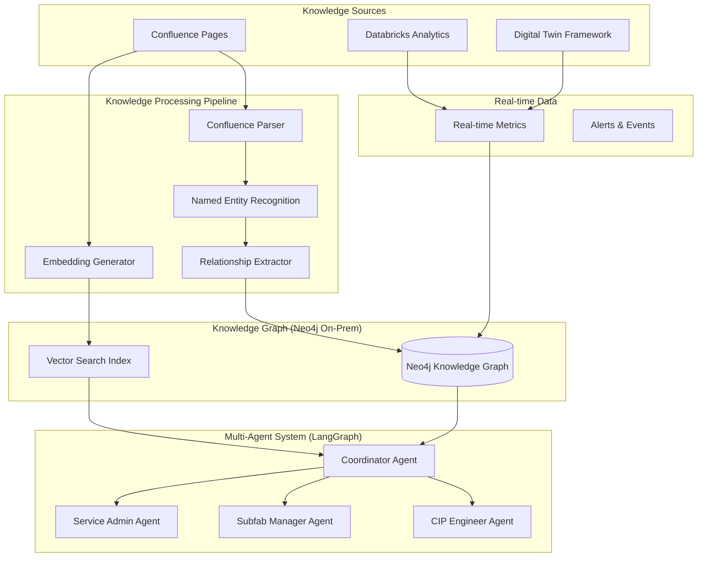

## 6. FastAPI Multi-Agent Service

### **Main Application**
```python
# multi-agent/main.py
from fastapi import FastAPI, HTTPException, BackgroundTasks
from fastapi.middleware.cors import CORSMiddleware
from pydantic import BaseModel
from typing import Dict, Any, List, Optional
import logging
import asyncio
from datetime import datetime

from multi_agent_system import MultiAgentCIPSystem
from confluence_sync import ConfluenceKnowledgeSync

# Configure logging
logging.basicConfig(level=logging.INFO)
logger = logging.getLogger(__name__)

app = FastAPI(
    title="CIP Multi-Agent System",
    description="Multi-agent system for CIP engineers and related roles",
    version="1.0.0"
)

# Add CORS middleware
app.add_middleware(
    CORSMiddleware,
    allow_origins=["*"],  # Configure appropriately for production
    allow_credentials=True,
    allow_methods=["*"],
    allow_headers=["*"],
)

# Initialize multi-agent system
multi_agent_system = MultiAgentCIPSystem(
    neo4j_uri="bolt://neo4j-primary:7687",
    neo4j_user="neo4j",
    neo4j_password="your_password"
)

# Initialize confluence sync
confluence_sync = ConfluenceKnowledgeSync(
    confluence_url="https://your-company.atlassian.net/wiki",
    username="your_username",
    api_token="your_api_token",
    neo4j_uri="bolt://neo4j-primary:7687",
    neo4j_user="neo4j",
    neo4j_password="your_password"
)

class QueryRequest(BaseModel):
    query: str
    user_context: Optional[Dict[str, Any]] = {}
    agent_preference: Optional[str] = None

class QueryResponse(BaseModel):
    query: str
    assigned_agent: str
    response: str
    action_items: List[Dict[str, str]]
    knowledge_sources: List[str]
    processing_path: List[str]
    confidence_score: float
    timestamp: datetime

class SyncRequest(BaseModel):
    space_keys: List[str]
    labels: List[str] = ["domain-knowledge"]
    force_full_sync: bool = False

@app.post("/api/query", response_model=QueryResponse)
async def process_query(request: QueryRequest):
    """Process user query through multi-agent system"""
    try:
        start_time = datetime.now()
        
        # Process query
        result = multi_agent_system.process_query(request.query)
        
        # Calculate confidence score (simplified)
        confidence_score = result.get("confidence", 0.8)
        
        response = QueryResponse(
            query=request.query,
            assigned_agent=result["assigned_agent"],
            response=result["response"],
            action_items=result["action_items"],
            knowledge_sources=result["knowledge_sources"],
            processing_path=result["processing_path"],
            confidence_score=confidence_score,
            timestamp=datetime.now()
        )
        
        # Log query for analytics
        processing_time = (datetime.now() - start_time).total_seconds()
        logger.info(f"Query processed in {processing_time:.2f}s - Agent: {result['assigned_agent']}")
        
        return response
        
    except Exception as e:
        logger.error(f"Error processing query: {str(e)}")
        raise HTTPException(status_code=500, detail=f"Error processing query: {str(e)}")

@app.post("/api/sync-confluence")
async def sync_confluence_knowledge(request: SyncRequest, background_tasks: BackgroundTasks):
    """Sync knowledge from Confluence pages"""
    try:
        # Run sync in background
        background_tasks.add_task(
            confluence_sync.sync_spaces,
            request.space_keys,
            request.labels,
            request.force_full_sync
        )
        
        return {
            "status": "sync_started",
            "message": f"Started syncing {len(request.space_keys)} spaces",
            "spaces": request.space_keys
        }
        
    except Exception as e:
        logger.error(f"Error starting confluence sync: {str(e)}")
        raise HTTPException(status_code=500, detail=f"Error starting sync: {str(e)}")

@app.get("/api/sync-status")
async def get_sync_status():
    """Get status of knowledge sync"""
    try:
        status = confluence_sync.get_sync_status()
        return status
    except Exception as e:
        raise HTTPException(status_code=500, detail=f"Error getting sync status: {str(e)}")

@app.get("/api/agents")
async def list_agents():
    """List available agents and their capabilities"""
    return {
        "agents": [
            {
                "name": "coordinator",
                "description": "Routes queries and coordinates multi-agent responses",
                "capabilities": ["query_analysis", "routing", "orchestration"]
            },
            {
                "name": "cip_engineer",
                "description": "Technical vacuum pump expert for maintenance and diagnostics",
                "capabilities": ["risk_assessment", "troubleshooting", "technical_analysis", "maintenance_planning"]
            },
            {
                "name": "subfab_manager",
                "description": "Operational and business focused agent",
                "capabilities": ["business_impact", "operational_planning", "resource_management"]
            },
            {
                "name": "service_admin",
                "description": "System administration and configuration",
                "capabilities": ["system_administration", "user_management", "configuration"]
            },
            {
                "name": "knowledge_specialist",
                "description": "Domain knowledge and methodology expert",
                "capabilities": ["methodology", "frameworks", "standards", "procedures"]
            }
        ]
    }

@app.get("/api/health")
async def health_check():
    """System health check"""
    try:
        # Check Neo4j connectivity
        neo4j_status = multi_agent_system.kg_client.health_check()
        
        # Check confluence connectivity
        confluence_status = confluence_sync.health_check()
        
        overall_status = "healthy" if neo4j_status and confluence_status else "unhealthy"
        
        return {
            "status": overall_status,
            "components": {
                "neo4j": "connected" if neo4j_status else "disconnected",
                "confluence": "connected" if confluence_status else "disconnected",
                "multi_agent_system": "operational"
            },
            "timestamp": datetime.now()
        }
        
    except Exception as e:
        return {
            "status": "unhealthy",
            "error": str(e),
            "timestamp": datetime.now()
        }

@app.get("/api/knowledge-stats")
async def get_knowledge_stats():
    """Get knowledge graph statistics"""
    try:
        stats = multi_agent_system.kg_client.get_knowledge_stats()
        return stats
    except Exception as e:
        raise HTTPException(status_code=500, detail=f"Error getting knowledge stats: {str(e)}")

# Scheduled tasks
@app.on_event("startup")
async def startup_event():
    """Initialize system on startup"""
    logger.info("Starting CIP Multi-Agent System")
    
    # Initialize knowledge graph schema if needed
    try:
        multi_agent_system.kg_client.initialize_schema()
        logger.info("Knowledge graph schema initialized")
    except Exception as e:
        logger.error(f"Error initializing schema: {str(e)}")
    
    # Start background sync scheduler
    asyncio.create_task(confluence_sync.start_scheduler())

if __name__ == "__main__":
    import uvicorn
    uvicorn.run(app, host="0.0.0.0", port=8000)
```

### **Confluence Knowledge Sync Service**
```python
# multi-agent/confluence_sync.py
import asyncio
import schedule
import time
from datetime import datetime, timedelta
from typing import List, Dict, Any
import logging

from confluence_extractor import ConfluenceKnowledgeExtractor, ConfluenceKnowledgeGraphBuilder

class ConfluenceKnowledgeSync:
    def __init__(self, confluence_url: str, username: str, api_token: str,
                 neo4j_uri: str, neo4j_user: str, neo4j_password: str):
        
        self.extractor = ConfluenceKnowledgeExtractor(confluence_url, username, api_token)
        self.graph_builder = ConfluenceKnowledgeGraphBuilder(
            neo4j_uri, neo4j_user, neo4j_password, "your_openai_key"
        )
        
        self.sync_status = {
            "last_sync": None,
            "status": "idle",
            "spaces_synced": [],
            "entities_processed": 0,
            "relationships_processed": 0,
            "errors": []
        }
        
        self.logger = logging.getLogger(__name__)
    
    async def sync_spaces(self, space_keys: List[str], labels: List[str], force_full: bool = False):
        """Sync knowledge from specified Confluence spaces"""
        
        self.sync_status["status"] = "running"
        self.sync_status["errors"] = []
        start_time = datetime.now()
        
        try:
            all_entities = []
            all_relationships = []
            
            for space_key in space_keys:
                self.logger.info(f"Syncing space: {space_key}")
                
                try:
                    # Extract knowledge from space
                    entities, relationships = self.extractor.extract_knowledge_from_space(
                        space_key, labels
                    )
                    
                    all_entities.extend(entities)
                    all_relationships.extend(relationships)
                    
                    self.logger.info(f"Extracted {len(entities)} entities and {len(relationships)} relationships from {space_key}")
                    
                except Exception as e:
                    error_msg = f"Error extracting from space {space_key}: {str(e)}"
                    self.logger.error(error_msg)
                    self.sync_status["errors"].append(error_msg)
            
            # Build/update knowledge graph
            if all_entities or all_relationships:
                self.logger.info("Building knowledge graph...")
                self.graph_builder.build_knowledge_graph(all_entities, all_relationships)
                
                self.sync_status["entities_processed"] = len(all_entities)
                self.sync_status["relationships_processed"] = len(all_relationships)
                self.sync_status["spaces_synced"] = space_keys
            
            # Update sync status
            self.sync_status["status"] = "completed"
            self.sync_status["last_sync"] = datetime.now()
            
            sync_duration = (datetime.now() - start_time).total_seconds()
            self.logger.info(f"Sync completed in {sync_duration:.2f} seconds")
            
        except Exception as e:
            self.sync_status["status"] = "failed"
            error_msg = f"Sync failed: {str(e)}"
            self.logger.error(error_msg)
            self.sync_status["errors"].append(error_msg)
    
    def get_sync_status(self) -> Dict[str, Any]:
        """Get current sync status"""
        return self.sync_status.copy()
    
    async def start_scheduler(self):
        """Start background scheduler for automatic syncing"""
        
        # Schedule daily sync at 2 AM
        schedule.every().day.at("02:00").do(
            self._scheduled_sync,
            ["ENGINEERING", "KNOWLEDGE"], # Default spaces
            ["domain-knowledge", "procedures"]
        )
        
        # Schedule weekly full sync on Sunday
        schedule.every().sunday.at("01:00").do(
            self._scheduled_sync,
            ["ENGINEERING", "KNOWLEDGE", "OPERATIONS"],
            ["domain-knowledge", "procedures", "standards"],
            True  # force_full
        )
        
        # Run scheduler in background
        while True:
            schedule.run_pending()
            await asyncio.sleep(60)  # Check every minute
    
    def _scheduled_sync(self, space_keys: List[str], labels: List[str], force_full: bool = False):
        """Wrapper for scheduled sync"""
        asyncio.create_task(self.sync_spaces(space_keys, labels, force_full))
    
    def health_check(self) -> bool:
        """Check if Confluence is accessible"""
        try:
            # Try to get a simple space list
            spaces = self.extractor.confluence.get_all_spaces(limit=1)
            return True
        except Exception as e:
            self.logger.error(f"Confluence health check failed: {str(e)}")
            return False
```

---

## 7. Production Deployment Configuration

### **Environment Configuration**
```yaml
# config/production.yaml
confluence:
  url: "${CONFLUENCE_URL}"
  username: "${CONFLUENCE_USERNAME}"
  api_token: "${CONFLUENCE_API_TOKEN}"
  sync_spaces:
    - "ENGINEERING"
    - "KNOWLEDGE" 
    - "PROCEDURES"
  sync_labels:
    - "domain-knowledge"
    - "risk-assessment"
    - "maintenance-procedures"
    - "cip-engineering"
  sync_schedule: "0 2 * * *"  # Daily at 2 AM

neo4j:
  # Use load balancer for read/write separation
  write_uri: "bolt://neo4j-lb:7688"  # Write to primary
  read_uri: "bolt://neo4j-lb:7687"   # Read from replicas
  user: "neo4j"
  password: "${NEO4J_PASSWORD}"
  
  # Connection pooling
  max_connection_pool_size: 100
  max_transaction_retry_time: 30
  connection_acquisition_timeout: 60
  
  # Performance settings
  query_timeout: 30
  max_query_time: 120

openai:
  api_key: "${OPENAI_API_KEY}"
  model: "gpt-4-turbo-preview"
  embedding_model: "text-embedding-3-large"
  max_tokens: 2000
  temperature: 0.1
  max_retries: 3
  timeout: 60

agents:
  coordinator:
    enabled: true
    max_routing_attempts: 3
  
  cip_engineer:
    enabled: true
    real_time_data_timeout: 10
    action_item_limit: 5
  
  subfab_manager:
    enabled: true
    business_context_weight: 0.7
  
  service_admin:
    enabled: true
    system_access_required: true
  
  knowledge_specialist:
    enabled: true
    max_knowledge_context: 15
    confidence_threshold: 0.9

system:
  max_concurrent_queries: 50
  query_timeout: 120
  cache_enabled: true
  cache_ttl: 3600
  monitoring_enabled: true
  debug_mode: false

logging:
  level: "INFO"
  format: "json"
  enable_query_logging: true
  enable_performance_logging: true
  log_retention_days: 30
```

### **Kubernetes Deployment**
```yaml
# k8s/multi-agent-deployment.yaml
apiVersion: apps/v1
kind: Deployment
metadata:
  name: cip-multi-agent
  namespace: cip-rag-system
  labels:
    app: cip-multi-agent
spec:
  replicas: 3
  strategy:
    type: RollingUpdate
    rollingUpdate:
      maxSurge: 1
      maxUnavailable: 0
  selector:
    matchLabels:
      app: cip-multi-agent
  template:
    metadata:
      labels:
        app: cip-multi-agent
    spec:
      containers:
      - name: multi-agent
        image: your-registry/cip-multi-agent:latest
        ports:
        - containerPort: 8000
        env:
        - name: NEO4J_URI
          value: "bolt://neo4j-lb:7687"
        - name: NEO4J_WRITE_URI
          value: "bolt://neo4j-lb:7688"
        - name: NEO4J_USER
          value: "neo4j"
        - name: NEO4J_PASSWORD
          valueFrom:
            secretKeyRef:
              name: neo4j-secret
              key: password
        - name: OPENAI_API_KEY
          valueFrom:
            secretKeyRef:
              name: openai-secret
              key: api-key
        - name: CONFLUENCE_URL
          valueFrom:
            configMapKeyRef:
              name: confluence-config
              key: url
        - name: CONFLUENCE_USERNAME
          valueFrom:
            secretKeyRef:
              name: confluence-secret
              key: username
        - name: CONFLUENCE_API_TOKEN
          valueFrom:
            secretKeyRef:
              name: confluence-secret
              key: api-token
        resources:
          requests:
            memory: "2Gi"
            cpu: "500m"
          limits:
            memory: "4Gi"
            cpu: "1"
        livenessProbe:
          httpGet:
            path: /api/health
            port: 8000
          initialDelaySeconds: 60
          periodSeconds: 30
          timeoutSeconds: 10
          failureThreshold: 3
        readinessProbe:
          httpGet:
            path: /api/health
            port: 8000
          initialDelaySeconds: 30
          periodSeconds: 10
          timeoutSeconds: 5
          failureThreshold: 3
        volumeMounts:
        - name: config
          mountPath: /app/config
          readOnly: true
        - name: logs
          mountPath: /app/logs
      volumes:
      - name: config
        configMap:
          name: cip-multi-agent-config
      - name: logs
        emptyDir: {}

---
apiVersion: v1
kind: Service
metadata:
  name: cip-multi-agent-service
  namespace: cip-rag-system
spec:
  selector:
    app: cip-multi-agent
  ports:
  - port: 8000
    targetPort: 8000
    protocol: TCP
  type: ClusterIP

---
apiVersion: networking.k8s.io/v1
kind: Ingress
metadata:
  name: cip-multi-agent-ingress
  namespace: cip-rag-system
  annotations:
    nginx.ingress.kubernetes.io/rewrite-target: /
    nginx.ingress.kubernetes.io/cors-allow-origin: "*"
    nginx.ingress.kubernetes.io/cors-allow-methods: "GET, POST, OPTIONS"
    nginx.ingress.kubernetes.io/cors-allow-headers: "DNT,User-Agent,X-Requested-With,If-Modified-Since,Cache-Control,Content-Type,Range"
spec:
  rules:
  - host: cip-agents.your-company.com
    http:
      paths:
      - path: /
        pathType: Prefix
        backend:
          service:
            name: cip-multi-agent-service
            port:
              number: 8000
```

### **Monitoring and Observability**
```yaml
# k8s/monitoring.yaml
apiVersion: v1
kind: Service
metadata:
  name: cip-multi-agent-metrics
  namespace: cip-rag-system
  labels:
    app: cip-multi-agent
spec:
  selector:
    app: cip-multi-agent
  ports:
  - name: metrics
    port: 9090
    targetPort: 9090

---
apiVersion: monitoring.coreos.com/v1
kind: ServiceMonitor
metadata:
  name: cip-multi-agent-monitor
  namespace: cip-rag-system
spec:
  selector:
    matchLabels:
      app: cip-multi-agent
  endpoints:
  - port: metrics
    interval: 30s
    path: /metrics
```

---

## 8. Monitoring and Analytics

### **Custom Metrics Collection**
```python
# multi-agent/metrics.py
from prometheus_client import Counter, Histogram, Gauge, start_http_server
import time
import functools
from typing import Dict, Any

# Define metrics
QUERY_COUNTER = Counter('cip_agent_queries_total', 'Total queries processed', ['agent', 'intent'])
QUERY_DURATION = Histogram('cip_agent_query_duration_seconds', 'Query processing time', ['agent'])
ACTIVE_QUERIES = Gauge('cip_agent_active_queries', 'Currently active queries')
KNOWLEDGE_SYNC_COUNTER = Counter('cip_knowledge_sync_total', 'Total knowledge syncs', ['status'])
AGENT_CONFIDENCE = Histogram('cip_agent_confidence_score', 'Agent confidence scores', ['agent'])

class MetricsCollector:
    def __init__(self):
        self.start_time = time.time()
        # Start metrics server on port 9090
        start_http_server(9090)
    
    def track_query(self, agent: str, intent: str):
        """Decorator to track query metrics"""
        def decorator(func):
            @functools.wraps(func)
            def wrapper(*args, **kwargs):
                start_time = time.time()
                ACTIVE_QUERIES.inc()
                
                try:
                    result = func(*args, **kwargs)
                    
                    # Record metrics
                    QUERY_COUNTER.labels(agent=agent, intent=intent).inc()
                    duration = time.time() - start_time
                    QUERY_DURATION.labels(agent=agent).observe(duration)
                    
                    # Record confidence if available
                    if isinstance(result, dict) and 'confidence' in result:
                        AGENT_CONFIDENCE.labels(agent=agent).observe(result['confidence'])
                    
                    return result
                    
                finally:
                    ACTIVE_QUERIES.dec()
            
            return wrapper
        return decorator
    
    def record_sync_status(self, status: str):
        """Record knowledge sync status"""
        KNOWLEDGE_SYNC_COUNTER.labels(status=status).inc()

# Global metrics instance
metrics = MetricsCollector()
```

### **Query Analytics Dashboard**
```python
# multi-agent/analytics.py
from datetime import datetime, timedelta
from typing import Dict, List, Any
import logging

class QueryAnalytics:
    def __init__(self, kg_client):
        self.kg_client = kg_client
        self.logger = logging.getLogger(__name__)
    
    def get_query_patterns(self, days: int = 7) -> Dict[str, Any]:
        """Analyze query patterns over time"""
        
        with self.kg_client.driver.session() as session:
            # Get query frequency by intent
            intent_stats = session.run("""
                MATCH (q:Query)
                WHERE q.timestamp > datetime() - duration('P7D')
                RETURN q.intent as intent, count(*) as query_count
                ORDER BY query_count DESC
                """)
            
            # Get agent utilization
            agent_stats = session.run("""
                MATCH (q:Query)
                WHERE q.timestamp > datetime() - duration('P7D')
                RETURN q.assigned_agent as agent, count(*) as query_count,
                       avg(q.processing_time_ms) as avg_processing_time
                ORDER BY query_count DESC
                """)
            
            # Get hourly distribution
            hourly_stats = session.run("""
                MATCH (q:Query)
                WHERE q.timestamp > datetime() - duration('P7D')
                RETURN q.timestamp.hour as hour, count(*) as query_count
                ORDER BY hour
                """)
            
            return {
                "intent_distribution": [dict(record) for record in intent_stats],
                "agent_utilization": [dict(record) for record in agent_stats],
                "hourly_distribution": [dict(record) for record in hourly_stats],
                "analysis_period": f"Last {days} days"
            }
    
    def get_knowledge_usage_stats(self) -> Dict[str, Any]:
        """Analyze knowledge graph usage patterns"""
        
        with self.kg_client.driver.session() as session:
            # Most accessed knowledge pages
            page_stats = session.run("""
                MATCH (page:KnowledgePage)<-[:REFERENCES]-(q:Query)
                RETURN page.title as page_title, count(q) as access_count
                ORDER BY access_count DESC
                LIMIT 10
                """)
            
            # Most used concepts
            concept_stats = session.run("""
                MATCH (concept:Concept)<-[:USES]-(q:Query)
                RETURN concept.name as concept_name, concept.type as concept_type,
                       count(q) as usage_count
                ORDER BY usage_count DESC
                LIMIT 10
                """)
            
            # Knowledge gaps (low confidence queries)
            gap_stats = session.run("""
                MATCH (q:Query)
                WHERE q.confidence_score < 0.6
                RETURN q.intent as intent, q.query_text as query,
                       q.confidence_score as confidence
                ORDER BY q.timestamp DESC
                LIMIT 20
                """)
            
            return {
                "most_accessed_pages": [dict(record) for record in page_stats],
                "most_used_concepts": [dict(record) for record in concept_stats],
                "knowledge_gaps": [dict(record) for record in gap_stats]
            }
    
    def generate_insights(self) -> List[str]:
        """Generate actionable insights from analytics"""
        
        insights = []
        
        # Get data
        query_patterns = self.get_query_patterns()
        knowledge_stats = self.get_knowledge_usage_stats()
        
        # Analyze agent utilization
        agent_stats = query_patterns["agent_utilization"]
        if agent_stats:
            top_agent = agent_stats[0]
            if top_agent["query_count"] > sum(a["query_count"] for a in agent_stats) * 0.5:
                insights.append(f"Agent '{top_agent['agent']}' is handling {top_agent['query_count']} queries - consider load balancing")
        
        # Analyze knowledge gaps
        gaps = knowledge_stats["knowledge_gaps"]
        low_confidence_count = len([g for g in gaps if g["confidence"] < 0.5])
        if low_confidence_count > 5:
            insights.append(f"Found {low_confidence_count} low-confidence queries - knowledge base may need expansion")
        
        # Analyze peak usage times
        hourly_dist = query_patterns["hourly_distribution"]
        if hourly_dist:
            peak_hour = max(hourly_dist, key=lambda x: x["query_count"])
            insights.append(f"Peak usage at hour {peak_hour['hour']} with {peak_hour['query_count']} queries")
        
        return insights
```

---

## 9. Testing and Validation

### **Integration Test Suite**
```python
# tests/test_integration.py
import pytest
import asyncio
from datetime import datetime
from multi_agent_system import MultiAgentCIPSystem
from confluence_sync import ConfluenceKnowledgeSync

@pytest.fixture(scope="session")
def neo4j_test_container():
    """Start test Neo4j container"""
    import testcontainers.neo4j
    
    with testcontainers.neo4j.Neo4jContainer() as neo4j:
        yield neo4j

@pytest.fixture
def multi_agent_system(neo4j_test_container):
    """Initialize multi-agent system for testing"""
    system = MultiAgentCIPSystem(
        neo4j_uri=neo4j_test_container.get_connection_url(),
        neo4j_user="neo4j",
        neo4j_password="test"
    )
    
    # Load test knowledge
    system.kg_client.load_test_knowledge()
    
    return system

class TestMultiAgentSystem:
    """Test multi-agent system functionality"""
    
    @pytest.mark.asyncio
    async def test_cip_engineer_risk_assessment(self, multi_agent_system):
        """Test CIP engineer agent for risk assessment"""
        
        query = "Which pumps require immediate replacement?"
        result = multi_agent_system.process_query(query)
        
        assert result["assigned_agent"] == "cip_engineer"
        assert "VP-001" in result["response"]  # Should identify critical asset
        assert len(result["action_items"]) > 0
        assert any("immediate" in action["timeline"] for action in result["action_items"])
    
    @pytest.mark.asyncio
    async def test_knowledge_specialist_methodology(self, multi_agent_system):
        """Test knowledge specialist for methodology questions"""
        
        query = "How is the P30 risk score calculated?"
        result = multi_agent_system.process_query(query)
        
        assert result["assigned_agent"] == "knowledge_specialist"
        assert "P₃₀" in result["response"]
        assert "Health Index" in result["response"]
        assert len(result["knowledge_sources"]) > 0
    
    @pytest.mark.asyncio
    async def test_coordinator_routing(self, multi_agent_system):
        """Test coordinator routing logic"""
        
        test_cases = [
            ("Critical pump status", "cip_engineer"),
            ("Business impact of downtime", "subfab_manager"),
            ("Risk assessment methodology", "knowledge_specialist"),
            ("User permissions setup", "service_admin")
        ]
        
        for query, expected_agent in test_cases:
            result = multi_agent_system.process_query(query)
            assert result["assigned_agent"] == expected_agent, f"Query '{query}' routed to {result['assigned_agent']}, expected {expected_agent}"
    
    def test_escalation_handling(self, multi_agent_system):
        """Test multi-agent escalation scenarios"""
        
        # Complex query requiring multiple agents
        query = "What's the business impact of VP-001 failure and what methodology should we use for risk assessment?"
        result = multi_agent_system.process_query(query)
        
        # Should involve multiple agents
        assert len(result["agent_responses"]) > 1
        assert "synthesizer" in result["processing_path"]

class TestConfluenceIntegration:
    """Test Confluence knowledge extraction"""
    
    @pytest.fixture
    def mock_confluence_sync(self, neo4j_test_container):
        """Mock confluence sync for testing"""
        from unittest.mock import Mock
        
        sync = ConfluenceKnowledgeSync(
            confluence_url="https://test.atlassian.net",
            username="test",
            api_token="test",
            neo4j_uri=neo4j_test_container.get_connection_url(),
            neo4j_user="neo4j",
            neo4j_password="test"
        )
        
        # Mock the extractor
        sync.extractor = Mock()
        return sync
    
    @pytest.mark.asyncio
    async def test_knowledge_extraction(self, mock_confluence_sync):
        """Test knowledge extraction from Confluence pages"""
        
        # Mock confluence page content
        mock_entities = [
            {
                "name": "P30 Risk Score",
                "type": "metric",
                "description": "30-day failure probability calculation",
                "page_source": "Risk Assessment Methodology",
                "section": "calculation_methodology"
            }
        ]
        
        mock_relationships = [
            {
                "source_entity": "P30 Risk Score",
                "target_entity": "Health Index",
                "relationship_type": "DEPENDS      - NEO4J_server_default__advertised__address=neo4j-read2
      # Read replica configuration
      - NEO4J_dbms_mode=READ_REPLICA
      - NEO4J_causal__clustering_discovery__type=LIST
      - NEO4J_causal__clustering_initial__discovery__members=neo4j-primary:5000,neo4j-read1:5000,neo4j-read2:5000
      # Performance tuning
      - NEO4J_dbms_memory_heap_max__size=6G
      - NEO4J_dbms_memory_pagecache_size=3G
      # Plugins
      - NEO4J_PLUGINS=["graph-data-science", "apoc"]
      - NEO4J_dbms_security_procedures_unrestricted=gds.*,apoc.*
      # Vector search
      - NEO4J_db_index_vector_enabled=true
    ports:
      - "7476:7474"
      - "7689:7687"
      - "5002:5000"
    volumes:
      - neo4j-read2-data:/data
      - neo4j-read2-logs:/logs
    networks:
      - neo4j-network
    restart: unless-stopped
    depends_on:
      - neo4j-primary

  # Knowledge extraction service
  confluence-extractor:
    build: 
      context: ./confluence-extractor
      dockerfile: Dockerfile
    container_name: confluence-extractor
    environment:
      - CONFLUENCE_URL=${CONFLUENCE_URL}
      - CONFLUENCE_USERNAME=${CONFLUENCE_USERNAME}
      - CONFLUENCE_API_TOKEN=${CONFLUENCE_API_TOKEN}
      - NEO4J_URI=bolt://neo4j-primary:7687
      - NEO4J_USER=neo4j
      - NEO4J_PASSWORD=${NEO4J_PASSWORD}
      - OPENAI_API_KEY=${OPENAI_API_KEY}
      - EXTRACTION_SCHEDULE=0 2 * * *  # Daily at 2 AM
    volumes:
      - ./confluence-extractor/config:/app/config
      - ./confluence-extractor/logs:/app/logs
    networks:
      - neo4j-network
    restart: unless-stopped
    depends_on:
      - neo4j-primary

  # Load balancer for Neo4j
  neo4j-lb:
    image: haproxy:2.8
    container_name: neo4j-lb
    ports:
      - "7480:7474"  # HTTP UI
      - "7690:7687"  # Bolt read queries
      - "7691:7688"  # Bolt write queries  
    volumes:
      - ./haproxy/haproxy.cfg:/usr/local/etc/haproxy/haproxy.cfg:ro
    networks:
      - neo4j-network
    restart: unless-stopped
    depends_on:
      - neo4j-primary
      - neo4j-read1
      - neo4j-read2

volumes:
  neo4j-primary-data:
  neo4j-primary-logs:
  neo4j-primary-conf:
  neo4j-primary-plugins:
  neo4j-read1-data:
  neo4j-read1-logs:
  neo4j-read2-data:
  neo4j-read2-logs:

networks:
  neo4j-network:
    driver: bridge
```

### **HAProxy Configuration for Neo4j Load Balancing**
```cfg
# haproxy/haproxy.cfg
global
    daemon
    log stdout local0

defaults
    mode tcp
    timeout connect 5000ms
    timeout client 50000ms
    timeout server 50000ms
    log global

# Neo4j Browser/HTTP (read-only)
frontend neo4j_http
    bind *:7474
    default_backend neo4j_http_backend

backend neo4j_http_backend
    balance roundrobin
    server neo4j-primary neo4j-primary:7474 check
    server neo4j-read1 neo4j-read1:7474 check
    server neo4j-read2 neo4j-read2:7474 check

# Neo4j Bolt read queries
frontend neo4j_bolt_read
    bind *:7687
    default_backend neo4j_bolt_read_backend

backend neo4j_bolt_read_backend
    balance roundrobin
    server neo4j-read1 neo4j-read1:7687 check
    server neo4j-read2 neo4j-read2:7687 check
    server neo4j-primary neo4j-primary:7687 check backup

# Neo4j Bolt write queries  
frontend neo4j_bolt_write
    bind *:7688
    default_backend neo4j_bolt_write_backend

backend neo4j_bolt_write_backend
    server neo4j-primary neo4j-primary:7687 check
```

---

## 4. LangGraph Multi-Agent System

### **Multi-Agent Architecture with LangGraph**
```python
from langgraph.graph import StateGraph, END
from langgraph.prebuilt import ToolExecutor, ToolInvocation
from langchain_core.messages import HumanMessage, AIMessage, SystemMessage
from langchain_openai import ChatOpenAI
from langchain_core.tools import tool
from typing import TypedDict, Annotated, List, Dict, Any
import operator
from datetime import datetime

# State definition for multi-agent system
class AgentState(TypedDict):
    messages: Annotated[List, operator.add]
    user_query: str
    query_intent: str
    query_complexity: str  # simple, moderate, complex
    assigned_agent: str
    agent_responses: Dict[str, Any]
    knowledge_context: List[Dict[str, Any]]
    real_time_data: Dict[str, Any]
    final_response: str
    action_items: List[Dict[str, str]]
    escalation_needed: bool

class MultiAgentCIPSystem:
    def __init__(self, neo4j_uri: str, neo4j_user: str, neo4j_password: str):
        self.kg_client = Neo4jKnowledgeClient(neo4j_uri, neo4j_user, neo4j_password)
        self.llm = ChatOpenAI(model="gpt-4-turbo-preview", temperature=0.1)
        
        # Initialize specialized agents
        self.agents = {
            "coordinator": CoordinatorAgent(self.kg_client, self.llm),
            "cip_engineer": CIPEngineerAgent(self.kg_client, self.llm),
            "subfab_manager": SubfabManagerAgent(self.kg_client, self.llm),
            "service_admin": ServiceAdminAgent(self.kg_client, self.llm),
            "knowledge_specialist": KnowledgeSpecialistAgent(self.kg_client, self.llm)
        }
        
        # Build the workflow graph
        self.workflow = self._build_workflow()
    
    def _build_workflow(self) -> StateGraph:
        """Build the multi-agent workflow using LangGraph"""
        
        workflow = StateGraph(AgentState)
        
        # Add nodes for each agent
        workflow.add_node("coordinator", self._coordinator_node)
        workflow.add_node("cip_engineer", self._cip_engineer_node)
        workflow.add_node("subfab_manager", self._subfab_manager_node)
        workflow.add_node("service_admin", self._service_admin_node)
        workflow.add_node("knowledge_specialist", self._knowledge_specialist_node)
        workflow.add_node("synthesizer", self._synthesizer_node)
        
        # Define the workflow edges
        workflow.set_entry_point("coordinator")
        
        # Coordinator routes to appropriate agents
        workflow.add_conditional_edges(
            "coordinator",
            self._route_to_agent,
            {
                "cip_engineer": "cip_engineer",
                "subfab_manager": "subfab_manager", 
                "service_admin": "service_admin",
                "knowledge_specialist": "knowledge_specialist",
                "escalate": "synthesizer"
            }
        )
        
        # All agents can route to synthesizer or escalate
        for agent in ["cip_engineer", "subfab_manager", "service_admin", "knowledge_specialist"]:
            workflow.add_conditional_edges(
                agent,
                self._check_completion,
                {
                    "synthesize": "synthesizer",
                    "escalate": "coordinator",
                    "end": END
                }
            )
        
        workflow.add_edge("synthesizer", END)
        
        return workflow.compile()
    
    def _coordinator_node(self, state: AgentState) -> AgentState:
        """Coordinator agent determines query routing and complexity"""
        return self.agents["coordinator"].process(state)
    
    def _cip_engineer_node(self, state: AgentState) -> AgentState:
        """CIP Engineer agent handles technical pump questions"""
        return self.agents["cip_engineer"].process(state)
    
    def _subfab_manager_node(self, state: AgentState) -> AgentState:
        """Subfab Manager agent handles operational and business questions"""
        return self.agents["subfab_manager"].process(state)
    
    def _service_admin_node(self, state: AgentState) -> AgentState:
        """Service Admin agent handles system and administrative questions"""
        return self.agents["service_admin"].process(state)
    
    def _knowledge_specialist_node(self, state: AgentState) -> AgentState:
        """Knowledge Specialist agent handles complex domain knowledge queries"""
        return self.agents["knowledge_specialist"].process(state)
    
    def _synthesizer_node(self, state: AgentState) -> AgentState:
        """Synthesizer combines responses from multiple agents"""
        return self._synthesize_responses(state)
    
    def _route_to_agent(self, state: AgentState) -> str:
        """Route query to appropriate agent based on intent and complexity"""
        intent = state["query_intent"]
        complexity = state["query_complexity"]
        
        # Complex queries requiring domain knowledge
        if complexity == "complex" or any(keyword in state["user_query"].lower() 
                                        for keyword in ["methodology", "calculation", "framework", "standard"]):
            return "knowledge_specialist"
        
        # Technical CIP engineer queries
        elif intent in ["risk_assessment", "troubleshooting", "technical_analysis"]:
            return "cip_engineer"
            
        # Business and operational queries
        elif intent in ["business_impact", "operational_planning", "resource_management"]:
            return "subfab_manager"
            
        # Administrative and system queries
        elif intent in ["system_administration", "user_management", "configuration"]:
            return "service_admin"
            
        # Multi-agent collaboration needed
        elif complexity == "complex":
            return "escalate"
            
        else:
            return "cip_engineer"  # Default to CIP engineer
    
    def _check_completion(self, state: AgentState) -> str:
        """Check if agent response is complete or needs escalation"""
        
        # Check if response quality is sufficient
        response = state["agent_responses"].get(state["assigned_agent"], {})
        confidence = response.get("confidence", 0.0)
        
        if confidence < 0.7:
            return "escalate"
        elif state["escalation_needed"]:
            return "synthesize"
        else:
            return "end"
    
    def _synthesize_responses(self, state: AgentState) -> AgentState:
        """Synthesize responses from multiple agents into coherent answer"""
        
        synthesis_prompt = f"""
        You are synthesizing responses from multiple specialized agents to answer: {state['user_query']}
        
        Agent Responses:
        {self._format_agent_responses(state['agent_responses'])}
        
        Knowledge Context:
        {self._format_knowledge_context(state['knowledge_context'])}
        
        Create a comprehensive, coherent response that:
        1. Directly answers the user's question
        2. Incorporates insights from all relevant agents
        3. Provides actionable recommendations
        4. Maintains technical accuracy
        5. Includes appropriate caveats or limitations
        """
        
        messages = [
            SystemMessage(content="You are an expert synthesizer combining multiple agent responses into coherent answers."),
            HumanMessage(content=synthesis_prompt)
        ]
        
        response = self.llm.invoke(messages)
        
        state["final_response"] = response.content
        state["messages"].append(AIMessage(content=response.content))
        
        return state
    
    def process_query(self, user_query: str) -> Dict[str, Any]:
        """Process user query through multi-agent system"""
        
        initial_state = AgentState(
            messages=[HumanMessage(content=user_query)],
            user_query=user_query,
            query_intent="",
            query_complexity="",
            assigned_agent="",
            agent_responses={},
            knowledge_context=[],
            real_time_data={},
            final_response="",
            action_items=[],
            escalation_needed=False
        )
        
        # Run the workflow
        final_state = self.workflow.invoke(initial_state)
        
        return {
            "query": user_query,
            "assigned_agent": final_state["assigned_agent"],
            "response": final_state["final_response"],
            "action_items": final_state["action_items"],
            "knowledge_sources": [ctx.get("source") for ctx in final_state["knowledge_context"]],
            "agent_responses": final_state["agent_responses"],
            "processing_path": [msg.type for msg in final_state["messages"]]
        }

class BaseSpecializedAgent:
    """Base class for specialized agents"""
    
    def __init__(self, kg_client, llm, agent_type: str):
        self.kg_client = kg_client
        self.llm = llm
        self.agent_type = agent_type
        self.tools = self._initialize_tools()
    
    def process(self, state: AgentState) -> AgentState:
        """Process the query using agent-specific logic"""
        
        # Extract knowledge context
        knowledge_context = self._get_knowledge_context(state["user_query"])
        state["knowledge_context"].extend(knowledge_context)
        
        # Get real-time data if needed
        real_time_data = self._get_real_time_data(state["user_query"])
        state["real_time_data"].update(real_time_data)
        
        # Generate agent-specific response
        response = self._generate_response(state)
        
        # Store agent response
        state["agent_responses"][self.agent_type] = response
        state["assigned_agent"] = self.agent_type
        
        # Add action items if any
        if response.get("action_items"):
            state["action_items"].extend(response["action_items"])
        
        # Check if escalation is needed
        state["escalation_needed"] = response.get("escalation_needed", False)
        
        return state
    
    def _get_knowledge_context(self, query: str) -> List[Dict[str, Any]]:
        """Get relevant knowledge context from graph"""
        return self.kg_client.semantic_search(query, limit=5)
    
    def _get_real_time_data(self, query: str) -> Dict[str, Any]:
        """Get real-time data relevant to query"""
        return {}  # Override in subclasses
    
    def _generate_response(self, state: AgentState) -> Dict[str, Any]:
        """Generate agent-specific response"""
        raise NotImplementedError("Subclasses must implement _generate_response")
    
    def _initialize_tools(self) -> List:
        """Initialize agent-specific tools"""
        return []

class CoordinatorAgent(BaseSpecializedAgent):
    """Coordinator agent for query analysis and routing"""
    
    def __init__(self, kg_client, llm):
        super().__init__(kg_client, llm, "coordinator")
    
    def process(self, state: AgentState) -> AgentState:
        """Analyze query and determine routing"""
        
        query = state["user_query"]
        
        # Classify intent
        intent = self._classify_intent(query)
        state["query_intent"] = intent
        
        # Assess complexity
        complexity = self._assess_complexity(query)
        state["query_complexity"] = complexity
        
        # Add initial analysis to messages
        analysis_msg = f"Query analyzed - Intent: {intent}, Complexity: {complexity}"
        state["messages"].append(AIMessage(content=analysis_msg))
        
        return state
    
    def _classify_intent(self, query: str) -> str:
        """Classify query intent"""
        
        intent_prompt = f"""
        Classify the intent of this query into one of these categories:
        - risk_assessment: Questions about pump risk, failure probability, critical assets
        - troubleshooting: Questions about problems, failures, diagnostics
        - technical_analysis: Questions about performance, trends, root causes
        - business_impact: Questions about costs, downtime, business effects
        - operational_planning: Questions about maintenance, scheduling, resources
        - methodology: Questions about procedures, standards, frameworks
        - system_administration: Questions about system configuration, users, access
        
        Query: {query}
        
        Respond with just the category name.
        """
        
        response = self.llm.invoke([HumanMessage(content=intent_prompt)])
        return response.content.strip().lower()
    
    def _assess_complexity(self, query: str) -> str:
        """Assess query complexity"""
        
        complexity_indicators = {
            "simple": ["what", "where", "when", "which", "status"],
            "moderate": ["how", "why", "analyze", "compare", "explain"],
            "complex": ["methodology", "framework", "multiple", "correlation", "optimization", "strategy"]
        }
        
        query_lower = query.lower()
        
        for complexity, indicators in complexity_indicators.items():
            if any(indicator in query_lower for indicator in indicators):
                return complexity
        
        return "moderate"  # Default

class CIPEngineerAgent(BaseSpecializedAgent):
    """Specialized agent for CIP Engineer tasks"""
    
    def __init__(self, kg_client, llm):
        super().__init__(kg_client, llm, "cip_engineer")
    
    @tool
    def get_critical_assets(self) -> List[Dict[str, Any]]:
        """Get list of critical assets requiring attention"""
        return self.kg_client.get_critical_assets()
    
    @tool
    def analyze_pump_health(self, asset_id: str) -> Dict[str, Any]:
        """Analyze health of specific pump"""
        return self.kg_client.get_asset_health_analysis(asset_id)
    
    @tool
    def get_maintenance_procedures(self, pump_model: str) -> List[Dict[str, Any]]:
        """Get maintenance procedures for pump model"""
        return self.kg_client.get_procedures_for_model(pump_model)
    
    def _get_real_time_data(self, query: str) -> Dict[str, Any]:
        """Get real-time pump data"""
        
        # Extract asset IDs from query
        import re
        asset_ids = re.findall(r'VP-\d+', query)
        
        real_time_data = {}
        for asset_id in asset_ids:
            health_data = self.kg_client.get_current_health_metrics(asset_id)
            if health_data:
                real_time_data[asset_id] = health_data
        
        return real_time_data
    
    def _generate_response(self, state: AgentState) -> Dict[str, Any]:
        """Generate CIP engineer response"""
        
        # Prepare context
        context = {
            "query": state["user_query"],
            "knowledge": state["knowledge_context"],
            "real_time_data": state["real_time_data"],
            "intent": state["query_intent"]
        }
        
        # Generate response using specialized prompt
        response_prompt = f"""
        You are an expert CIP (Continuous Improvement) engineer specializing in vacuum pump maintenance and predictive analytics.
        
        User Query: {context['query']}
        Query Intent: {context['intent']}
        
        Knowledge Context:
        {self._format_context(context['knowledge'])}
        
        Real-time Data:
        {self._format_real_time_data(context['real_time_data'])}
        
        Provide a comprehensive response that includes:
        1. Direct technical answer to the question
        2. Supporting data and analysis
        3. Specific action items with timelines
        4. Risk assessment if applicable
        5. Recommended next steps
        
        Focus on actionable insights that prevent downtime and optimize maintenance.
        """
        
        messages = [
            SystemMessage(content="You are an expert CIP engineer with deep knowledge of vacuum pump systems, predictive maintenance, and semiconductor manufacturing."),
            HumanMessage(content=response_prompt)
        ]
        
        response = self.llm.invoke(messages)
        
        # Extract action items (simplified - could use structured output)
        action_items = self._extract_action_items(response.content)
        
        return {
            "response": response.content,
            "confidence": 0.8,  # Could implement confidence scoring
            "action_items": action_items,
            "escalation_needed": self._needs_escalation(state["user_query"], response.content)
        }
    
    def _extract_action_items(self, response_text: str) -> List[Dict[str, str]]:
        """Extract action items from response text"""
        
        action_items = []
        
        # Simple regex-based extraction (could be improved with structured output)
        import re
        
        # Look for numbered lists or bullet points with action verbs
        action_patterns = [
            r'\d+\.\s*(Replace|Monitor|Schedule|Check|Inspect|Review|Update|Contact)\s+([^.]+)',
            r'[-*]\s*(Replace|Monitor|Schedule|Check|Inspect|Review|Update|Contact)\s+([^.]+)'
        ]
        
        for pattern in action_patterns:
            matches = re.finditer(pattern, response_text, re.IGNORECASE)
            for match in matches:
                action_items.append({
                    "action": match.group(0).strip(),
                    "priority": "high" if any(word in match.group(0).lower() for word in ["immediate", "urgent", "critical"]) else "medium",
                    "timeline": "24_hours" if "immediate" in match.group(0).lower() else "1_week"
                })
        
        return action_items[:5]  # Limit to top 5 actions
    
    def _needs_escalation(self, query: str, response: str) -> bool:
        """Determine if query needs escalation to other agents"""
        
        escalation_keywords = [
            "complex analysis", "business impact", "cost", "budget", "resource allocation",
            "multiple departments", "strategic", "policy", "compliance"
        ]
        
        query_text = f"{query} {response}".lower()
        return any(keyword in query_text for keyword in escalation_keywords)

class KnowledgeSpecialistAgent(BaseSpecializedAgent):
    """Specialized agent for domain knowledge and methodology questions"""
    
    def __init__(self, kg_client, llm):
        super().__init__(kg_client, llm, "knowledge_specialist")
    
    def _get_knowledge_context(self, query: str) -> List[Dict[str, Any]]:
        """Get comprehensive knowledge context for methodology questions"""
        
        # Use both semantic search and graph traversal
        semantic_results = self.kg_client.semantic_search(query, limit=10)
        
        # Get related concepts and processes
        concept_results = self.kg_client.get_related_concepts(query)
        
        # Get methodology and framework knowledge
        methodology_results = self.kg_client.get_methodology_knowledge(query)
        
        # Combine and prioritize results
        all_results = semantic_results + concept_results + methodology_results
        
        # Remove duplicates and sort by relevance
        seen = set()
        unique_results = []
        for result in all_results:
            if result.get("source") not in seen:
                seen.add(result.get("source"))
                unique_results.append(result)
        
        return unique_results[:15]  # Return top 15 most relevant
    
    def _generate_response(self, state: AgentState) -> Dict[str, Any]:
        """Generate knowledge specialist response"""
        
        response_prompt = f"""
        You are a domain knowledge specialist with deep expertise in vacuum pump technology, 
        risk assessment methodologies, maintenance frameworks, and semiconductor manufacturing standards.
        
        User Query: {state['user_query']}
        
        Comprehensive Knowledge Context:
        {self._format_context(state['knowledge_context'])}
        
        Provide an authoritative response that includes:
        1. Detailed explanation of relevant methodologies/frameworks
        2. Step-by-step procedures if applicable
        3. Industry standards and best practices
        4. Calculation methods and formulas
        5. Implementation guidelines
        6. Related concepts and dependencies
        
        Ensure technical accuracy and cite relevant knowledge sources.
        """
        
        messages = [
            SystemMessage(content="You are a domain knowledge specialist with comprehensive expertise in vacuum technology, risk assessment, and industrial maintenance methodologies."),
            HumanMessage(content=response_prompt)
        ]
        
        response = self.llm.invoke(messages)
        
        return {
            "response": response.content,
            "confidence": 0.9,  # Knowledge specialist has high confidence
            "action_items": [],
            "escalation_needed": False,  # Knowledge specialist rarely escalates
            "knowledge_depth": "comprehensive"
        }

class Neo4jKnowledgeClient:
    """Client for interacting with Neo4j knowledge graph"""
    
    def __init__(self, uri: str, user: str, password: str):
        from neo4j import GraphDatabase
        self.driver = GraphDatabase.driver(uri, auth=(user, password))
    
    def semantic_search(self, query: str, limit: int = 5) -> List[Dict[str, Any]]:
        """Perform semantic search using vector embeddings"""
        
        # Generate embedding for query
        import openai
        embedding_response = openai.embeddings.create(
            model="text-embedding-3-large",
            input=query
        )
        query_embedding = embedding_response.data[0].embedding
        
        with self.driver.session() as session:
            result = session.run("""
                CALL db.index.vector.queryNodes('concept_embeddings', $limit, $embedding)
                YIELD node, score
                RETURN node.name as name, node.description as description, 
                       node.type as type, node.page_source as source, score
                UNION
                CALL db.index.vector.queryNodes('process_embeddings', $limit, $embedding)
                YIELD node, score  
                RETURN node.name as name, node.description as description,
                       node.type as type, node.page_source as source, score
                ORDER BY score DESC
                LIMIT $limit
                """,
                embedding=query_embedding,
                limit=limit
            )
            
            return [dict(record) for record in result]
    
    def get_critical_assets(self) -> List[Dict[str, Any]]:
        """Get critical assets from real-time data"""
        
        with self.driver.session() as session:
            result = session.run("""
                MATCH (asset:Asset)-[:HAS_CURRENT_HEALTH]->(health:HealthMetrics)
                WHERE health.health_index < 0.3 OR health.rul_days < 30
                RETURN asset.id as asset_id, asset.model as model, asset.location as location,
                       health.health_index as health_index, health.rul_days as rul_days,
                       health.failure_likelihood as failure_likelihood
                ORDER BY health.health_index ASC, health.rul_days ASC
                """)
            
            return [dict(record) for record in result]
    
    def get_methodology_knowledge(self, query: str) -> List[Dict[str, Any]]:
        """Get methodology and framework knowledge"""
        
        with self.driver.session() as session:
            result = session.run("""
                MATCH (concept:Concept)-[:DEFINED_IN]->(page:KnowledgePage)
                WHERE concept.type IN ['methodology', 'framework', 'procedure', 'standard']
                  AND (toLower(concept.name) CONTAINS toLower($query_term) 
                       OR toLower(concept.description) CONTAINS toLower($query_term)
                       OR toLower(page.title) CONTAINS toLower($query_term))
                RETURN concept.name as name, concept.description as description,
                       concept.type as type, page.title as source,
                       1.0 as score
                """,
                query_term=query
            )
            
            return [dict(record) for record in result]
```

---

## 5. Dockerfile and Container Setup

### **Confluence Extractor Service**
```dockerfile
# confluence-extractor/Dockerfile
FROM python:3.11-slim

WORKDIR /app

# Install system dependencies
RUN apt-get update && apt-get install -y \
    gcc \
    g++ \
    cron \
    && rm -rf /var/lib/apt/lists/*

# Install Python dependencies
COPY requirements.txt .
RUN pip install --no-cache-dir -r requirements.txt

# Download spaCy model
RUN python -m spacy download en_core_web_lg

# Copy application code
COPY . .

# Create directories
RUN mkdir -p /app/logs /app/config

# Create non-root user
RUN useradd -m -u 1000 appuser && chown -R appuser:appuser /app
USER appuser

# Setup cron for scheduled extraction
COPY crontab /etc/cron.d/confluence-extractor
RUN chmod 0644 /etc/cron.d/confluence-extractor

CMD ["python", "app.py"]
```

### **Multi-Agent Service**
```dockerfile
# multi-agent/Dockerfile  
FROM python:3.11-slim

WORKDIR /app

# Install system dependencies
RUN apt-get update && apt-get install -y \
    gcc \
    g++ \
    && rm -rf /var/lib/apt/lists/*

# Install Python dependencies
COPY requirements.txt .
RUN pip install --no-cache-dir -r requirements.txt

# Copy application code
COPY . .

# Create non-root user  
RUN useradd -m -u 1000 appuser && chown -R appuser:appuser /app
USER appuser

EXPOSE 8000

CMD ["uvicorn", "main:app", "--host", "0.0.0.0", "--port", "8000", "--workers", "1"]
```

### **Requirements Files**
```txt
# confluence-extractor/requirements.txt
atlassian-python-api==3.41.0
neo4j==5.15.0
openai==1.3.8
spacy==3.7.2
beautifulsoup4==4.12.2
schedule==1.2.0
python-dotenv==1.0.0
structlog==23.2.0
pydantic==2.5.0

# multi-agent/requirements.txt
langgraph==0.0.21
langchain==0.1.0
langchain-openai==0.0.2
langchain-community==0.0.10
neo4j==5.15.0
fastapi==0.104.1
uvicorn[standard]==0.24.0
pydantic==2.5.0
python-multipart==0.0.6
structlog==23.2.0
```

---

## # Confluence-Driven Knowledge Graph + Multi-Agent RAG Setup

## Overview
This guide shows how to build a Knowledge Graph from Confluence pages containing domain knowledge, deploy it on-premises using Neo4j, and create a multi-agent system using LangGraph for CIP engineers and future roles.

---

## 1. Architecture Overview

### **Knowledge Flow Architecture**


---

## 2. Confluence Knowledge Extraction Pipeline

### **Confluence Page Structure for Domain Knowledge**

#### **Example: Risk Assessment Knowledge Article**
```markdown
# Risk Assessment Report Structure and Methodology

## Page Labels
- domain-knowledge
- risk-assessment  
- cip-engineering
- methodology

## Overview
This page describes the structure and methodology for creating risk assessment reports for vacuum pump systems in semiconductor manufacturing.

## Report Components

### Executive Summary Dashboard
**Purpose**: Provide quick overview of fleet risk status
**Components**:
- Risk distribution chart (Categories A-E)
- Business impact summary
- Alert notifications

**Relationships**:
- CONTAINS: Risk categories (A, B, C, D, E)
- DISPLAYS: Business metrics (downtime cost, production impact)
- TRIGGERS: Alert conditions

### Risk Calculation Methodology

#### P30 Risk Score Calculation
**Formula**: P₃₀ = f(Health Index, RUL, MTBF, Process Criticality)

**Input Parameters**:
- Health Index (0-1): Current condition assessment
- Remaining Useful Life (days): Predicted operational time
- MTBF (days): Mean time between failures
- Process Criticality (1-5): Business impact weighting

**Calculation Steps**:
1. Normalize health metrics to 0-1 scale
2. Apply process criticality weighting
3. Combine using survival analysis model
4. Output probability percentage

**Thresholds**:
- Category A (Critical): P₃₀ ≥ 80%
- Category B (High): 60-80%
- Category C (Medium): 30-60%
- Category D (Low-Medium): 10-30%
- Category E (Low): <10%

## Dependencies
- **Data Sources**: Databricks Health Index, RUL models
- **Business Context**: Asset registry, process criticality ratings
- **Standards**: SEMI S2, ISO 55000

## Related Procedures
- [[Maintenance Planning Process]]
- [[Asset Health Monitoring]]
- [[Business Impact Assessment]]
```

### **Confluence Extraction Service**
```python
import requests
import re
from typing import Dict, List, Any, Tuple
from dataclasses import dataclass
from atlassian import Confluence
import spacy
from spacy import displacy

@dataclass
class KnowledgeEntity:
    name: str
    type: str  # concept, process, metric, threshold, etc.
    description: str
    properties: Dict[str, Any]
    page_source: str
    section: str

@dataclass
class KnowledgeRelationship:
    source_entity: str
    target_entity: str
    relationship_type: str  # CONTAINS, DEPENDS_ON, CALCULATES, etc.
    properties: Dict[str, Any]
    context: str

class ConfluenceKnowledgeExtractor:
    def __init__(self, confluence_url: str, username: str, api_token: str):
        self.confluence = Confluence(
            url=confluence_url,
            username=username,
            api_token=api_token
        )
        # Load spaCy model for NER
        self.nlp = spacy.load("en_core_web_lg")
        
        # Domain-specific patterns
        self.domain_patterns = {
            "metrics": r"(Health Index|RUL|MTBF|P₃₀|Risk Score|Failure Likelihood)",
            "thresholds": r"(\d+(?:\.\d+)?%?\s*(?:≥|>=|>|<|≤|<=)\s*\d+(?:\.\d+)?%?)",
            "categories": r"(Category\s+[A-E]|Critical|High|Medium|Low)",
            "formulas": r"(P₃₀\s*=.*?|Formula:|Calculation:)",
            "assets": r"(VP-\d+|HiPace\s+\d+|XDS\s+\d+[a-z]*)",
            "processes": r"(etch|CVD|PVD|load\s+lock|metal\s+deposition)"
        }
    
    def extract_knowledge_from_space(self, space_key: str, 
                                   labels: List[str] = ["domain-knowledge"]) -> Tuple[List[KnowledgeEntity], List[KnowledgeRelationship]]:
        """Extract knowledge entities and relationships from Confluence space"""
        
        # Get pages with domain knowledge labels
        pages = self._get_labeled_pages(space_key, labels)
        
        all_entities = []
        all_relationships = []
        
        for page in pages:
            print(f"Processing page: {page['title']}")
            
            # Get page content
            content = self.confluence.get_page_by_id(
                page['id'], 
                expand='body.storage,metadata.labels'
            )
            
            # Extract entities and relationships
            entities, relationships = self._extract_from_page(content)
            all_entities.extend(entities)
            all_relationships.extend(relationships)
        
        return all_entities, all_relationships
    
    def _get_labeled_pages(self, space_key: str, labels: List[str]) -> List[Dict]:
        """Get pages with specific labels"""
        pages = []
        
        for label in labels:
            # Use CQL to find pages with labels
            cql = f'space="{space_key}" AND label="{label}"'
            search_results = self.confluence.cql(cql)
            
            for result in search_results.get('results', []):
                if result['content']['type'] == 'page':
                    pages.append({
                        'id': result['content']['id'],
                        'title': result['content']['title'],
                        'space': space_key
                    })
        
        return pages
    
    def _extract_from_page(self, page_content: Dict) -> Tuple[List[KnowledgeEntity], List[KnowledgeRelationship]]:
        """Extract entities and relationships from a single page"""
        
        page_title = page_content['title']
        page_id = page_content['id']
        
        # Get plain text content
        html_content = page_content['body']['storage']['value']
        text_content = self._html_to_text(html_content)
        
        # Extract structured sections
        sections = self._extract_sections(text_content)
        
        entities = []
        relationships = []
        
        for section_name, section_content in sections.items():
            # Extract domain entities
            section_entities = self._extract_entities_from_section(
                section_content, page_title, section_name, page_id
            )
            entities.extend(section_entities)
            
            # Extract relationships
            section_relationships = self._extract_relationships_from_section(
                section_content, section_entities, page_title, section_name
            )
            relationships.extend(section_relationships)
        
        return entities, relationships
    
    def _extract_entities_from_section(self, content: str, page_title: str, 
                                     section: str, page_id: str) -> List[KnowledgeEntity]:
        """Extract domain entities using NLP and patterns"""
        entities = []
        
        # Use spaCy for general NER
        doc = self.nlp(content)
        
        # Extract domain-specific entities
        for pattern_type, pattern in self.domain_patterns.items():
            matches = re.finditer(pattern, content, re.IGNORECASE)
            
            for match in matches:
                entity_text = match.group(1) if match.groups() else match.group(0)
                
                entities.append(KnowledgeEntity(
                    name=entity_text.strip(),
                    type=pattern_type,
                    description=self._extract_entity_description(entity_text, content),
                    properties={
                        "pattern_type": pattern_type,
                        "confidence": 0.8,
                        "context_window": content[max(0, match.start()-50):match.end()+50]
                    },
                    page_source=page_title,
                    section=section
                ))
        
        # Extract structured information (lists, tables)
        structured_entities = self._extract_structured_entities(content, page_title, section, page_id)
        entities.extend(structured_entities)
        
        return entities
    
    def _extract_relationships_from_section(self, content: str, entities: List[KnowledgeEntity],
                                          page_title: str, section: str) -> List[KnowledgeRelationship]:
        """Extract relationships between entities"""
        relationships = []
        
        # Relationship patterns
        relationship_patterns = {
            "CONTAINS": r"(contains?|includes?|comprises?|consists of)",
            "DEPENDS_ON": r"(depends on|requires?|needs?|based on)",
            "CALCULATES": r"(calculates?|computes?|determines?|derives?)",
            "TRIGGERS": r"(triggers?|causes?|results in|leads to)",
            "IMPLEMENTS": r"(implements?|follows?|adheres to|complies with)",
            "RELATES_TO": r"(relates to|associated with|connected to|linked to)"
        }
        
        # Find relationships between entities in the same section
        entity_names = [e.name for e in entities]
        
        for i, entity1 in enumerate(entities):
            for j, entity2 in enumerate(entities):
                if i != j:
                    # Look for relationship indicators between entities
                    for rel_type, pattern in relationship_patterns.items():
                        # Create regex to find relationships
                        regex_pattern = f"{re.escape(entity1.name)}.{{0,100}}{pattern}.{{0,100}}{re.escape(entity2.name)}"
                        
                        if re.search(regex_pattern, content, re.IGNORECASE):
                            relationships.append(KnowledgeRelationship(
                                source_entity=entity1.name,
                                target_entity=entity2.name,
                                relationship_type=rel_type,
                                properties={
                                    "confidence": 0.7,
                                    "extraction_method": "pattern_matching"
                                },
                                context=section
                            ))
        
        # Extract explicit relationships from structured content
        structured_relationships = self._extract_structured_relationships(content, entities, page_title, section)
        relationships.extend(structured_relationships)
        
        return relationships
    
    def _extract_structured_entities(self, content: str, page_title: str, 
                                   section: str, page_id: str) -> List[KnowledgeEntity]:
        """Extract entities from structured content (lists, tables, etc.)"""
        entities = []
        
        # Extract from bullet points and numbered lists
        list_pattern = r'^\s*[-*•]\s*(.+?)(?=\n|$)'
        list_matches = re.finditer(list_pattern, content, re.MULTILINE)
        
        for match in list_matches:
            item_text = match.group(1).strip()
            
            # Check if this looks like a definition or important concept
            if ':' in item_text:
                term, definition = item_text.split(':', 1)
                entities.append(KnowledgeEntity(
                    name=term.strip(),
                    type="concept",
                    description=definition.strip(),
                    properties={
                        "extraction_method": "structured_list",
                        "confidence": 0.9
                    },
                    page_source=page_title,
                    section=section
                ))
        
        # Extract from headers (concepts/processes)
        header_pattern = r'^#+\s*(.+?)$'
        header_matches = re.finditer(header_pattern, content, re.MULTILINE)
        
        for match in header_matches:
            header_text = match.group(1).strip()
            entities.append(KnowledgeEntity(
                name=header_text,
                type="process" if any(word in header_text.lower() for word in ['process', 'procedure', 'method']) else "concept",
                description=f"Process or concept defined in {page_title}",
                properties={
                    "extraction_method": "header",
                    "confidence": 0.8
                },
                page_source=page_title,
                section=section
            ))
        
        return entities
    
    def _extract_structured_relationships(self, content: str, entities: List[KnowledgeEntity],
                                        page_title: str, section: str) -> List[KnowledgeRelationship]:
        """Extract relationships from structured content"""
        relationships = []
        
        # Extract from "Dependencies" or "Related" sections
        if "dependencies" in section.lower() or "related" in section.lower():
            # Find wiki links [[Page Name]]
            wiki_links = re.finditer(r'\[\[([^\]]+)\]\]', content)
            
            for link in wiki_links:
                linked_page = link.group(1)
                relationships.append(KnowledgeRelationship(
                    source_entity=page_title,
                    target_entity=linked_page,
                    relationship_type="RELATES_TO",
                    properties={
                        "extraction_method": "wiki_link",
                        "confidence": 0.9
                    },
                    context=section
                ))
        
        return relationships
    
    def _html_to_text(self, html_content: str) -> str:
        """Convert Confluence HTML to plain text"""
        from bs4 import BeautifulSoup
        
        soup = BeautifulSoup(html_content, 'html.parser')
        
        # Remove script and style elements
        for script in soup(["script", "style"]):
            script.extract()
        
        # Get text and normalize whitespace
        text = soup.get_text()
        lines = (line.strip() for line in text.splitlines())
        chunks = (phrase.strip() for line in lines for phrase in line.split("  "))
        text = ' '.join(chunk for chunk in chunks if chunk)
        
        return text
    
    def _extract_sections(self, content: str) -> Dict[str, str]:
        """Extract sections from content based on headers"""
        sections = {}
        
        # Split by headers
        header_pattern = r'^(#+)\s*(.+?)$'
        lines = content.split('\n')
        
        current_section = "overview"
        current_content = []
        
        for line in lines:
            header_match = re.match(header_pattern, line)
            
            if header_match:
                # Save previous section
                if current_content:
                    sections[current_section] = '\n'.join(current_content)
                
                # Start new section
                current_section = header_match.group(2).strip().lower().replace(' ', '_')
                current_content = []
            else:
                current_content.append(line)
        
        # Save last section
        if current_content:
            sections[current_section] = '\n'.join(current_content)
        
        return sections
    
    def _extract_entity_description(self, entity: str, content: str) -> str:
        """Extract description for an entity from surrounding context"""
        # Find the entity in content and extract surrounding sentences
        entity_pos = content.lower().find(entity.lower())
        if entity_pos == -1:
            return f"Entity {entity} mentioned in knowledge base"
        
        # Extract surrounding context (±100 characters)
        start = max(0, entity_pos - 100)
        end = min(len(content), entity_pos + len(entity) + 100)
        context = content[start:end]
        
        # Find complete sentences around the entity
        sentences = re.split(r'[.!?]+', context)
        for sentence in sentences:
            if entity.lower() in sentence.lower():
                return sentence.strip()
        
        return f"Entity {entity} from domain knowledge"
```

### **Knowledge Graph Builder**
```python
from neo4j import GraphDatabase
import openai
from typing import List, Dict, Any
import logging

class ConfluenceKnowledgeGraphBuilder:
    def __init__(self, neo4j_uri: str, neo4j_user: str, neo4j_password: str, 
                 openai_api_key: str):
        self.driver = GraphDatabase.driver(neo4j_uri, auth=(neo4j_user, neo4j_password))
        openai.api_key = openai_api_key
        self.logger = logging.getLogger(__name__)
    
    def build_knowledge_graph(self, entities: List[KnowledgeEntity], 
                            relationships: List[KnowledgeRelationship]):
        """Build Neo4j knowledge graph from extracted entities and relationships"""
        
        # Create schema and constraints
        self._create_schema()
        
        # Load entities
        self._load_entities(entities)
        
        # Load relationships  
        self._load_relationships(relationships)
        
        # Create embeddings for semantic search
        self._create_embeddings()
        
        # Create domain-specific indexes
        self._create_domain_indexes()
        
        self.logger.info(f"Knowledge graph built with {len(entities)} entities and {len(relationships)} relationships")
    
    def _create_schema(self):
        """Create Neo4j schema for knowledge graph"""
        
        with self.driver.session() as session:
            # Core constraints
            session.run("""
                CREATE CONSTRAINT concept_name IF NOT EXISTS 
                FOR (c:Concept) REQUIRE c.name IS UNIQUE
            """)
            
            session.run("""
                CREATE CONSTRAINT process_name IF NOT EXISTS 
                FOR (p:Process) REQUIRE p.name IS UNIQUE
            """)
            
            session.run("""
                CREATE CONSTRAINT metric_name IF NOT EXISTS 
                FOR (m:Metric) REQUIRE m.name IS UNIQUE  
            """)
            
            session.run("""
                CREATE CONSTRAINT knowledge_page IF NOT EXISTS
                FOR (k:KnowledgePage) REQUIRE k.title IS UNIQUE
            """)
            
            # Vector indexes for semantic search
            session.run("""
                CALL db.index.vector.createNodeIndex(
                    'concept_embeddings',
                    'Concept',
                    'embedding', 
                    1536,
                    'cosine'
                ) 
            """)
            
            session.run("""
                CALL db.index.vector.createNodeIndex(
                    'process_embeddings', 
                    'Process',
                    'embedding',
                    1536,
                    'cosine'
                )
            """)
            
            session.run("""
                CALL db.index.vector.createNodeIndex(
                    'page_embeddings',
                    'KnowledgePage', 
                    'embedding',
                    1536,
                    'cosine'
                )
            """)
    
    def _load_entities(self, entities: List[KnowledgeEntity]):
        """Load entities into Neo4j"""
        
        with self.driver.session() as session:
            for entity in entities:
                # Generate embedding
                embedding = self._get_embedding(f"{entity.name} {entity.description}")
                
                # Determine node label based on entity type
                label = self._get_node_label(entity.type)
                
                # Create/merge entity node
                session.run(f"""
                    MERGE (e:{label} {{name: $name}})
                    SET e.description = $description,
                        e.type = $type,
                        e.embedding = $embedding,
                        e.properties = $properties,
                        e.page_source = $page_source,
                        e.section = $section,
                        e.created = datetime(),
                        e.updated = datetime()
                    """,
                    name=entity.name,
                    description=entity.description,
                    type=entity.type,
                    embedding=embedding,
                    properties=entity.properties,
                    page_source=entity.page_source,
                    section=entity.section
                )
                
                # Link to knowledge page
                session.run("""
                    MERGE (page:KnowledgePage {title: $page_title})
                    MERGE (e {name: $entity_name})
                    MERGE (e)-[:DEFINED_IN]->(page)
                    """,
                    page_title=entity.page_source,
                    entity_name=entity.name
                )
    
    def _load_relationships(self, relationships: List[KnowledgeRelationship]):
        """Load relationships into Neo4j"""
        
        with self.driver.session() as session:
            for rel in relationships:
                session.run(f"""
                    MATCH (source {{name: $source_name}})
                    MATCH (target {{name: $target_name}})
                    MERGE (source)-[r:{rel.relationship_type}]->(target)
                    SET r.properties = $properties,
                        r.context = $context,
                        r.confidence = $confidence,
                        r.created = datetime()
                    """,
                    source_name=rel.source_entity,
                    target_name=rel.target_entity,
                    properties=rel.properties,
                    context=rel.context,
                    confidence=rel.properties.get('confidence', 0.5)
                )
    
    def _create_embeddings(self):
        """Create embeddings for knowledge pages"""
        
        with self.driver.session() as session:
            # Get all knowledge pages
            pages = session.run("""
                MATCH (page:KnowledgePage)
                WHERE page.embedding IS NULL
                RETURN page.title as title, page.content as content
            """)
            
            for page in pages:
                # Create page content summary for embedding
                content_summary = self._create_page_summary(page["title"])
                embedding = self._get_embedding(content_summary)
                
                session.run("""
                    MATCH (page:KnowledgePage {title: $title})
                    SET page.embedding = $embedding,
                        page.summary = $summary
                    """,
                    title=page["title"],
                    embedding=embedding,
                    summary=content_summary
                )
    
    def _create_domain_indexes(self):
        """Create domain-specific indexes for performance"""
        
        with self.driver.session() as session:
            # Text search indexes
            session.run("""
                CREATE INDEX concept_description IF NOT EXISTS
                FOR (c:Concept) ON (c.description)
            """)
            
            session.run("""
                CREATE INDEX process_description IF NOT EXISTS  
                FOR (p:Process) ON (p.description)
            """)
            
            # Property indexes for filtering
            session.run("""
                CREATE INDEX entity_type IF NOT EXISTS
                FOR (n) ON (n.type)
            """)
            
            session.run("""
                CREATE INDEX page_source IF NOT EXISTS
                FOR (n) ON (n.page_source)
            """)
    
    def _get_node_label(self, entity_type: str) -> str:
        """Map entity types to Neo4j node labels"""
        
        label_mapping = {
            "concepts": "Concept",
            "metrics": "Metric", 
            "processes": "Process",
            "thresholds": "Threshold",
            "categories": "Category",
            "formulas": "Formula",
            "assets": "Asset",
            "procedures": "Procedure"
        }
        
        return label_mapping.get(entity_type, "Concept")
    
    def _get_embedding(self, text: str) -> List[float]:
        """Generate OpenAI embedding"""
        response = openai.embeddings.create(
            model="text-embedding-3-large",
            input=text
        )
        return response.data[0].embedding
    
    def _create_page_summary(self, page_title: str) -> str:
        """Create summary of knowledge page for embedding"""
        
        with self.driver.session() as session:
            # Get all entities and relationships from this page
            result = session.run("""
                MATCH (entity)-[:DEFINED_IN]->(page:KnowledgePage {title: $title})
                OPTIONAL MATCH (entity)-[rel]-(related)
                RETURN entity.name as entity_name, 
                       entity.description as entity_desc,
                       entity.type as entity_type,
                       collect(DISTINCT type(rel)) as relationships,
                       collect(DISTINCT related.name) as related_entities
                """,
                title=page_title
            )
            
            summary_parts = [f"Knowledge page: {page_title}"]
            
            for record in result:
                entity_summary = f"{record['entity_name']} ({record['entity_type']}): {record['entity_desc']}"
                
                if record['relationships']:
                    entity_summary += f" Related through: {', '.join(record['relationships'])}"
                
                if record['related_entities']:
                    entity_summary += f" Connected to: {', '.join(record['related_entities'][:5])}"
                
                summary_parts.append(entity_summary)
            
            return " | ".join(summary_parts)
```

---

## 3. On-Premises Neo4j Deployment

### **Docker Compose for On-Prem Deployment**
```yaml
# docker-compose.prod.yml
version: '3.8'

services:
  neo4j-primary:
    image: neo4j:5.15-enterprise
    hostname: neo4j-primary
    container_name: neo4j-primary
    environment:
      - NEO4J_AUTH=neo4j/${NEO4J_PASSWORD}
      - NEO4J_ACCEPT_LICENSE_AGREEMENT=yes
      - NEO4J_server_default__listen__address=0.0.0.0
      - NEO4J_server_default__advertised__address=neo4j-primary
      # Cluster configuration
      - NEO4J_dbms_mode=CORE
      - NEO4J_causal__clustering_discovery__type=LIST
      - NEO4J_causal__clustering_initial__discovery__members=neo4j-primary:5000,neo4j-read1:5000,neo4j-read2:5000
      - NEO4J_causal__clustering_minimum__core__cluster__size__at__formation=1
      - NEO4J_causal__clustering_minimum__core__cluster__size__at__runtime=1
      # Performance tuning
      - NEO4J_dbms_memory_heap_max__size=8G
      - NEO4J_dbms_memory_pagecache_size=4G
      - NEO4J_dbms_connectors_default__listen__address=0.0.0.0
      # Plugins
      - NEO4J_PLUGINS=["graph-data-science", "apoc", "n10s"]
      - NEO4J_dbms_security_procedures_unrestricted=gds.*,apoc.*,n10s.*
      # Vector search
      - NEO4J_db_index_vector_enabled=true
      # Security
      - NEO4J_dbms_security_auth__enabled=true
      - NEO4J_dbms_logs_security_level=INFO
    ports:
      - "7474:7474"
      - "7687:7687"
      - "5000:5000"
      - "6000:6000"
      - "7000:7000"
    volumes:
      - neo4j-primary-data:/data
      - neo4j-primary-logs:/logs
      - neo4j-primary-conf:/conf
      - neo4j-primary-plugins:/plugins
      - ./neo4j-backup:/backup
    networks:
      - neo4j-network
    restart: unless-stopped
    healthcheck:
      test: ["CMD-SHELL", "cypher-shell -u neo4j -p $NEO4J_PASSWORD 'RETURN 1'"]
      interval: 30s
      timeout: 10s
      retries: 5

  neo4j-read1:
    image: neo4j:5.15-enterprise
    hostname: neo4j-read1
    container_name: neo4j-read1
    environment:
      - NEO4J_AUTH=neo4j/${NEO4J_PASSWORD}
      - NEO4J_ACCEPT_LICENSE_AGREEMENT=yes
      - NEO4J_server_default__listen__address=0.0.0.0
      - NEO4J_server_default__advertised__address=neo4j-read1
      # Read replica configuration
      - NEO4J_dbms_mode=READ_REPLICA
      - NEO4J_causal__clustering_discovery__type=LIST
      - NEO4J_causal__clustering_initial__discovery__members=neo4j-primary:5000,neo4j-read1:5000,neo4j-read2:5000
      # Performance tuning
      - NEO4J_dbms_memory_heap_max__size=6G
      - NEO4J_dbms_memory_pagecache_size=3G
      # Plugins
      - NEO4J_PLUGINS=["graph-data-science", "apoc"]
      - NEO4J_dbms_security_procedures_unrestricted=gds.*,apoc.*
      # Vector search
      - NEO4J_db_index_vector_enabled=true
    ports:
      - "7475:7474"
      - "7688:7687"
      - "5001:5000"
    volumes:
      - neo4j-read1-data:/data
      - neo4j-read1-logs:/logs
    networks:
      - neo4j-network
    restart: unless-stopped
    depends_on:
      - neo4j-primary

  neo4j-read2:
    image: neo4j:5.15-enterprise
    hostname: neo4j-read2
    container_name: neo4j-read2
    environment:
      - NEO4J_AUTH=neo4j/${NEO4J_PASSWORD}
      - NEO4J_ACCEPT_LICENSE_AGREEMENT=yes
      - NEO4J_server_default__listen__address=0.0.0.0
      - NEO4J_server_default__advert